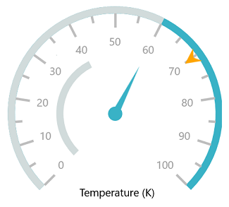

# Getting Started with UWP Radial Gauge (SfCircularGauge)

This section explains the steps required to configure the [`CircularGauge`](https://help.syncfusion.com/cr/uwp/Syncfusion.UI.Xaml.Gauges.SfCircularGauge.html) , and also explains the steps required to add basic elements to [`CircularGauge`](https://help.syncfusion.com/cr/uwp/Syncfusion.UI.Xaml.Gauges.SfCircularGauge.html)  through various APIs available within it.

## Adding Gauge Reference

Refer this [article](https://help.syncfusion.com/uwp/add-syncfusion-controls) to know how to add Syncfusion controls in Visual Studio projects through various way. You can also refer [this](https://help.syncfusion.com/uwp/control-dependencies) link to know about the assemblies required for adding Gauge to your project.

## Initialize Gauge

Import  the [`CircularGauge`](https://help.syncfusion.com/cr/uwp/Syncfusion.UI.Xaml.Gauges.SfCircularGauge.html)  namespace as shown below in your respective Window,





xmlns:syncfusion="using:Syncfusion.UI.Xaml.Gauges"





using Syncfusion.UI.Xaml.Gauges;





You can initialize an empty [`CircularGauge`](https://help.syncfusion.com/cr/uwp/Syncfusion.UI.Xaml.Gauges.SfCircularGauge.html)  control.





    <gauge:SfCircularGauge/>





SfCircularGauge sfCircularGauge = new SfCircularGauge();

this.Content = sfCircularGauge;





## Adding header

You can assign a unique header to [`CircularGauge`](https://help.syncfusion.com/cr/uwp/Syncfusion.UI.Xaml.Gauges.SfCircularGauge.html)  by using the [`GaugeHeader`](https://help.syncfusion.com/cr/uwp/Syncfusion.UI.Xaml.Gauges.SfCircularGauge.html#Syncfusion_UI_Xaml_Gauges_SfCircularGauge_GaugeHeader) property.





    <gauge:SfCircularGauge HeaderAlignment="Custom" GaugeHeaderPosition="0.4,0.7">

    <gauge:SfCircularGauge.GaugeHeader>

    <TextBlock Text="Temperature (K)"

    Height="40" Width="120" FontSize="15" Foreground="Black"/>

    </gauge:SfCircularGauge.GaugeHeader>

    </gauge:SfCircularGauge>





SfCircularGauge sfCircularGauge = new SfCircularGauge();

sfCircularGauge.HeaderAlignment = HeaderAlignment.Custom;

sfCircularGauge.GaugeHeaderPosition = new Point(0.4, 0.7);

TextBlock textBlock = new TextBlock();

textBlock.Text = "Temperature (K)";

textBlock.Height = 40;

textBlock.Width = 120;

textBlock.FontSize = 15;

textBlock.Foreground = new SolidColorBrush(Colors.Black);

sfCircularGauge.GaugeHeader = textBlock;





## Configuring Scales

You can configure the [`CircularScale`](https://help.syncfusion.com/cr/uwp/Syncfusion.UI.Xaml.Gauges.CircularScale.html)  elements by making use of following API’s available in [`CircularGauge`](https://help.syncfusion.com/cr/uwp/Syncfusion.UI.Xaml.Gauges.SfCircularGauge.html).

They are:

* StartAngle

* SweepAngle

* StartValue

* EndValue

* Interval

* TickStroke

* LabelStroke





    <gauge:SfCircularGauge.Scales>

    <gauge:CircularScale Radius="150" RimStroke="#39B2C6" RimStrokeThickness="9"

    TickStroke="#BEBEBE" LabelStroke="#9E9E9E" SmallTickStroke="#BEBEBE"/>

    </gauge:SfCircularGauge.Scales>





CircularScale circularScale = new CircularScale();

circularScale.Radius = 150;

circularScale.RimStroke = new SolidColorBrush(Color.FromArgb(0xff, 0x57, 0xb2, 0xc6));

circularScale.TickStroke = new SolidColorBrush(Color.FromArgb(0xff, 0xc1, 0xc1, 0xc1));

circularScale.SmallTickStroke = new SolidColorBrush(Color.FromArgb(0xff, 0xc1, 0xc1, 0xc1));

circularScale.RimStrokeThickness = 9;

circularScale.LabelStroke = new SolidColorBrush(Color.FromArgb(0xff, 0x99, 0x99, 0x99));

sfCircularGauge.Scales.Add(circularScale);





## Adding ranges

You can add ranges to the [`CircularGauge`](https://help.syncfusion.com/cr/uwp/Syncfusion.UI.Xaml.Gauges.SfCircularGauge.html)   by creating ranges collection using the [`CircularRange`](https://help.syncfusion.com/cr/uwp/Syncfusion.UI.Xaml.Gauges.CircularRange.html)   property.





    <gauge:SfCircularGauge>

    <gauge:SfCircularGauge.Scales>

     <gauge:CircularScale>

     <gauge:CircularScale.Ranges>

     <gauge:CircularRange StartValue="0" EndValue="60" Stroke="#D1DBDB" />

     </gauge:CircularScale.Ranges>

     </gauge:CircularScale>

     </gauge:SfCircularGauge.Scales>
 
      </gauge:SfCircularGauge>





SfCircularGauge sfCircularGauge = new SfCircularGauge();

CircularScale circularScale = new CircularScale();

CircularRange circularRange = new CircularRange();

circularRange.StartValue = 0;

circularRange.EndValue = 60;

circularRange.Stroke = new SolidColorBrush(Color.FromArgb(0xff, 0xd1, 0xdb, 0xdb));

circularScale.Ranges.Add(circularRange);

sfCircularGauge.Scales.Add(circularScale);





## Adding a needle pointer

Create a `Needle Pointer`, and associate it with a scale that is to be displayed the current value.





    <gauge:SfCircularGauge>

     <gauge:SfCircularGauge.Scales>

     <gauge:CircularScale>

     <gauge:CircularScale.Pointers>

     <gauge:CircularPointer PointerType="NeedlePointer" Value="60" 

     NeedleLengthFactor="0.5" NeedlePointerType="Triangle"

     PointerCapDiameter="20" PointerCapStroke="#39B2C6" 

     NeedlePointerStroke="#39B2C6"/>

    </gauge:CircularScale.Pointers>

    </gauge:CircularScale>

    </gauge:SfCircularGauge.Scales>

     </gauge:SfCircularGauge>





SfCircularGauge sfCircularGauge = new SfCircularGauge();

CircularScale circularScale = new CircularScale();

CircularPointer circularPointer = new CircularPointer();

circularPointer.PointerType = PointerType.NeedlePointer;

circularPointer.NeedleLengthFactor = 0.5;

circularPointer.NeedlePointerType = NeedlePointerType.Triangle;

circularPointer.PointerCapDiameter = 20;

circularPointer.NeedlePointerStroke = new SolidColorBrush(Color.FromArgb(0xff, 0x39, 0xb2, 0xc6));

circularPointer.PointerCapStroke = new SolidColorBrush(Color.FromArgb(0xff, 0x39, 0xb2, 0xc6));

circularPointer.Value = 60;

circularScale.Pointers.Add(circularPointer);

sfCircularGauge.Scales.Add(circularScale);





## Adding a range pointer

The `Range Pointer` provides an alternative way to indicate the current value.





    <gauge:SfCircularGauge>

    <gauge:SfCircularGauge.Scales>

    <gauge:CircularScale>

    <gauge:CircularScale.Pointers>

    <gauge:CircularPointer PointerType="RangePointer" Value="40" 

    RangePointerStroke="#D1DBDB" RangePointerStrokeThickness="9"/>

    </gauge:CircularScale.Pointers>

    </gauge:CircularScale>

    </gauge:SfCircularGauge.Scales>

    </gauge:SfCircularGauge>





SfCircularGauge sfCircularGauge = new SfCircularGauge();

CircularScale circularScale = new CircularScale();

CircularPointer circularPointer = new CircularPointer();

circularPointer.PointerType = PointerType.RangePointer;

circularPointer.Value = 40;

circularPointer.RangePointerStrokeThickness = 9;

circularPointer.RangePointerStroke = new SolidColorBrush(Color.FromArgb(0xff, 0xd1, 0xdb, 0xdb));

circularScale.Pointers.Add(circularPointer);

sfCircularGauge.Scales.Add(circularScale);





## Adding a symbol pointer

The `Symbol Pointer` points to the current value in a scale.





    <gauge:SfCircularGauge>

    <gauge:SfCircularGauge.Scales>

    <gauge:CircularScale>

    <gauge:CircularScale.Pointers>

    <gauge:CircularPointer PointerType="SymbolPointer" Value="70" Symbol="InvertedArrow"/>

    </gauge:CircularScale.Pointers>

    </gauge:CircularScale>

    </gauge:SfCircularGauge.Scales>

    </gauge:SfCircularGauge>





SfCircularGauge sfCircularGauge = new SfCircularGauge();

CircularScale circularScale = new CircularScale();

CircularPointer circularPointer = new CircularPointer();

circularPointer.PointerType = PointerType.SymbolPointer;

circularPointer.Value = 70;

circularPointer.Symbol = Syncfusion.UI.Xaml.Gauges.Symbol.InvertedArrow;

circularScale.Pointers.Add(circularPointer);

sfCircularGauge.Scales.Add(circularScale);





The following code example is the complete code of the previous configurations.





    <Page

    x:Class="GaugeGettingStarted.MainPage"

    xmlns="http://schemas.microsoft.com/winfx/2006/xaml/presentation"

    xmlns:x="http://schemas.microsoft.com/winfx/2006/xaml"

    xmlns:local="using:GaugeGettingStarted"

    xmlns:d="http://schemas.microsoft.com/expression/blend/2008"

    xmlns:mc="http://schemas.openxmlformats.org/markup-compatibility/2006"

    mc:Ignorable="d"

    xmlns:gauge="using:Syncfusion.UI.Xaml.Gauges">

    <Grid Background="{ThemeResource ApplicationPageBackgroundThemeBrush}">

    <gauge:SfCircularGauge Height="500" Width="500" HeaderAlignment="Custom" GaugeHeaderPosition="0.4,0.7">

    <gauge:SfCircularGauge.GaugeHeader>

    <TextBlock Text="Temperature (K)" Height="40" Width="120" FontSize="15" Foreground="Black"/>

    </gauge:SfCircularGauge.GaugeHeader>

    <gauge:SfCircularGauge.Scales>

    <gauge:CircularScale Radius="150" RimStroke="#39B2C6" RimStrokeThickness="9"

    TickStroke="#BEBEBE" LabelStroke="#9E9E9E" SmallTickStroke="#BEBEBE">

    <gauge:CircularScale.Ranges>

    <gauge:CircularRange StartValue="0" EndValue="60" Stroke="#D1DBDB" StrokeThickness="9" />

    </gauge:CircularScale.Ranges>

    <gauge:CircularScale.Pointers>

    <gauge:CircularPointer PointerType="NeedlePointer" Value="60" 

    NeedleLengthFactor="0.5" NeedlePointerType="Triangle"
 
    PointerCapDiameter="20" PointerCapStroke="#39B2C6" NeedlePointerStroke="#39B2C6" />

    <gauge:CircularPointer PointerType="RangePointer" Value="40" RangePointerStroke="#D1DBDB" 
    
    RangePointerStrokeThickness="9"/>

    <gauge:CircularPointer PointerType="SymbolPointer" Value="70" Symbol="InvertedArrow"/>

    </gauge:CircularScale.Pointers>

    </gauge:CircularScale>

    </gauge:SfCircularGauge.Scales>

    </gauge:SfCircularGauge>

    </Grid>

    </Page>





using Windows.Foundation;

using Windows.UI.Xaml.Controls;

using Windows.UI.Xaml.Media;

using Syncfusion.UI.Xaml.Gauges;

using Windows.UI;

namespace GaugeGettingStarted

{

public sealed partial class MainPage : Page

{

public MainPage()

{

this.InitializeComponent();

SfCircularGauge sfCircularGauge = new SfCircularGauge();

sfCircularGauge.Height = 500;

sfCircularGauge.Width = 500;

//Adding header

sfCircularGauge.HeaderAlignment = HeaderAlignment.Custom;

sfCircularGauge.GaugeHeaderPosition = new Point(0.4, 0.7);

TextBlock textBlock = new TextBlock();

textBlock.Text = "Temperature (K)";

textBlock.Height = 40;

textBlock.Width = 120;

textBlock.FontSize = 15;

textBlock.Foreground = new SolidColorBrush(Colors.Black);

sfCircularGauge.GaugeHeader = textBlock;

//Initializing scales for circular gauge

CircularScale circularScale = new CircularScale();

circularScale.Radius = 150;

circularScale.RimStroke = new SolidColorBrush(Color.FromArgb(0xff, 0x57, 0xb2, 0xc6));

circularScale.TickStroke = new SolidColorBrush(Color.FromArgb(0xff, 0xc1, 0xc1, 0xc1));

circularScale.SmallTickStroke = new SolidColorBrush(Color.FromArgb(0xff, 0xc1, 0xc1, 0xc1));

circularScale.RimStrokeThickness = 9;

circularScale.LabelStroke = new SolidColorBrush(Color.FromArgb(0xff, 0x99, 0x99, 0x99));

//Adding range

CircularRange circularRange = new CircularRange();

circularRange.StartValue = 0;

circularRange.EndValue = 60;

circularRange.Stroke = new SolidColorBrush(Color.FromArgb(0xff, 0xd1, 0xdb, 0xdb));

circularScale.Ranges.Add(circularRange);

//Adding needle pointer

CircularPointer circularPointer = new CircularPointer();

circularPointer.PointerType = PointerType.NeedlePointer;

circularPointer.NeedleLengthFactor = 0.5;

circularPointer.NeedlePointerType = NeedlePointerType.Triangle;

circularPointer.PointerCapDiameter = 20;

circularPointer.PointerCapStroke = new SolidColorBrush(Color.FromArgb(0xff, 0x39, 0xb2, 0xc6));

circularPointer.Value = 60;

circularPointer.NeedlePointerStroke = new SolidColorBrush(Color.FromArgb(0xff, 0x39, 0xb2, 0xc6));

circularScale.Pointers.Add(circularPointer);

//Adding range pointer

CircularPointer circularPointer1 = new CircularPointer();

circularPointer1.PointerType = PointerType.RangePointer;

circularPointer1.Value = 40;

circularPointer1.RangePointerStrokeThickness = 9;

circularPointer1.RangePointerStroke = new SolidColorBrush(Color.FromArgb(0xff, 0xd1, 0xdb, 0xdb));

circularScale.Pointers.Add(circularPointer1);

//Adding symbol pointer

CircularPointer circularPointer2 = new CircularPointer();

circularPointer2.PointerType = PointerType.SymbolPointer;

circularPointer2.Value = 70;

circularPointer2.Symbol = Syncfusion.UI.Xaml.Gauges.Symbol.InvertedArrow;

circularScale.Pointers.Add(circularPointer2);

sfCircularGauge.Scales.Add(circularScale);

this.Content = sfCircularGauge;

}

}

}





The following screenshot illustrates the result of the previous codes.

You can find the complete getting started sample from this [`link`](http://www.syncfusion.com/downloads/support/directtrac/general/ze/GaugeGettingStarted-1968766965).

