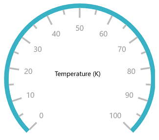
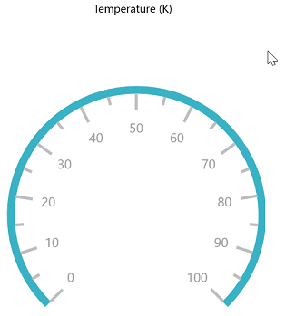
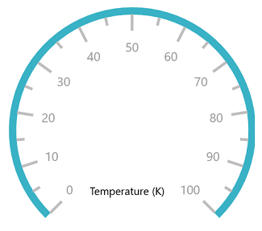
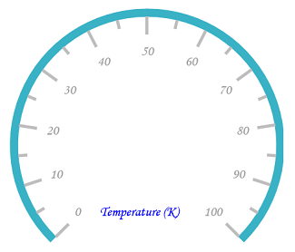

# Header in UWP Radial Gauge (SfCircularGauge)

Header allows you to show text or any UI content inside the gauge control using [`GaugeHeader`](https://help.syncfusion.com/cr/uwp/Syncfusion.UI.Xaml.Gauges.SfCircularGauge.html#Syncfusion_UI_Xaml_Gauges_SfCircularGauge_GaugeHeader)  option. This provides information about the data that is being plotted in the circular gauge.

## Header

The [`GaugeHeader`](https://help.syncfusion.com/cr/uwp/Syncfusion.UI.Xaml.Gauges.SfCircularGauge.html#Syncfusion_UI_Xaml_Gauges_SfCircularGauge_GaugeHeader)  is an object that can be used to set a unique header for the circular gauge. You can add text and images as header in the circular gauge. Only one header can be added in a circular gauge.





    <gauge:SfCircularGauge HeaderAlignment="Center">

    <gauge:SfCircularGauge.GaugeHeader>

    <TextBlock Text="Temperature (K)"

    Height="40" Width="100"

    FontSize="13" Foreground="Black"/>

    </gauge:SfCircularGauge.GaugeHeader>

    <gauge:SfCircularGauge.Scales>

    <gauge:CircularScale Radius="150" RimStroke="#39B2C6" RimStrokeThickness="8"

    TickStroke="#BEBEBE" LabelStroke="#9E9E9E" SmallTickStroke="#BEBEBE">

    <gauge:CircularScale.Pointers>

    <gauge:CircularPointer NeedlePointerVisibility="Collapsed"/>

    </gauge:CircularScale.Pointers>

    </gauge:CircularScale>

    </gauge:SfCircularGauge.Scales>

    </gauge:SfCircularGauge>





SfCircularGauge sfCircularGauge = new SfCircularGauge();

sfCircularGauge.HeaderAlignment = HeaderAlignment.Center;

TextBlock textBlock = new TextBlock();

textBlock.Text = "Temperature (K)";

textBlock.Height = 40;

textBlock.Width = 100;

textBlock.FontSize = 13;

textBlock.Foreground = new SolidColorBrush(Colors.Black);

sfCircularGauge.GaugeHeader = textBlock;

CircularScale circularScale = new CircularScale();

circularScale.Radius = 150;

circularScale.RimStroke = new SolidColorBrush(Color.FromArgb(0xff, 0x57, 0xb2, 0xc6));

circularScale.TickStroke = new SolidColorBrush(Color.FromArgb(0xff, 0xc1, 0xc1, 0xc1));

circularScale.SmallTickStroke = new SolidColorBrush(Color.FromArgb(0xff, 0xc1, 0xc1, 0xc1));

circularScale.RimStrokeThickness = 8;

circularScale.LabelStroke = new SolidColorBrush(Color.FromArgb(0xff, 0x99, 0x99, 0x99));

CircularPointer circularPointer = new CircularPointer();

circularPointer.NeedlePointerVisibility = Windows.UI.Xaml.Visibility.Collapsed;

circularScale.Pointers.Add(circularPointer);

sfCircularGauge.Scales.Add(circularScale);





## Setting alignment for header

The gauge header can be positioned by using the [`HeaderAlignment`](https://help.syncfusion.com/cr/uwp/Syncfusion.UI.Xaml.Gauges.SfCircularGauge.html#Syncfusion_UI_Xaml_Gauges_SfCircularGauge_HeaderAlignment) property. The default value of this property is Left.

It includes the following options:

* Left

* Right

* Top

* Bottom

* Center

* TopLeft

* TopRight

* BottomLeft

* BottomRight

* Custom





    <gauge:SfCircularGauge HeaderAlignment="Top">

    <gauge:SfCircularGauge.GaugeHeader>

    <TextBlock Text="Temperature (K)"

    Height="40" Width="100"

    FontSize="13" Foreground="Black"/>

    </gauge:SfCircularGauge.GaugeHeader>

    <gauge:SfCircularGauge.Scales>

    <gauge:CircularScale Radius="150" RimStroke="#39B2C6" RimStrokeThickness="8"

    TickStroke="#BEBEBE" LabelStroke="#9E9E9E" SmallTickStroke="#BEBEBE">

    <gauge:CircularScale.Pointers>

    <gauge:CircularPointer NeedlePointerVisibility="Collapsed"/>

    </gauge:CircularScale.Pointers>

    </gauge:CircularScale>

    </gauge:SfCircularGauge.Scales>

    </gauge:SfCircularGauge>





SfCircularGauge sfCircularGauge = new SfCircularGauge();

sfCircularGauge.HeaderAlignment = HeaderAlignment.Top;

TextBlock textBlock = new TextBlock();

textBlock.Text = "Temperature (K)";

textBlock.Height = 40;

textBlock.Width = 100;

textBlock.FontSize = 13;

textBlock.Foreground = new SolidColorBrush(Colors.Black);

sfCircularGauge.GaugeHeader = textBlock;

CircularScale circularScale = new CircularScale();

circularScale.Radius = 150;

circularScale.RimStroke = new SolidColorBrush(Color.FromArgb(0xff, 0x57, 0xb2, 0xc6));

circularScale.TickStroke = new SolidColorBrush(Color.FromArgb(0xff, 0xc1, 0xc1, 0xc1));

circularScale.SmallTickStroke = new SolidColorBrush(Color.FromArgb(0xff, 0xc1, 0xc1, 0xc1));

circularScale.RimStrokeThickness = 8;

circularScale.LabelStroke = new SolidColorBrush(Color.FromArgb(0xff, 0x99, 0x99, 0x99));

CircularPointer circularPointer = new CircularPointer();

circularPointer.NeedlePointerVisibility = Windows.UI.Xaml.Visibility.Collapsed;

circularScale.Pointers.Add(circularPointer);

sfCircularGauge.Scales.Add(circularScale);





## Setting position for header

The [`GaugeHeaderPosition`](https://help.syncfusion.com/cr/uwp/Syncfusion.UI.Xaml.Gauges.SfCircularGauge.html#Syncfusion_UI_Xaml_Gauges_SfCircularGauge_GaugeHeaderPosition)  property is used to place header in the circular gauge. The value for [`GaugeHeaderPosition`](https://help.syncfusion.com/cr/uwp/Syncfusion.UI.Xaml.Gauges.SfCircularGauge.html#Syncfusion_UI_Xaml_Gauges_SfCircularGauge_GaugeHeaderPosition)  should be specified in offset value. In the point value, which has been given for the [`GaugeHeaderPosition`](https://help.syncfusion.com/cr/uwp/Syncfusion.UI.Xaml.Gauges.SfCircularGauge.html#Syncfusion_UI_Xaml_Gauges_SfCircularGauge_GaugeHeaderPosition) , the first value represent x-coordinate and the second value represents y-coordinate. First, set the [`HeaderAlignment`](https://help.syncfusion.com/cr/uwp/Syncfusion.UI.Xaml.Gauges.SfCircularGauge.html#Syncfusion_UI_Xaml_Gauges_SfCircularGauge_HeaderAlignment)  to custom, then set the position of header.





    <gauge:SfCircularGauge  HeaderAlignment="Custom" GaugeHeaderPosition="0.42,0.6">

    <gauge:SfCircularGauge.GaugeHeader>

    <TextBlock Text="Temperature (K)"

    Height="40" Width="100"

    FontSize="13" Foreground="Black"/>

    </gauge:SfCircularGauge.GaugeHeader>

    <gauge:SfCircularGauge.Scales>

    <gauge:CircularScale Radius="150" RimStroke="#39B2C6" RimStrokeThickness="8"

    TickStroke="#BEBEBE" LabelStroke="#9E9E9E" SmallTickStroke="#BEBEBE">

    <gauge:CircularScale.Pointers>

    <gauge:CircularPointer NeedlePointerVisibility="Collapsed"/>

    </gauge:CircularScale.Pointers>

    </gauge:CircularScale>

    </gauge:SfCircularGauge.Scales>

    </gauge:SfCircularGauge>





SfCircularGauge sfCircularGauge = new SfCircularGauge();

sfCircularGauge.HeaderAlignment = HeaderAlignment.Custom;

sfCircularGauge.GaugeHeaderPosition = new Point(0.42, 0.6);

TextBlock textBlock = new TextBlock();

textBlock.Text = "Temperature (K)";

textBlock.Height = 40;

textBlock.Width = 100;

textBlock.FontSize = 13;

textBlock.Foreground = new SolidColorBrush(Colors.Black);

sfCircularGauge.GaugeHeader = textBlock;

CircularScale circularScale = new CircularScale();

circularScale.Radius = 150;

circularScale.RimStroke = new SolidColorBrush(Color.FromArgb(0xff, 0x57, 0xb2, 0xc6));

circularScale.TickStroke = new SolidColorBrush(Color.FromArgb(0xff, 0xc1, 0xc1, 0xc1));

circularScale.SmallTickStroke = new SolidColorBrush(Color.FromArgb(0xff, 0xc1, 0xc1, 0xc1));

circularScale.RimStrokeThickness = 8;

circularScale.LabelStroke = new SolidColorBrush(Color.FromArgb(0xff, 0x99, 0x99, 0x99));

CircularPointer circularPointer = new CircularPointer();

circularPointer.NeedlePointerVisibility = Windows.UI.Xaml.Visibility.Collapsed;

circularScale.Pointers.Add(circularPointer);

sfCircularGauge.Scales.Add(circularScale);





## Customization of header font

You can customize the header’s text by using the `FontFamily`, `FontStyle`, `FontSize`, and `Foreground` properties.





    <gauge:SfCircularGauge  HeaderAlignment="Custom" GaugeHeaderPosition="0.42,0.6" 

    FontFamily="Monotype Corsiva" FontSize="15"

    FontStyle="Italic"  Foreground="Blue">

    <gauge:SfCircularGauge.GaugeHeader>

    <TextBlock Text="Temperature (K)"

    Height="40" Width="100" />

    </gauge:SfCircularGauge.GaugeHeader>

    <gauge:SfCircularGauge.Scales>

    <gauge:CircularScale Radius="150" RimStroke="#39B2C6" RimStrokeThickness="8"

    TickStroke="#BEBEBE" LabelStroke="#9E9E9E" SmallTickStroke="#BEBEBE">

    <gauge:CircularScale.Pointers>

    <gauge:CircularPointer NeedlePointerVisibility="Collapsed"/>

    </gauge:CircularScale.Pointers>

    </gauge:CircularScale>

    </gauge:SfCircularGauge.Scales>

    </gauge:SfCircularGauge>





SfCircularGauge sfCircularGauge = new SfCircularGauge();

sfCircularGauge.HeaderAlignment = HeaderAlignment.Custom;

sfCircularGauge.GaugeHeaderPosition = new Point(0.42, 0.6);

TextBlock textBlock = new TextBlock();

textBlock.Text = "Temperature (K)";

textBlock.Height = 40;

textBlock.Width = 100;

textBlock.FontSize = 13;

textBlock.Foreground = new SolidColorBrush(Colors.Black);

sfCircularGauge.GaugeHeader = textBlock;

sfCircularGauge.FontSize = 15;

sfCircularGauge.FontFamily = new FontFamily("Monotype Corsiva");

sfCircularGauge.FontStyle = Windows.UI.Text.FontStyle.Italic;

sfCircularGauge.Foreground = new SolidColorBrush(Colors.Blue);

CircularScale circularScale = new CircularScale();

circularScale.Radius = 150;

circularScale.RimStroke = new SolidColorBrush(Color.FromArgb(0xff, 0x57, 0xb2, 0xc6));

circularScale.TickStroke = new SolidColorBrush(Color.FromArgb(0xff, 0xc1, 0xc1, 0xc1));

circularScale.SmallTickStroke = new SolidColorBrush(Color.FromArgb(0xff, 0xc1, 0xc1, 0xc1));

circularScale.RimStrokeThickness = 8;

circularScale.LabelStroke = new SolidColorBrush(Color.FromArgb(0xff, 0x99, 0x99, 0x99));

CircularPointer circularPointer = new CircularPointer();

circularPointer.NeedlePointerVisibility = Windows.UI.Xaml.Visibility.Collapsed;

circularScale.Pointers.Add(circularPointer);

sfCircularGauge.Scales.Add(circularScale);





