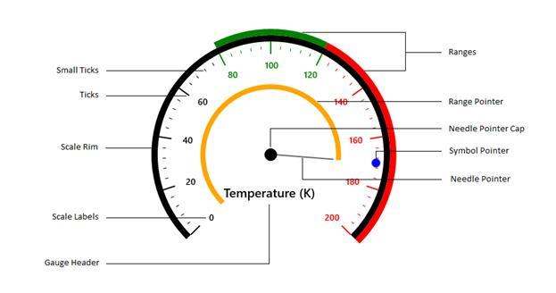

# UWP Radial Gauge (SfCircularGauge) Overview

Circular Gauge helps you to visualize the numeric values over a circular scale. The appearance of the gauge is fully customized to integrate your applications without fault.

## Key features

[`SfCircularGauge`](https://help.syncfusion.com/cr/uwp/Syncfusion.UI.Xaml.Gauges.SfCircularGauge.html)  is a composed control of several scales. Scales will be an integrated UI part of the circular gauge.

[`SfCircularGauge`](https://help.syncfusion.com/cr/uwp/Syncfusion.UI.Xaml.Gauges.SfCircularGauge.html) is a composite UI element with the following subparts:

* Scales

* Ranges

* Pointers

* Header

* Annotations

The circular gauge control is highly customizable control with variety of simple APIs to modify its basic look and feel. You can position ranges, ticks, labels, and range pointers as needed.

### Scales

[`Scales`](https://help.syncfusion.com/uwp/sfcirculargauge/scales)  contains labels, tick marks, and a rim to customize its basic look and feel. It defines the start angle, sweep direction, sweep angle, overall minimum and maximum values, the frequency of labels, and tick marks.

### Ranges

[`Ranges`](https://help.syncfusion.com/uwp/sfcirculargauge/ranges) is a visual element that depicts the start and end values of inner divisions within the scale’s range. Each scale is capable of displaying one or more ranges, and each range can depict different zones or regions of same metrics, such as high, low, and average temperatures.   

### Pointers

[`Pointers`](https://help.syncfusion.com/uwp/sfcirculargauge/pointers) is an element that points out the values of the bound property on a scale. A circular scale will have one or more pointers that can be used to measure different values. Each pointer has a `Value` property, which informs the current value to the user visually.

### Header

[`Header`](https://help.syncfusion.com/uwp/sfcirculargauge/header) can be used to set a unique header for the circular gauge. The user can add text as the header in a circular gauge.

### Annotations

[`Annotations`](https://help.syncfusion.com/uwp/sfcirculargauge/annotations) allows you to mark the specific area of interest in a circular gauge. You can place custom views, text, and images as annotations by using the annotations feature.

