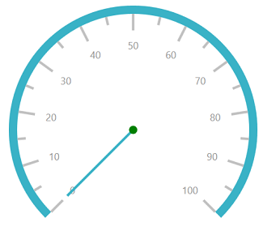
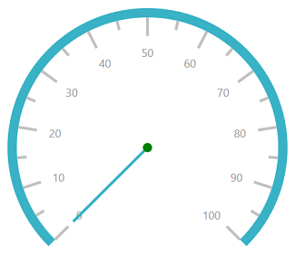
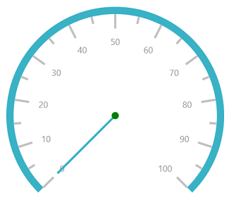

# Pointers in UWP Radial Gauge (SfCircularGauge)

Pointers are used to indicate values on the scale. Value of the pointer can be modified using the [`Value`](https://help.syncfusion.com/cr/uwp/Syncfusion.UI.Xaml.Gauges.CircularPointer.html#Syncfusion_UI_Xaml_Gauges_CircularPointer_Value) property.

## Pointer Type

There are three types of pointers. You can choose a pointer using the [`PointerType`](https://help.syncfusion.com/cr/uwp/Syncfusion.UI.Xaml.Gauges.CircularPointer.html#Syncfusion_UI_Xaml_Gauges_CircularPointer_PointerType) property. 

## Needle pointer

A needle pointer contains two parts, a needle and a pointer cap, that can be placed on a gauge to mark values. 





    <gauge:SfCircularGauge >

    <gauge:SfCircularGauge.Scales>

    <gauge:CircularScale >

    <gauge:CircularScale.Pointers>

    <gauge:CircularPointer PointerType="NeedlePointer"/>

    </gauge:CircularScale.Pointers>

    </gauge:CircularScale>

    </gauge:SfCircularGauge.Scales>

    </gauge:SfCircularGauge>





SfCircularGauge sfCircularGauge = new SfCircularGauge();

CircularScale scale = new CircularScale();

CircularPointer circularPointer = new CircularPointer();

circularPointer.PointerType = PointerType.NeedlePointer;

scale.Pointers.Add(circularPointer);

sfCircularGauge.Scales.Add(scale);





### NeedlePointerType

The appearance of the needle pointer can be customized using the [`NeedlePointerType`](https://help.syncfusion.com/cr/uwp/Syncfusion.UI.Xaml.Gauges.CircularPointer.html#Syncfusion_UI_Xaml_Gauges_CircularPointer_NeedlePointerType) property. The default value of this property is Rectangle.
The [`NeedlePointerType`](https://help.syncfusion.com/cr/uwp/Syncfusion.UI.Xaml.Gauges.CircularPointer.html#Syncfusion_UI_Xaml_Gauges_CircularPointer_NeedlePointerType) is an `enum` property that includes the following options:

1.	Rectangle

2.	Triangle

3.	Tapered

4.	Arrow





    <gauge:SfCircularGauge >

    <gauge:SfCircularGauge.Scales>

    <gauge:CircularScale >

    <gauge:CircularScale.Pointers>

    <gauge:CircularPointer PointerType="NeedlePointer" NeedlePointerType="Triangle"/>

    </gauge:CircularScale.Pointers>

    </gauge:CircularScale>

    </gauge:SfCircularGauge.Scales>

    </gauge:SfCircularGauge>





SfCircularGauge sfCircularGauge = new SfCircularGauge();

CircularScale scale = new CircularScale();

CircularPointer circularPointer = new CircularPointer();

circularPointer.PointerType = PointerType.NeedlePointer;

circularPointer.NeedlePointerType = NeedlePointerType.Triangle;

scale.Pointers.Add(circularPointer);

sfCircularGauge.Scales.Add(scale);





### Needle pointer customization

The length of a needle is controlled using the [`NeedleLengthFactor`](https://help.syncfusion.com/cr/uwp/Syncfusion.UI.Xaml.Gauges.CircularPointer.html#Syncfusion_UI_Xaml_Gauges_CircularPointer_NeedleLengthFactor) property. The minimum and maximum bounds of the [`NeedleLengthFactor`](https://help.syncfusion.com/cr/uwp/Syncfusion.UI.Xaml.Gauges.CircularPointer.html#Syncfusion_UI_Xaml_Gauges_CircularPointer_NeedleLengthFactor) property are 0 and 1. The needle’s UI is customized using the [`NeedlePointerStroke`](https://help.syncfusion.com/cr/uwp/Syncfusion.UI.Xaml.Gauges.CircularPointer.html#Syncfusion_UI_Xaml_Gauges_CircularPointer_NeedlePointerStroke) and [`NeedlePointerStrokeThickness`](https://help.syncfusion.com/cr/uwp/Syncfusion.UI.Xaml.Gauges.CircularPointer.html#Syncfusion_UI_Xaml_Gauges_CircularPointer_NeedlePointerStrokeThickness) properties. The size of the pointer cap can be modified by changing the [`PointerCapDiameter`](https://help.syncfusion.com/cr/uwp/Syncfusion.UI.Xaml.Gauges.CircularPointer.html#Syncfusion_UI_Xaml_Gauges_CircularPointer_PointerCapDiameter) property, and color can be modified using the [`PointerCapStroke`](https://help.syncfusion.com/cr/uwp/Syncfusion.UI.Xaml.Gauges.CircularPointer.html#Syncfusion_UI_Xaml_Gauges_CircularPointer_PointerCapStroke) property.





    <gauge:SfCircularGauge >

    <gauge:SfCircularGauge.Scales>

    <gauge:CircularScale >

    <gauge:CircularScale.Pointers>

    <gauge:CircularPointer PointerType="NeedlePointer" NeedlePointerType="Triangle" NeedlePointerStroke="DeepSkyBlue" 
    
    PointerCapDiameter="20" PointerCapStroke="DeepSkyBlue" NeedleLengthFactor="0.5" NeedlePointerStrokeThickness="10"/>

    </gauge:CircularScale.Pointers>

    </gauge:CircularScale>

    </gauge:SfCircularGauge.Scales>

    </gauge:SfCircularGauge>





SfCircularGauge sfCircularGauge = new SfCircularGauge();

CircularScale scale = new CircularScale();

CircularPointer circularPointer = new CircularPointer();

circularPointer.PointerType = PointerType.NeedlePointer;

circularPointer.NeedlePointerType = NeedlePointerType.Triangle;

circularPointer.NeedlePointerStroke = new SolidColorBrush(Colors.DeepSkyBlue);

circularPointer.NeedlePointerStrokeThickness =10;

circularPointer.NeedleLengthFactor = 0.5;

circularPointer.PointerCapDiameter = 20;

circularPointer.PointerCapStroke = new SolidColorBrush(Colors.DeepSkyBlue);

scale.Pointers.Add(circularPointer);

sfCircularGauge.Scales.Add(scale);





### Setting visibility of needle pointer

The visibility of the needle pointer can be set using the [`NeedlePointerVisibility`](https://help.syncfusion.com/cr/uwp/Syncfusion.UI.Xaml.Gauges.CircularPointer.html#Syncfusion_UI_Xaml_Gauges_CircularPointer_NeedlePointerVisibility) property.





    <gauge:SfCircularGauge >

    <gauge:SfCircularGauge.Scales>

    <gauge:CircularScale >

    <gauge:CircularScale.Pointers>

    <gauge:CircularPointer NeedlePointerVisibility="Hidden"/>

    </gauge:CircularScale.Pointers>

    </gauge:CircularScale>

    </gauge:SfCircularGauge.Scales>

    </gauge:SfCircularGauge>





SfCircularGauge sfCircularGauge = new SfCircularGauge();

CircularScale scale = new CircularScale();

CircularPointer circularPointer = new CircularPointer();

circularPointer.NeedlePointerVisibility = Visibility.Hidden;

scale.Pointers.Add(circularPointer);

sfCircularGauge.Scales.Add(scale);





## Range pointer

The range pointer is an accenting line or shaded background range that can be placed on a gauge to mark values. 





    <gauge:SfCircularGauge >

    <gauge:SfCircularGauge.Scales>

    <gauge:CircularScale >
                
    <gauge:CircularScale.Pointers>

    <gauge:CircularPointer PointerType="RangePointer" Value="50" />

    </gauge:CircularScale.Pointers>

    </gauge:CircularScale>

    </gauge:SfCircularGauge.Scales>

    </gauge:SfCircularGauge>





SfCircularGauge sfCircularGauge = new SfCircularGauge();

CircularScale scale = new CircularScale();

CircularPointer circularPointer = new CircularPointer();

circularPointer.PointerType = PointerType.RangePointer;

circularPointer.Value = 50;

scale.Pointers.Add(circularPointer);

sfCircularGauge.Scales.Add(scale);





### Range pointer customization

The range pointer’s UI is customized using the [`RangePointerStroke`](https://help.syncfusion.com/cr/uwp/Syncfusion.UI.Xaml.Gauges.CircularPointer.html#Syncfusion_UI_Xaml_Gauges_CircularPointer_RangePointerStroke) and [`RangePointerStrokeThickness`](https://help.syncfusion.com/cr/uwp/Syncfusion.UI.Xaml.Gauges.CircularPointer.html#Syncfusion_UI_Xaml_Gauges_CircularPointer_RangePointerStrokeThickness) properties.  





    <gauge:SfCircularGauge >

    <gauge:SfCircularGauge.Scales>

    <gauge:CircularScale >

    <gauge:CircularScale.Pointers>

    <gauge:CircularPointer PointerType="RangePointer" Value="50" RangePointerStroke="DarkCyan"
                        
    RangePointerStrokeThickness="20"/>

    </gauge:CircularScale.Pointers>

    </gauge:CircularScale>

    </gauge:SfCircularGauge.Scales>

    </gauge:SfCircularGauge>





SfCircularGauge sfCircularGauge = new SfCircularGauge();

CircularScale scale = new CircularScale();

CircularPointer circularPointer = new CircularPointer();

circularPointer.PointerType = PointerType.RangePointer;

circularPointer.Value = 50;

circularPointer.RangePointerStroke = new SolidColorBrush(Colors.DarkCyan);

circularPointer.RangePointerStrokeThickness = 20;

scale.Pointers.Add(circularPointer);

sfCircularGauge.Scales.Add(scale);





### Setting visibility for range pointer

The [`RangePointerVisibility`](https://help.syncfusion.com/cr/uwp/Syncfusion.UI.Xaml.Gauges.CircularPointer.html#Syncfusion_UI_Xaml_Gauges_CircularPointer_RangePointerVisibility) property is used to set the visibility of the range pointer.





    <gauge:SfCircularGauge >

    <gauge:SfCircularGauge.Scales>

    <gauge:CircularScale >

    <gauge:CircularScale.Pointers>

    <gauge:CircularPointer RangePointerVisibility="Hidden"/>

    </gauge:CircularScale.Pointers>

    </gauge:CircularScale>

    </gauge:SfCircularGauge.Scales>

    </gauge:SfCircularGauge>





SfCircularGauge sfCircularGauge = new SfCircularGauge();

CircularScale scale = new CircularScale();

CircularPointer circularPointer = new CircularPointer();

circularPointer.RangePointerVisibility = Visibility.Hidden;

scale.Pointers.Add(circularPointer);

sfCircularGauge.Scales.Add(scale);





### Setting position for range pointer

The `RangePointer` can be placed inside or outside the scale by the following two ways:
1.	Using the [`RangePointerPosition`](https://help.syncfusion.com/cr/uwp/Syncfusion.UI.Xaml.Gauges.CircularScale.html#Syncfusion_UI_Xaml_Gauges_CircularScale_RangePointerPosition) property.

You can place the range pointer by selecting one of the options available in the [`RangePointerPosition`](https://help.syncfusion.com/cr/uwp/Syncfusion.UI.Xaml.Gauges.CircularScale.html#Syncfusion_UI_Xaml_Gauges_CircularScale_RangePointerPosition) property. 

They are:

1.	Inside (Default)

2.	Outside

3.	Cross

4.	Custom





    <gauge:SfCircularGauge >

    <gauge:SfCircularGauge.Scales>

    <gauge:CircularScale RangePointerPosition="Outside">

    <gauge:CircularScale.Pointers>

    <gauge:CircularPointer PointerType="RangePointer" RangePointerStroke="HotPink" Value="60"/>

    </gauge:CircularScale.Pointers>

    </gauge:CircularScale>

    </gauge:SfCircularGauge.Scales>

    </gauge:SfCircularGauge>





SfCircularGauge sfCircularGauge = new SfCircularGauge();

CircularScale scale = new CircularScale();

scale.RangePointerPosition = RangePointerPosition.Outside;

CircularPointer circularPointer = new CircularPointer();

circularPointer.PointerType = PointerType.RangePointer;

circularPointer.RangePointerStroke = new SolidColorBrush(Colors.HotPink);

circularPointer.Value = 60;

scale.Pointers.Add(circularPointer);

sfCircularGauge.Scales.Add(scale);





2.	Using the [`RangePointerOffset`](https://help.syncfusion.com/cr/uwp/Syncfusion.UI.Xaml.Gauges.CircularScale.html#Syncfusion_UI_Xaml_Gauges_CircularScale_RangePointerOffset) property. First, set the [`RangePointerPosition`](https://help.syncfusion.com/cr/uwp/Syncfusion.UI.Xaml.Gauges.CircularScale.html#Syncfusion_UI_Xaml_Gauges_CircularScale_RangePointerPosition) to custom, and then set the [`RangePointerOffset`](https://help.syncfusion.com/cr/uwp/Syncfusion.UI.Xaml.Gauges.CircularScale.html#Syncfusion_UI_Xaml_Gauges_CircularScale_RangePointerOffset) property.





    <gauge:SfCircularGauge >

    <gauge:SfCircularGauge.Scales>

    <gauge:CircularScale RangePointerPosition="Custom" RangePointerOffset="0.5">

    <gauge:CircularScale.Pointers>

    <gauge:CircularPointer PointerType="RangePointer" RangePointerStroke="HotPink" Value="60"/>

    </gauge:CircularScale.Pointers>

    </gauge:CircularScale>

    </gauge:SfCircularGauge.Scales>

    </gauge:SfCircularGauge>





SfCircularGauge sfCircularGauge = new SfCircularGauge();

CircularScale scale = new CircularScale();

scale.RangePointerOffset = 0.5;

scale.RangePointerPosition = RangePointerPosition.Custom;

CircularPointer circularPointer = new CircularPointer();

circularPointer.PointerType = PointerType.RangePointer;

circularPointer.Value = 90;

scale.Pointers.Add(circularPointer);

sfCircularGauge.Scales.Add(scale);





## Symbol pointer

In symbol pointer, the value is pointed out using a symbol on the scale. The symbol is an enum property that provides symbol options for the symbol pointer, which contains several shapes such as rectangle, ellipse, and triangle.





    <gauge:SfCircularGauge >

    <gauge:SfCircularGauge.Scales>

    <gauge:CircularScale>

    <gauge:CircularScale.Pointers>

    <gauge:CircularPointer PointerType="SymbolPointer"  Value="60"/>

    </gauge:CircularScale.Pointers>

    </gauge:CircularScale>

    </gauge:SfCircularGauge.Scales>

    </gauge:SfCircularGauge>





SfCircularGauge sfCircularGauge = new SfCircularGauge();

CircularScale scale = new CircularScale();

CircularPointer circularPointer = new CircularPointer();

circularPointer.PointerType = PointerType.SymbolPointer;

circularPointer.Value = 60;

scale.Pointers.Add(circularPointer);

sfCircularGauge.Scales.Add(scale);





### Symbol pointer customization

You can modify the stroke of the symbol by changing the [`SymbolPointerStroke`](https://help.syncfusion.com/cr/uwp/Syncfusion.UI.Xaml.Gauges.CircularPointer.html#Syncfusion_UI_Xaml_Gauges_CircularPointer_SymbolPointerStroke) property. The [`SymbolPointerHeight`](https://help.syncfusion.com/cr/uwp/Syncfusion.UI.Xaml.Gauges.CircularPointer.html#Syncfusion_UI_Xaml_Gauges_CircularPointer_SymbolPointerHeight) property is used to set the height of the symbol pointer. The value should be given as a double value. The [`SymbolPointerWidth`](https://help.syncfusion.com/cr/uwp/Syncfusion.UI.Xaml.Gauges.CircularPointer.html#Syncfusion_UI_Xaml_Gauges_CircularPointer_SymbolPointerWidth) property is used to set the width of the symbol pointer.





    <gauge:SfCircularGauge >

    <gauge:SfCircularGauge.Scales>

    <gauge:CircularScale>

    <gauge:CircularScale.Pointers>
    
    <gauge:CircularPointer PointerType="SymbolPointer"  Value="60" SymbolPointerStroke="Red"

    SymbolPointerHeight="20" SymbolPointerWidth="20"/>

    </gauge:CircularScale.Pointers>

    </gauge:CircularScale>

    </gauge:SfCircularGauge.Scales>

    </gauge:SfCircularGauge>





SfCircularGauge sfCircularGauge = new SfCircularGauge();

CircularScale scale = new CircularScale();

CircularPointer circularPointer = new CircularPointer();

circularPointer.PointerType = PointerType.SymbolPointer;

circularPointer.Value = 60;

circularPointer.SymbolPointerStroke = new SolidColorBrush(Colors.Red);

circularPointer.SymbolPointerHeight = 20;

circularPointer.SymbolPointerWidth = 20;

scale.Pointers.Add(circularPointer);

sfCircularGauge.Scales.Add(scale);





### Setting visibility of symbol pointer

The visibility of the symbol pointer can be set using the [`SymbolPointerVisibility`](https://help.syncfusion.com/cr/uwp/Syncfusion.UI.Xaml.Gauges.CircularPointer.html#Syncfusion_UI_Xaml_Gauges_CircularPointer_SymbolPointerVisibility) Property.





    <gauge:SfCircularGauge >

    <gauge:SfCircularGauge.Scales>

    <gauge:CircularScale>

    <gauge:CircularScale.Pointers>

    <gauge:CircularPointer SymbolPointerVisibility="Hidden"/>

    </gauge:CircularScale.Pointers>

    </gauge:CircularScale>

    </gauge:SfCircularGauge.Scales>

    </gauge:SfCircularGauge>





SfCircularGauge sfCircularGauge = new SfCircularGauge();

CircularScale scale = new CircularScale();

CircularPointer circularPointer = new CircularPointer();

circularPointer.SymbolPointerVisibility = Visibility.Hidden;

scale.Pointers.Add(circularPointer);

sfCircularGauge.Scales.Add(scale);





### Setting multiple pointers

In addition to the default pointer, you can add n number of pointers to a scale using the [`Pointers`](https://help.syncfusion.com/cr/uwp/Syncfusion.UI.Xaml.Gauges.CircularScale.html#Syncfusion_UI_Xaml_Gauges_CircularScale_Pointers) property.





    <gauge:SfCircularGauge>

    <gauge:SfCircularGauge.Scales>

    <gauge:CircularScale >

    <gauge:CircularScale.Pointers>

    <gauge:CircularPointer PointerType="NeedlePointer" NeedleLengthFactor="0.4" Value="60"

    NeedlePointerType="Tapered" PointerCapStroke="#39B2C6" />

    <gauge:CircularPointer PointerType="RangePointer"  Value="100"/>

    <gauge:CircularPointer PointerType="SymbolPointer"  Value="50" Symbol="Pentagon"

     SymbolPointerHeight="20" SymbolPointerWidth="20" SymbolPointerStroke="#39B2C6"/>

    </gauge:CircularScale.Pointers>

    </gauge:CircularScale>

    </gauge:SfCircularGauge.Scales>

    </gauge:SfCircularGauge>





SfCircularGauge sfCircularGauge = new SfCircularGauge();

CircularScale scale = new CircularScale();

CircularPointer circularPointer = new CircularPointer();

circularPointer.PointerType = PointerType.NeedlePointer;

circularPointer.NeedleLengthFactor = 0.4;

circularPointer.Value = 60;

circularPointer.NeedlePointerType = NeedlePointerType.Tapered;

circularPointer.PointerCapStroke = new SolidColorBrush(Color.FromArgb(0xff, 0x39, 0xb2, 0xc6));

scale.Pointers.Add(circularPointer);

CircularPointer circularPointer1 = new CircularPointer();

circularPointer1.PointerType = PointerType.RangePointer;

circularPointer1.Value = 100;

scale.Pointers.Add(circularPointer1);

CircularPointer circularPointer2 = new CircularPointer();

circularPointer2.PointerType = PointerType.SymbolPointer;

circularPointer2.Value = 50;

circularPointer2.Symbol = Symbol.Pentagon;

circularPointer2.SymbolPointerHeight = 20;

circularPointer2.SymbolPointerWidth = 20;

circularPointer2.SymbolPointerStroke = new SolidColorBrush(Color.FromArgb(0xff, 0x39, 0xb2, 0xc6));

scale.Pointers.Add(circularPointer2);

scale.Pointers.Add(circularPointer);

sfCircularGauge.Scales.Add(scale);





## Setting animation for pointer

The [`EnableAnimation`](https://help.syncfusion.com/cr/uwp/Syncfusion.UI.Xaml.Gauges.CircularPointer.html#Syncfusion_UI_Xaml_Gauges_CircularPointer_EnableAnimation) property is a Boolean property that enables or disables the animation of the pointers in circular gauge.





    <gauge:SfCircularGauge>

    <gauge:SfCircularGauge.Scales>

    <gauge:CircularScale Radius="150" >

    <gauge:CircularScale.Pointers>

    <gauge:CircularPointer PointerType="NeedlePointer" NeedleLengthFactor="0.4" Value="60"

     NeedlePointerType="Triangle" PointerCapStroke="#39B2C6"   PointerCapDiameter="20"/>

    <gauge:CircularPointer PointerType="RangePointer"  Value="100" RangePointerStroke="#39B2C6"/>

    </gauge:CircularScale.Pointers>

    </gauge:CircularScale>
                
    </gauge:SfCircularGauge.Scales>

    </gauge:SfCircularGauge>





            SfCircularGauge sfCircularGauge = new SfCircularGauge();

            CircularScale scale = new CircularScale();

            scale.Radius = 150;

            CircularPointer circularPointer = new CircularPointer();

            circularPointer.PointerType = PointerType.NeedlePointer;

            circularPointer.EnableAnimation = true;

            circularPointer.NeedleLengthFactor = 0.4;

            circularPointer.Value = 60;

            circularPointer.NeedlePointerType = NeedlePointerType.Triangle;

            circularPointer.PointerCapDiameter = 20;

            circularPointer.PointerCapStroke = new SolidColorBrush(Color.FromArgb(0xff, 0x39, 0xb2, 0xc6));

            scale.Pointers.Add(circularPointer);

            CircularPointer circularPointer1 = new CircularPointer();

            circularPointer1.PointerType = PointerType.RangePointer;

            circularPointer1.RangePointerStroke = new SolidColorBrush(Color.FromArgb(0xff, 0x39, 0xb2, 0xc6));

            circularPointer1.EnableAnimation = true;

            circularPointer1.Value = 100;

            scale.Pointers.Add(circularPointer1);

            scale.Pointers.Add(circularPointer);

            sfCircularGauge.Scales.Add(scale);





### Step frequency

The [`StepFrequency`](https://help.syncfusion.com/cr/uwp/Syncfusion.UI.Xaml.Gauges.CircularPointer.html#Syncfusion_UI_Xaml_Gauges_CircularPointer_StepFrequency) property is used to specify the interval between snap points while dragging the [`SymbolPointer`](https://help.syncfusion.com/cr/uwp/Syncfusion.UI.Xaml.Gauges.PointerType.html#Syncfusion_UI_Xaml_Gauges_PointerType_SymbolPointer) or [`NeedlePointer`](https://help.syncfusion.com/cr/uwp/Syncfusion.UI.Xaml.Gauges.PointerType.html#Syncfusion_UI_Xaml_Gauges_PointerType_NeedlePointer).

For example, when the value of [`StepFrequency`](https://help.syncfusion.com/cr/uwp/Syncfusion.UI.Xaml.Gauges.CircularPointer.html#Syncfusion_UI_Xaml_Gauges_CircularPointer_StepFrequency) is 20, then while dragging, the pointer will not move continuously, instead it will update in terms of 20.

N> To work with the [`StepFrequency`](https://help.syncfusion.com/cr/uwp/Syncfusion.UI.Xaml.Gauges.CircularPointer.html#Syncfusion_UI_Xaml_Gauges_CircularPointer_StepFrequency) value, enable pointer dragging support.





        <gauge:SfCircularGauge Height="500" Width="500" >

            <gauge:SfCircularGauge.Scales>

                <gauge:CircularScale Radius="150" ShowRim="True" RimStroke="#39B2C6" RimStrokeThickness="9"

    TickStroke="#BEBEBE" LabelStroke="#9E9E9E" SmallTickStroke="#BEBEBE" TickPosition="Cross" >                  

                    <gauge:CircularScale.Pointers>

                        <gauge:CircularPointer PointerType="NeedlePointer" Value="60" EnableAnimation="False"

    NeedleLengthFactor="0.7" NeedlePointerType="Triangle" EnableDragging="True" StepFrequency="20"
 
    PointerCapDiameter="20" PointerCapStroke="#39B2C6" NeedlePointerStroke="#39B2C6" />

                       

                        <gauge:CircularPointer PointerType="SymbolPointer" Value="70" StepFrequency="5"
                                               Symbol="Arrow" EnableDragging="True" EnableAnimation="False"/>

                    </gauge:CircularScale.Pointers>

                </gauge:CircularScale>

            </gauge:SfCircularGauge.Scales>

        </gauge:SfCircularGauge>





SfCircularGauge sfCircularGauge = new SfCircularGauge();

            sfCircularGauge.Height = 500;

            sfCircularGauge.Width = 500;

            CircularScale circularScale = new CircularScale();

            circularScale.Radius = 150;

            circularScale.RimStroke = new SolidColorBrush(Color.FromArgb(0xff, 0x57, 0xb2, 0xc6));

            circularScale.TickStroke = new SolidColorBrush(Color.FromArgb(0xff, 0xc1, 0xc1, 0xc1));

            circularScale.SmallTickStroke = new SolidColorBrush(Color.FromArgb(0xff, 0xc1, 0xc1, 0xc1));

            circularScale.RimStrokeThickness = 9;
            circularScale.TickPosition = TickPosition.Cross;

            circularScale.LabelStroke = new SolidColorBrush(Color.FromArgb(0xff, 0x99, 0x99, 0x99));

            CircularPointer circularPointer = new CircularPointer();
            circularPointer.PointerType = PointerType.NeedlePointer;
            circularPointer.Value = 60;
            circularPointer.EnableAnimation = false;
            circularPointer.EnableDragging = true;
            circularPointer.StepFrequency = 20;
            circularPointer.NeedleLengthFactor = 0.7;

            circularPointer.NeedlePointerType = NeedlePointerType.Triangle;

            circularPointer.PointerCapDiameter = 20;

            circularPointer.PointerCapStroke = new SolidColorBrush(Color.FromArgb(0xff, 0x39, 0xb2, 0xc6));

            circularPointer.NeedlePointerStroke = new SolidColorBrush(Color.FromArgb(0xff, 0x39, 0xb2, 0xc6));

            circularScale.Pointers.Add(circularPointer);

            CircularPointer circularPointer2 = new CircularPointer();

            circularPointer2.PointerType = PointerType.SymbolPointer;

            circularPointer2.Value = 70;

            circularPointer2.StepFrequency = 5;

            circularPointer2.EnableDragging = true;
            circularPointer2.EnableAnimation = false;

            circularPointer2.Symbol = Syncfusion.UI.Xaml.Gauges.Symbol.Arrow;

            circularScale.Pointers.Add(circularPointer2);

            sfCircularGauge.Scales.Add(circularScale);

            grid.Children.Add(sfCircularGauge);





## Events

### Value change started event

Called when the user starts updating a new value of the pointer by initiating the dragging. While dragging the pointer, other events (ValueChanging, ValueChanged, and ValueChangeCompleted) will be followed after this event.

The [`ValueChangeStarted`](https://help.syncfusion.com/cr/uwp/Syncfusion.UI.Xaml.Gauges.CircularPointer.html#Syncfusion_UI_Xaml_Gauges_CircularPointer_ValueChangeStarted) event contains the following argument.

[`Value`](https://help.syncfusion.com/cr/uwp/Syncfusion.UI.Xaml.Gauges.PointerValueChangedEventArgs.html#Syncfusion_UI_Xaml_Gauges_PointerValueChangedEventArgs_Value) : This value will be the last value the pointer had before the changes began.





                    <gauge:CircularScale.Pointers>

                        <gauge:CircularPointer ValueChangeStarted="CircularPointer_ValueChangeStarted" PointerType="NeedlePointer"/>

                    </gauge:CircularScale.Pointers>





        private void CircularPointer_ValueChangeStarted(object sender, Syncfusion.UI.Xaml.Gauges.PointerValueChangedEventArgs e)
        {

        }





### Value changing event

Called during a drag when the user is updating before a new value for the pointer by dragging

The [`ValueChanging`](https://help.syncfusion.com/cr/uwp/Syncfusion.UI.Xaml.Gauges.CircularPointer.html#Syncfusion_UI_Xaml_Gauges_CircularPointer_ValueChanging) event contains the following argument.

[`NewValue`](https://help.syncfusion.com/cr/uwp/Syncfusion.UI.Xaml.Gauges.PointerValueChangingEventArgs.html#Syncfusion_UI_Xaml_Gauges_PointerValueChangingEventArgs_NewValue) : Gets the new pointer value, which is updated while dragging.
[`OldValue`](https://help.syncfusion.com/cr/uwp/Syncfusion.UI.Xaml.Gauges.PointerValueChangingEventArgs.html#Syncfusion_UI_Xaml_Gauges_PointerValueChangingEventArgs_OldValue) : Gets the old value of the pointer, which is updated by pointer dragging.
[`Cancel`](https://help.syncfusion.com/cr/uwp/Syncfusion.UI.Xaml.Gauges.PointerValueChangingEventArgs.html#Syncfusion_UI_Xaml_Gauges_PointerValueChangingEventArgs_Cancel) : Used to restrict the updating pointer value and cancel dragging.





                   <gauge:CircularScale.Pointers>

                        <gauge:CircularPointer ValueChanging="CircularPointer_ValueChanging" PointerType="NeedlePointer"/>

                    </gauge:CircularScale.Pointers>





        private void CircularPointer_ValueChanging(object sender, Syncfusion.UI.Xaml.Gauges.PointerValueChangingEventArgs e)
        {

        }





### Value change completed event

Called after a new value has been updated by terminating the dragging of the pointer. While dragging the pointer, other events (ValueChangeStarted, ValueChanging, and ValueChanged) will be called prior to the ValueChangeCompleted event.

This event will notify the completion of dragging with a new value being updated.

The [`ValueChangeCompleted`](https://help.syncfusion.com/cr/uwp/Syncfusion.UI.Xaml.Gauges.CircularPointer.html#Syncfusion_UI_Xaml_Gauges_CircularPointer_ValueChangeCompleted) event contains the following argument.

[`Value`](https://help.syncfusion.com/cr/uwp/Syncfusion.UI.Xaml.Gauges.PointerValueChangedEventArgs.html#Syncfusion_UI_Xaml_Gauges_PointerValueChangedEventArgs_Value) : Gets the updated value of the pointer.





                  <gauge:CircularScale.Pointers>

                        <gauge:CircularPointer ValueChangeCompleted="CircularPointer_ValueChangeCompleted" PointerType="NeedlePointer"/>

                    </gauge:CircularScale.Pointers>





        private void CircularPointer_ValueChangeCompleted(object sender, Syncfusion.UI.Xaml.Gauges.PointerValueChangedEventArgs e)
        {

        }




