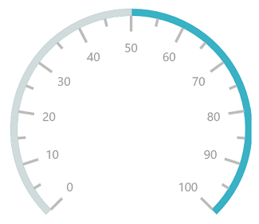
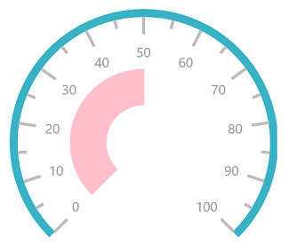
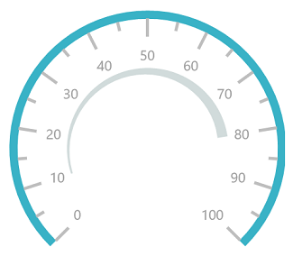
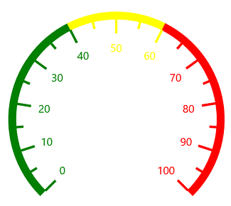
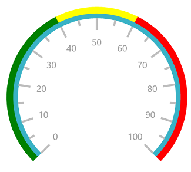
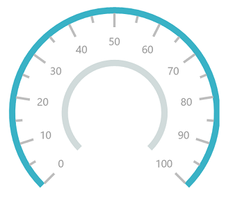
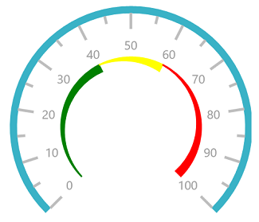
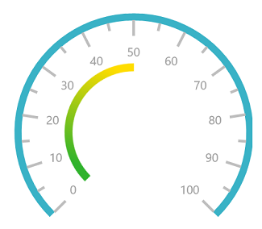

# Ranges in UWP Radial Gauge (SfCircularGauge)

Range is a visual element, which begins and ends at the specified values within a scale.

## Setting start and end values for range

The start and end values of ranges are set by using the [`StartValue`](https://help.syncfusion.com/cr/uwp/Syncfusion.UI.Xaml.Gauges.CircularRange.html#Syncfusion_UI_Xaml_Gauges_CircularRange_StartValue)  and [`EndValue`](https://help.syncfusion.com/cr/uwp/Syncfusion.UI.Xaml.Gauges.CircularRange.html#Syncfusion_UI_Xaml_Gauges_CircularRange_EndValue)  properties.





    <gauge:SfCircularGauge>

    <gauge:SfCircularGauge.Scales>

    <gauge:CircularScale  Radius="150" RimStroke="#39B2C6" RimStrokeThickness="8"

    TickStroke="#BEBEBE" LabelStroke="#9E9E9E" SmallTickStroke="#BEBEBE">

    <gauge:CircularScale.Ranges>

    <gauge:CircularRange StartValue="0" EndValue="50" Stroke="#D1DBDB"/>

    </gauge:CircularScale.Ranges>

    <gauge:CircularScale.Pointers>

    <gauge:CircularPointer NeedlePointerVisibility="Collapsed"/>

    </gauge:CircularScale.Pointers>

    </gauge:CircularScale>

    </gauge:SfCircularGauge.Scales>

    </gauge:SfCircularGauge>





SfCircularGauge sfCircularGauge = new SfCircularGauge();

CircularScale circularScale = new CircularScale();

circularScale.Radius = 150;

circularScale.RimStroke = new SolidColorBrush(Color.FromArgb(0xff, 0x57, 0xb2, 0xc6));

circularScale.TickStroke = new SolidColorBrush(Color.FromArgb(0xff, 0xc1, 0xc1, 0xc1));

circularScale.SmallTickStroke = new SolidColorBrush(Color.FromArgb(0xff, 0xc1, 0xc1, 0xc1));

circularScale.RimStrokeThickness = 8;

circularScale.LabelStroke = new SolidColorBrush(Color.FromArgb(0xff, 0x99, 0x99, 0x99));

CircularRange circularRange = new CircularRange();

circularRange.StartValue = 0;

circularRange.EndValue = 50;

circularRange.Stroke = new SolidColorBrush(Color.FromArgb(0xff, 0xd1, 0xdb, 0xdb));

circularScale.Ranges.Add(circularRange);

CircularPointer circularPointer = new CircularPointer();

circularPointer.NeedlePointerVisibility = Windows.UI.Xaml.Visibility.Collapsed;

circularScale.Pointers.Add(circularPointer);

sfCircularGauge.Scales.Add(circularScale);





## Range customization

A range’s UI is customized by using the [`Stroke`](https://help.syncfusion.com/cr/uwp/Syncfusion.UI.Xaml.Gauges.CircularRange.html#Syncfusion_UI_Xaml_Gauges_CircularRange_Stroke) , [`StrokeThickness`](https://help.syncfusion.com/cr/uwp/Syncfusion.UI.Xaml.Gauges.CircularRange.html#Syncfusion_UI_Xaml_Gauges_CircularRange_StrokeThickness) , and [`RangeOffset`](https://help.syncfusion.com/cr/uwp/Syncfusion.UI.Xaml.Gauges.CircularScale.html#Syncfusion_UI_Xaml_Gauges_CircularScale_RangeOffset)  properties. First, set the [`RangePosition`](https://help.syncfusion.com/cr/uwp/Syncfusion.UI.Xaml.Gauges.CircularScale.html#Syncfusion_UI_Xaml_Gauges_CircularScale_RangePosition)  property to custom, and then set the offset.





    <gauge:SfCircularGauge>

    <gauge:SfCircularGauge.Scales>

    <gauge:CircularScale RangePosition="Custom" RangeOffset="0.55"  Radius="150" RimStroke="#39B2C6" 
    
    RimStrokeThickness="8" TickStroke="#BEBEBE" LabelStroke="#9E9E9E" SmallTickStroke="#BEBEBE">

    <gauge:CircularScale.Ranges>

    <gauge:CircularRange StartValue="0" EndValue="50" Stroke="Pink" StrokeThickness="40"/>

    </gauge:CircularScale.Ranges>

    <gauge:CircularScale.Pointers>

    <gauge:CircularPointer NeedlePointerVisibility="Collapsed"/>

    </gauge:CircularScale.Pointers>

    </gauge:CircularScale>

    </gauge:SfCircularGauge.Scales>

    </gauge:SfCircularGauge>





SfCircularGauge sfCircularGauge = new SfCircularGauge();

CircularScale circularScale = new CircularScale();

circularScale.RangePosition = RangePosition.Custom;

circularScale.RangeOffset = 0.55;

circularScale.Radius = 150;

circularScale.RimStroke = new SolidColorBrush(Color.FromArgb(0xff, 0x57, 0xb2, 0xc6));

circularScale.TickStroke = new SolidColorBrush(Color.FromArgb(0xff, 0xc1, 0xc1, 0xc1));

circularScale.SmallTickStroke = new SolidColorBrush(Color.FromArgb(0xff, 0xc1, 0xc1, 0xc1));

circularScale.RimStrokeThickness = 8;

circularScale.LabelStroke = new SolidColorBrush(Color.FromArgb(0xff, 0x99, 0x99, 0x99));

CircularRange circularRange = new CircularRange();

circularRange.StartValue = 0;

circularRange.EndValue = 50;

circularRange.Stroke = new SolidColorBrush(Colors.Pink);

circularRange.StrokeThickness = 40;

circularScale.Ranges.Add(circularRange);

CircularPointer circularPointer = new CircularPointer();

circularPointer.NeedlePointerVisibility = Windows.UI.Xaml.Visibility.Collapsed;

circularScale.Pointers.Add(circularPointer);

sfCircularGauge.Scales.Add(circularScale);





## Setting width for range

The appearance of the circular range is customized by setting the [`StartWidth`](https://help.syncfusion.com/cr/uwp/Syncfusion.UI.Xaml.Gauges.CircularRange.html#Syncfusion_UI_Xaml_Gauges_CircularRange_StartWidth)  and [`EndWidth`](https://help.syncfusion.com/cr/uwp/Syncfusion.UI.Xaml.Gauges.CircularRange.html#Syncfusion_UI_Xaml_Gauges_CircularRange_EndWidth)  properties.





     <gauge:SfCircularGauge>

     <gauge:SfCircularGauge.Scales>

    <gauge:CircularScale  RangePosition="Inside" Radius="150" RimStroke="#39B2C6" RimStrokeThickness="8"

    TickStroke="#BEBEBE" LabelStroke="#9E9E9E" SmallTickStroke="#BEBEBE">

    <gauge:CircularScale.Ranges>

    <gauge:CircularRange StartValue="10" EndValue="80" StrokeThickness ="10" StartWidth="1" EndWidth="10" Stroke="#D1DBDB"/>

    </gauge:CircularScale.Ranges>

    <gauge:CircularScale.Pointers>

    <gauge:CircularPointer NeedlePointerVisibility="Collapsed"/>

    </gauge:CircularScale.Pointers>

    </gauge:CircularScale>

    </gauge:SfCircularGauge.Scales>

    </gauge:SfCircularGauge>





SfCircularGauge sfCircularGauge = new SfCircularGauge();

CircularScale circularScale = new CircularScale();

circularScale.RangePosition = RangePosition.Inside;

circularScale.Radius = 150;

circularScale.RimStroke = new SolidColorBrush(Color.FromArgb(0xff, 0x57, 0xb2, 0xc6));

circularScale.TickStroke = new SolidColorBrush(Color.FromArgb(0xff, 0xc1, 0xc1, 0xc1));

circularScale.SmallTickStroke = new SolidColorBrush(Color.FromArgb(0xff, 0xc1, 0xc1, 0xc1));

circularScale.RimStrokeThickness = 8;

circularScale.LabelStroke = new SolidColorBrush(Color.FromArgb(0xff, 0x99, 0x99, 0x99));

CircularRange circularRange = new CircularRange();

circularRange.StartValue = 10;

circularRange.EndValue = 80;

circularRange.StrokeThickness = 10;

circularRange.StartWidth = 1;

circularRange.EndWidth = 10;

circularRange.Stroke = new SolidColorBrush(Color.FromArgb(0xff, 0xd1, 0xdb, 0xdb));

circularScale.Ranges.Add(circularRange);

CircularPointer circularPointer = new CircularPointer();

circularPointer.NeedlePointerVisibility = Windows.UI.Xaml.Visibility.Collapsed;

circularScale.Pointers.Add(circularPointer);

sfCircularGauge.Scales.Add(circularScale);





## Binding range stroke

You can bind the range’s stroke to the tick lines and labels within its range by setting the [`BindRangeStrokeToLabels`](https://help.syncfusion.com/cr/uwp/Syncfusion.UI.Xaml.Gauges.CircularScale.html#Syncfusion_UI_Xaml_Gauges_CircularScale_BindRangeStrokeToLabels)  and [`BindRangeStrokeToTicks`](https://help.syncfusion.com/cr/uwp/Syncfusion.UI.Xaml.Gauges.CircularScale.html#Syncfusion_UI_Xaml_Gauges_CircularScale_BindRangeStrokeToTicks)  properties to true.





    <gauge:SfCircularGauge >

    <gauge:SfCircularGauge.Scales>

    <gauge:CircularScale  BindRangeStrokeToLabels="True" BindRangeStrokeToTicks="True" Radius="150">

    <gauge:CircularScale.Ranges>

    <gauge:CircularRange StartValue="0" EndValue="40" Stroke="Green" StrokeThickness ="10" />

    <gauge:CircularRange StartValue="40" EndValue="60" Stroke="Yellow" StrokeThickness ="10" />

    <gauge:CircularRange StartValue="60" EndValue="100" Stroke="Red" StrokeThickness ="10"/>

    </gauge:CircularScale.Ranges>

    <gauge:CircularScale.Pointers>

    <gauge:CircularPointer NeedlePointerVisibility="Collapsed"/>

    </gauge:CircularScale.Pointers>

    </gauge:CircularScale>

    </gauge:SfCircularGauge.Scales>

    </gauge:SfCircularGauge>





SfCircularGauge sfCircularGauge = new SfCircularGauge();

CircularScale scale = new CircularScale();

scale.Radius = 150;

scale.BindRangeStrokeToLabels = true;

scale.BindRangeStrokeToTicks = true;

CircularRange circularRange = new CircularRange();

circularRange.StartValue = 0;

circularRange.EndValue = 40;

circularRange.Stroke = new SolidColorBrush(Colors.Green);

circularRange.StrokeThickness = 10;

scale.Ranges.Add(circularRange);

CircularRange circularRange1 = new CircularRange();

circularRange1.StartValue = 40;

circularRange1.EndValue = 60;

circularRange1.Stroke = new SolidColorBrush(Colors.Yellow);

circularRange1.StrokeThickness = 10;

scale.Ranges.Add(circularRange1);

CircularRange circularRange2 = new CircularRange();

circularRange2.StartValue = 60;

circularRange2.EndValue = 100;

circularRange2.Stroke = new SolidColorBrush(Colors.Red);

circularRange2.StrokeThickness = 10;

scale.Ranges.Add(circularRange2);

CircularPointer circularPointer = new CircularPointer();

circularPointer.NeedlePointerVisibility = Windows.UI.Xaml.Visibility.Collapsed;

scale.Pointers.Add(circularPointer);

sfCircularGauge.Scales.Add(scale);





## Setting position for range

The range can be placed inside the scale, outside the scale, or on the scale by using the following two ways:

### Range position

You can place the range by selecting one of the options available in the [`RangePosition`](https://help.syncfusion.com/cr/uwp/Syncfusion.UI.Xaml.Gauges.CircularScale.html#Syncfusion_UI_Xaml_Gauges_CircularScale_RangePosition)  property.

1.Inside

2.Outside

3.SetAsGaugeRim (Default)

4.Custom





    <gauge:SfCircularGauge>

    <gauge:SfCircularGauge.Scales>

    <gauge:CircularScale  RangePosition="Outside" Radius="150" RimStroke="#39B2C6" RimStrokeThickness="8"

    TickStroke="#BEBEBE" LabelStroke="#9E9E9E" SmallTickStroke="#BEBEBE">

    <gauge:CircularScale.Ranges>

    <gauge:CircularRange StartValue="0" EndValue="40" Stroke="Green" StrokeThickness ="10" />

    <gauge:CircularRange StartValue="40" EndValue="60" Stroke="Yellow" StrokeThickness ="10" />

    <gauge:CircularRange StartValue="60" EndValue="100" Stroke="Red" StrokeThickness ="10"/>

    </gauge:CircularScale.Ranges>

    <gauge:CircularScale.Pointers>

    <gauge:CircularPointer NeedlePointerVisibility="Collapsed"/>

    </gauge:CircularScale.Pointers>

    </gauge:CircularScale>

    </gauge:SfCircularGauge.Scales>

    </gauge:SfCircularGauge>





SfCircularGauge sfCircularGauge = new SfCircularGauge();

CircularScale circularScale = new CircularScale();

circularScale.RangePosition = RangePosition.Outside;

circularScale.Radius = 150;

circularScale.RimStroke = new SolidColorBrush(Color.FromArgb(0xff, 0x57, 0xb2, 0xc6));

circularScale.TickStroke = new SolidColorBrush(Color.FromArgb(0xff, 0xc1, 0xc1, 0xc1));

circularScale.SmallTickStroke = new SolidColorBrush(Color.FromArgb(0xff, 0xc1, 0xc1, 0xc1));

circularScale.RimStrokeThickness = 8;

circularScale.LabelStroke = new SolidColorBrush(Color.FromArgb(0xff, 0x99, 0x99, 0x99));

CircularRange circularRange = new CircularRange();

circularRange.StartValue = 0;

circularRange.EndValue = 40;

circularRange.Stroke = new SolidColorBrush(Colors.Green);

circularRange.StrokeThickness = 10;

circularScale.Ranges.Add(circularRange);

CircularRange circularRange1 = new CircularRange();

circularRange1.StartValue = 40;

circularRange1.EndValue = 60;

circularRange1.Stroke = new SolidColorBrush(Colors.Yellow);

circularRange1.StrokeThickness = 10;

circularScale.Ranges.Add(circularRange1);

CircularRange circularRange2 = new CircularRange();

circularRange2.StartValue = 60;

circularRange2.EndValue = 100;

circularRange2.Stroke = new SolidColorBrush(Colors.Red);

circularRange2.StrokeThickness = 10;

circularScale.Ranges.Add(circularRange2);

CircularPointer circularPointer = new CircularPointer();

circularPointer.NeedlePointerVisibility = Windows.UI.Xaml.Visibility.Collapsed;

circularScale.Pointers.Add(circularPointer);

sfCircularGauge.Scales.Add(circularScale);





### Range offset

You can place the range by using [`RangeOffset`](https://help.syncfusion.com/cr/uwp/Syncfusion.UI.Xaml.Gauges.CircularScale.html#Syncfusion_UI_Xaml_Gauges_CircularScale_RangeOffset)  property. First, set the [`RangePosition`](https://help.syncfusion.com/cr/uwp/Syncfusion.UI.Xaml.Gauges.CircularScale.html#Syncfusion_UI_Xaml_Gauges_CircularScale_RangePosition)  to custom, and then set the [`RangeOffset`](https://help.syncfusion.com/cr/uwp/Syncfusion.UI.Xaml.Gauges.CircularScale.html#Syncfusion_UI_Xaml_Gauges_CircularScale_RangeOffset) property.





    <gauge:SfCircularGauge>

    <gauge:SfCircularGauge.Scales>

    <gauge:CircularScale  RangePosition="Custom" RangeOffset="0.5" Radius="150" RimStroke="#39B2C6" RimStrokeThickness="8"

    TickStroke="#BEBEBE" LabelStroke="#9E9E9E" SmallTickStroke="#BEBEBE">

    <gauge:CircularScale.Ranges>

    <gauge:CircularRange StartValue="0" EndValue="100" Stroke="#D1DBDB" StrokeThickness="8"/>

    </gauge:CircularScale.Ranges>

    <gauge:CircularScale.Pointers>

    <gauge:CircularPointer NeedlePointerVisibility="Collapsed"/>

    </gauge:CircularScale.Pointers>

    </gauge:CircularScale>

    </gauge:SfCircularGauge.Scales>

    </gauge:SfCircularGauge>





SfCircularGauge sfCircularGauge = new SfCircularGauge();

CircularScale circularScale = new CircularScale();

circularScale.RangeOffset = 0.5;

circularScale.RangePosition = RangePosition.Custom;

circularScale.Radius = 150;

circularScale.RimStroke = new SolidColorBrush(Color.FromArgb(0xff, 0x57, 0xb2, 0xc6));

circularScale.TickStroke = new SolidColorBrush(Color.FromArgb(0xff, 0xc1, 0xc1, 0xc1));

circularScale.SmallTickStroke = new SolidColorBrush(Color.FromArgb(0xff, 0xc1, 0xc1, 0xc1));

circularScale.RimStrokeThickness = 8;

circularScale.LabelStroke = new SolidColorBrush(Color.FromArgb(0xff, 0x99, 0x99, 0x99));

CircularRange circularRange = new CircularRange();

circularRange.StartValue = 0;

circularRange.EndValue = 100;

circularRange.StrokeThickness = 8;

circularRange.Stroke = new SolidColorBrush(Color.FromArgb(0xff, 0xd1, 0xdb, 0xdb));

circularScale.Ranges.Add(circularRange);

CircularPointer circularPointer = new CircularPointer();

circularPointer.NeedlePointerVisibility = Windows.UI.Xaml.Visibility.Collapsed;

circularScale.Pointers.Add(circularPointer);

sfCircularGauge.Scales.Add(circularScale);





## Setting multiple ranges

In addition to the default range, you can add n number of ranges to a scale by using the [`Ranges`](https://help.syncfusion.com/cr/uwp/Syncfusion.UI.Xaml.Gauges.CircularScale.html#Syncfusion_UI_Xaml_Gauges_CircularScale_Ranges)  property.





    <gauge:SfCircularGauge>

    <gauge:SfCircularGauge.Scales>

    <gauge:CircularScale  RangePosition="Inside" Radius="150" RimStroke="#39B2C6" RimStrokeThickness="8"

    TickStroke="#BEBEBE" LabelStroke="#9E9E9E" SmallTickStroke="#BEBEBE">

    <gauge:CircularScale.Ranges>

    <gauge:CircularRange StartValue="0" EndValue="40" Stroke="Green" StrokeThickness ="10" StartWidth="1" EndWidth="10"/>

    <gauge:CircularRange StartValue="40" EndValue="60" Stroke="Yellow" StrokeThickness ="10" StartWidth="1" 
    
    EndWidth="10"/>

    <gauge:CircularRange StartValue="60" EndValue="100" Stroke="Red" StrokeThickness ="10" StartWidth="1" EndWidth="10"/>

    </gauge:CircularScale.Ranges>

    <gauge:CircularScale.Pointers>

    <gauge:CircularPointer NeedlePointerVisibility="Collapsed"/>

    </gauge:CircularScale.Pointers>

    </gauge:CircularScale>

    </gauge:SfCircularGauge.Scales>

    </gauge:SfCircularGauge>





SfCircularGauge sfCircularGauge = new SfCircularGauge();

CircularScale circularScale = new CircularScale();

circularScale.RangePosition = RangePosition.Inside;

circularScale.Radius = 150;

circularScale.RimStroke = new SolidColorBrush(Color.FromArgb(0xff, 0x57, 0xb2, 0xc6));

circularScale.TickStroke = new SolidColorBrush(Color.FromArgb(0xff, 0xc1, 0xc1, 0xc1));

circularScale.SmallTickStroke = new SolidColorBrush(Color.FromArgb(0xff, 0xc1, 0xc1, 0xc1));

circularScale.RimStrokeThickness = 8;

circularScale.LabelStroke = new SolidColorBrush(Color.FromArgb(0xff, 0x99, 0x99, 0x99));

CircularRange circularRange = new CircularRange();

circularRange.StartValue = 0;

circularRange.EndValue = 40;

circularRange.Stroke = new SolidColorBrush(Colors.Green);

circularRange.StrokeThickness = 10;

circularRange.StartWidth = 1;

circularRange.EndWidth = 10;

circularScale.Ranges.Add(circularRange);

CircularRange circularRange1 = new CircularRange();

circularRange1.StartValue = 40;

circularRange1.EndValue = 60;

circularRange1.Stroke = new SolidColorBrush(Colors.Yellow);

circularRange1.StrokeThickness = 10;

circularRange1.StartWidth = 1;

circularRange1.EndWidth = 10;

circularScale.Ranges.Add(circularRange1);

CircularRange circularRange2 = new CircularRange();

circularRange2.StartValue = 60;

circularRange2.EndValue = 100;

circularRange2.Stroke = new SolidColorBrush(Colors.Red);

circularRange2.StrokeThickness = 10;

circularRange2.StartWidth = 1;

circularRange2.EndWidth = 10;

circularScale.Ranges.Add(circularRange2);

CircularPointer circularPointer = new CircularPointer();

circularPointer.NeedlePointerVisibility = Windows.UI.Xaml.Visibility.Collapsed;

circularScale.Pointers.Add(circularPointer);

sfCircularGauge.Scales.Add(circularScale);





## Setting gradient color for range

You can give smooth color transition to range by specifying the different colors based on range value.





    <gauge:SfCircularGauge>

    <gauge:SfCircularGauge.Scales>

    <gauge:CircularScale  RangePosition="Inside" Radius="150" RimStroke="#39B2C6" RimStrokeThickness="8"

    TickStroke="#BEBEBE" LabelStroke="#9E9E9E" SmallTickStroke="#BEBEBE">

    <gauge:CircularScale.Ranges>

    <gauge:CircularRange StartValue="0" EndValue="50"  >

    <gauge:CircularRange.GradientStops>

    <gauge:GaugeGradientStop Value="0" Color="#30B32D"/>

    <gauge:GaugeGradientStop Value="50" Color="#FFDD00"/>

    </gauge:CircularRange.GradientStops>

    </gauge:CircularRange>

    </gauge:CircularScale.Ranges>

    <gauge:CircularScale.Pointers>

    <gauge:CircularPointer NeedlePointerVisibility="Collapsed"/>

    </gauge:CircularScale.Pointers>

    </gauge:CircularScale>

    </gauge:SfCircularGauge.Scales>

    </gauge:SfCircularGauge>





            SfCircularGauge sfCircularGauge = new SfCircularGauge();

            CircularScale circularScale = new CircularScale();

            circularScale.RangePosition = RangePosition.Inside;

            circularScale.Radius = 150;

            circularScale.RimStroke = new SolidColorBrush(Color.FromArgb(0xff, 0x57, 0xb2, 0xc6));

            circularScale.TickStroke = new SolidColorBrush(Color.FromArgb(0xff, 0xc1, 0xc1, 0xc1));

            circularScale.SmallTickStroke = new SolidColorBrush(Color.FromArgb(0xff, 0xc1, 0xc1, 0xc1));

            circularScale.RimStrokeThickness = 8;

            circularScale.LabelStroke = new SolidColorBrush(Color.FromArgb(0xff, 0x99, 0x99, 0x99));

            CircularRange circularRange = new CircularRange();

            circularRange.StartValue = 0;

            circularRange.EndValue = 50;

            ObservableCollection<GaugeGradientStop> gradientColor1 = new ObservableCollection<GaugeGradientStop>();

            GaugeGradientStop gaugeGradientStop = new GaugeGradientStop();

            gaugeGradientStop.Value = 0;

            gaugeGradientStop.Color = Color.FromArgb(0xff, 0x30, 0xB3, 0x2D);

            gradientColor1.Add(gaugeGradientStop);

            GaugeGradientStop gaugeGradientStop1 = new GaugeGradientStop();

            gaugeGradientStop1.Value = 50;

            gaugeGradientStop1.Color = Color.FromArgb(0xff, 0xFF, 0xDD, 0x00);

            gradientColor1.Add(gaugeGradientStop1);

            circularRange.GradientStops = gradientColor1;

            circularScale.Ranges.Add(circularRange);

            CircularPointer circularPointer = new CircularPointer();

            circularPointer.NeedlePointerVisibility = Windows.UI.Xaml.Visibility.Collapsed;

            circularScale.Pointers.Add(circularPointer);

            sfCircularGauge.Scales.Add(circularScale);





