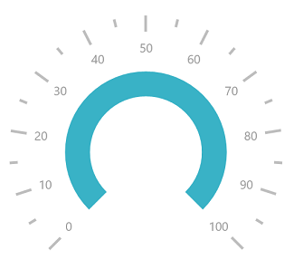

# Rim in UWP Radial Gauge (SfCircularGauge)

Scale determines the structure of a circular gauge by using a circular rim. By setting the [`StartAngle`](https://help.syncfusion.com/cr/uwp/Syncfusion.UI.Xaml.Gauges.CircularScale.html#Syncfusion_UI_Xaml_Gauges_CircularScale_StartAngle)  and [`SweepAngle`](https://help.syncfusion.com/cr/uwp/Syncfusion.UI.Xaml.Gauges.CircularScale.html#Syncfusion_UI_Xaml_Gauges_CircularScale_SweepAngle)  properties, you can change the shape of the circular gauge to a full-circular gauge, half-circular gauge, or quarter-circular gauge.

The [`StartValue`](https://help.syncfusion.com/cr/uwp/Syncfusion.UI.Xaml.Gauges.CircularScale.html#Syncfusion_UI_Xaml_Gauges_CircularScale_StartValue)  and [`EndValue`](https://help.syncfusion.com/cr/uwp/Syncfusion.UI.Xaml.Gauges.CircularScale.html#Syncfusion_UI_Xaml_Gauges_CircularScale_EndValue)  properties determine the overall range of the circular rim.





    <gauge:SfCircularGauge>

    <gauge:SfCircularGauge.Scales>

    <gauge:CircularScale  StartAngle="270" SweepAngle="360" StartValue="0" EndValue="360"

    Interval="20" MinorTicksPerInterval="0"

    Radius="150" RimStroke="#39B2C6" RimStrokeThickness="8"

    TickStroke="#BEBEBE" LabelStroke="#9E9E9E" SmallTickStroke="#BEBEBE" ShowFirstLabel="false">

    <gauge:CircularScale.Pointers>

    <gauge:CircularPointer NeedlePointerVisibility="Collapsed"/>

    </gauge:CircularScale.Pointers>

    </gauge:CircularScale>

    </gauge:SfCircularGauge.Scales>

    </gauge:SfCircularGauge>





SfCircularGauge sfCircularGauge = new SfCircularGauge();

CircularScale circularScale = new CircularScale();

circularScale.StartAngle = 270;

circularScale.SweepAngle = 360;

circularScale.StartValue = 0;

circularScale.EndValue = 360;

circularScale.Interval = 20;

circularScale.MinorTicksPerInterval = 0;

circularScale.Radius = 150;

circularScale.ShowFirstLabel = false;

circularScale.RimStroke = new SolidColorBrush(Color.FromArgb(0xff, 0x57, 0xb2, 0xc6));

circularScale.TickStroke = new SolidColorBrush(Color.FromArgb(0xff, 0xc1, 0xc1, 0xc1));

circularScale.SmallTickStroke = new SolidColorBrush(Color.FromArgb(0xff, 0xc1, 0xc1, 0xc1));

circularScale.RimStrokeThickness = 8;

circularScale.LabelStroke = new SolidColorBrush(Color.FromArgb(0xff, 0x99, 0x99, 0x99));

CircularPointer circularPointer = new CircularPointer();

circularPointer.NeedlePointerVisibility = Windows.UI.Xaml.Visibility.Collapsed;

circularScale.Pointers.Add(circularPointer);

sfCircularGauge.Scales.Add(circularScale);





## Rim customization

The color and thickness of the rim can be set by using the [`RimStroke`](https://help.syncfusion.com/cr/uwp/Syncfusion.UI.Xaml.Gauges.CircularScale.html#Syncfusion_UI_Xaml_Gauges_CircularScale_RimStroke)  and [`RimStrokeThickness`](https://help.syncfusion.com/cr/uwp/Syncfusion.UI.Xaml.Gauges.CircularScale.html#Syncfusion_UI_Xaml_Gauges_CircularScale_RimStrokeThickness)  properties.





    <gauge:SfCircularGauge>

    <gauge:SfCircularGauge.Scales>

    <gauge:CircularScale  RadiusFactor="1" RimStrokeThickness="40" RimStroke="SkyBlue"

    Radius="150" 

    TickStroke="#BEBEBE" LabelStroke="#9E9E9E" SmallTickStroke="#BEBEBE">

    <gauge:CircularScale.Pointers>

    <gauge:CircularPointer NeedlePointerVisibility="Collapsed"/>

    </gauge:CircularScale.Pointers>

    </gauge:CircularScale>

    </gauge:SfCircularGauge.Scales>

    </gauge:SfCircularGauge>





SfCircularGauge sfCircularGauge = new SfCircularGauge();

CircularScale circularScale = new CircularScale();

circularScale.RadiusFactor = 1;

circularScale.RimStrokeThickness = 40;

circularScale.RimStroke = new SolidColorBrush(Colors.SkyBlue);

circularScale.Radius = 150;

circularScale.TickStroke = new SolidColorBrush(Color.FromArgb(0xff, 0xc1, 0xc1, 0xc1));

circularScale.SmallTickStroke = new SolidColorBrush(Color.FromArgb(0xff, 0xc1, 0xc1, 0xc1));

circularScale.LabelStroke = new SolidColorBrush(Color.FromArgb(0xff, 0x99, 0x99, 0x99));

CircularPointer circularPointer = new CircularPointer();

circularPointer.NeedlePointerVisibility = Windows.UI.Xaml.Visibility.Collapsed;

circularScale.Pointers.Add(circularPointer);

sfCircularGauge.Scales.Add(circularScale);





## Setting position for rim

You can customize the position of [`Scales`](https://help.syncfusion.com/cr/uwp/Syncfusion.UI.Xaml.Gauges.SfCircularGauge.html#Syncfusion_UI_Xaml_Gauges_SfCircularGauge_Scales)  in the following two ways:

1.`RadiusFactor` property.

2.`Radius` property.

### Setting radius factor for rim

The value for [`RadiusFactor`](https://help.syncfusion.com/cr/uwp/Syncfusion.UI.Xaml.Gauges.CircularScale.html#Syncfusion_UI_Xaml_Gauges_CircularScale_RadiusFactor)  should be specified in offset value.





     <gauge:SfCircularGauge>

     <gauge:SfCircularGauge.Scales>

     <gauge:CircularScale   RadiusFactor="0.5" Radius="200"

     RimStroke="#39B2C6" RimStrokeThickness="30"

    TickStroke="#BEBEBE" LabelStroke="#9E9E9E" SmallTickStroke="#BEBEBE">

    <gauge:CircularScale.Pointers>

    <gauge:CircularPointer NeedlePointerVisibility="Collapsed"/>

    </gauge:CircularScale.Pointers>

    </gauge:CircularScale>

    </gauge:SfCircularGauge.Scales>

    </gauge:SfCircularGauge>





SfCircularGauge sfCircularGauge = new SfCircularGauge();

CircularScale circularScale = new CircularScale();

circularScale.RadiusFactor = 0.5;

circularScale.RimStrokeThickness = 30;

circularScale.Radius = 200;

circularScale.RimStroke = new SolidColorBrush(Color.FromArgb(0xff, 0x57, 0xb2, 0xc6));

circularScale.TickStroke = new SolidColorBrush(Color.FromArgb(0xff, 0xc1, 0xc1, 0xc1));

circularScale.SmallTickStroke = new SolidColorBrush(Color.FromArgb(0xff, 0xc1, 0xc1, 0xc1));

circularScale.LabelStroke = new SolidColorBrush(Color.FromArgb(0xff, 0x99, 0x99, 0x99));

CircularPointer circularPointer = new CircularPointer();

circularPointer.NeedlePointerVisibility = Windows.UI.Xaml.Visibility.Collapsed;

circularScale.Pointers.Add(circularPointer);

sfCircularGauge.Scales.Add(circularScale);





### Setting radius for rim

You can set the [`Radius`](https://help.syncfusion.com/cr/uwp/Syncfusion.UI.Xaml.Gauges.CircularScale.html#Syncfusion_UI_Xaml_Gauges_CircularScale_Radius)  of rim in pixel value.





    <gauge:SfCircularGauge>

    <gauge:SfCircularGauge.Scales>

    <gauge:CircularScale  Radius="100"

    RimStroke="#39B2C6" RimStrokeThickness="8"

    TickStroke="#BEBEBE" LabelStroke="#9E9E9E" SmallTickStroke="#BEBEBE">

    <gauge:CircularScale.Pointers>

    <gauge:CircularPointer NeedlePointerVisibility="Collapsed"/>

    </gauge:CircularScale.Pointers>

    </gauge:CircularScale>

    </gauge:SfCircularGauge.Scales>

    </gauge:SfCircularGauge>





SfCircularGauge sfCircularGauge = new SfCircularGauge();

CircularScale circularScale = new CircularScale();

circularScale.RimStrokeThickness = 8;

circularScale.Radius = 100;

circularScale.RimStroke = new SolidColorBrush(Color.FromArgb(0xff, 0x57, 0xb2, 0xc6));

circularScale.TickStroke = new SolidColorBrush(Color.FromArgb(0xff, 0xc1, 0xc1, 0xc1));

circularScale.SmallTickStroke = new SolidColorBrush(Color.FromArgb(0xff, 0xc1, 0xc1, 0xc1));

circularScale.LabelStroke = new SolidColorBrush(Color.FromArgb(0xff, 0x99, 0x99, 0x99));

CircularPointer circularPointer = new CircularPointer();

circularPointer.NeedlePointerVisibility = Windows.UI.Xaml.Visibility.Collapsed;

circularScale.Pointers.Add(circularPointer);

sfCircularGauge.Scales.Add(circularScale);





