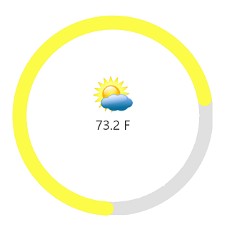

---

layout: post
title: Annotations in UWP Radial Gauge control | Syncfusion
description: Learn here all about Annotations support in Syncfusion UWP Radial Gauge (SfCircularGauge) control and more.
platform: uwp
control: SfCircularGauge
documentation: ug

---

# Annotations in UWP Radial Gauge (SfCircularGauge)

[`SfCircularGauge`](https://help.syncfusion.com/cr/uwp/Syncfusion.UI.Xaml.Gauges.SfCircularGauge.html) supports [`Annotations`](https://help.syncfusion.com/cr/uwp/Syncfusion.UI.Xaml.Gauges.SfCircularGauge.html#Syncfusion_UI_Xaml_Gauges_SfCircularGauge_Annotations), which allows you to mark the specific area of interest in circular gauge. You can place custom views as annotations. The text and images also can be added by using [`Annotations`](https://help.syncfusion.com/cr/uwp/Syncfusion.UI.Xaml.Gauges.SfCircularGauge.html#Syncfusion_UI_Xaml_Gauges_SfCircularGauge_Annotations) property.

##  Setting image annotation

Annotations provide options to add any image over the gauge control with respect to its offset position. You can add multiple images in single control.





    <Grid Background="{ThemeResource ApplicationPageBackgroundThemeBrush}">

    <Grid.Resources>

    <DataTemplate  x:Key="dataTemplate">

    <Image Source="weather.jpg" Height="60" Width="60"/>

    </DataTemplate>

    </Grid.Resources>

    <gauge:SfCircularGauge HeaderAlignment="Custom" GaugeHeaderPosition="0.46,0.5">

    <gauge:SfCircularGauge.Annotations>

    <gauge:GaugeAnnotation Angle="270" Offset="0.1" ContentTemplate="{StaticResource dataTemplate}">

    </gauge:GaugeAnnotation>

    </gauge:SfCircularGauge.Annotations>

    <gauge:SfCircularGauge.GaugeHeader>

    <TextBlock Text="73.2 F"

    Height="40" Width="120"

    FontSize="20" Foreground="#424242"/>

    </gauge:SfCircularGauge.GaugeHeader>

    <gauge:SfCircularGauge.Scales>

    <gauge:CircularScale Radius="150" RimStrokeThickness="20" RimStroke="#e0e0e0"

    StartAngle="90" SweepAngle="360"  StartValue="0" EndValue="100"

    Interval="10" RangePointerPosition="Custom" RangePointerOffset="0" >

    <gauge:CircularScale.Pointers>
                            
    <gauge:CircularPointer PointerType="RangePointer" Value="73.2" RangePointerStrokeThickness="20" RangeCap="Both"
    
    RangePointerStroke="#FCFB48"/>

    </gauge:CircularScale.Pointers>

    </gauge:CircularScale>

    </gauge:SfCircularGauge.Scales>

    </gauge:SfCircularGauge>

    </Grid>





           SfCircularGauge gauge = new SfCircularGauge();

            CircularScale scale = new CircularScale();

            scale.RimStrokeThickness = 20;

            scale.Radius = 150;

            scale.RimStroke = new SolidColorBrush(Color.FromArgb(0xff, 0xe0, 0xe0, 0xe0));

            scale.StartAngle = 90;

            scale.SweepAngle = 360;

            scale.StartValue = 0;

            scale.EndValue = 100;

            scale.Interval = 10;

            scale.RangePointerPosition = RangePointerPosition.Custom;

            scale.RangePointerOffset = 0;

            CircularPointer pointer = new CircularPointer();

            pointer.PointerType = PointerType.RangePointer;

            pointer.Value = 73.2;

            pointer.RangePointerStrokeThickness = 20;

            pointer.RangeCap = RangeCap.Both;

            pointer.RangePointerStroke = new SolidColorBrush(Color.FromArgb(0xff, 0xFC, 0xFB, 0x48));

            scale.Pointers.Add(pointer);

            gauge.HeaderAlignment = HeaderAlignment.Custom;

            gauge.GaugeHeaderPosition = new Point(0.46, 0.5);

            TextBlock textBlock = new TextBlock();

            textBlock.Text = "73.2 F";

            textBlock.Height = 40;

            textBlock.Width = 120;

            textBlock.FontSize = 20;

            textBlock.FontStyle = Windows.UI.Text.FontStyle.Normal;

            textBlock.Foreground = new SolidColorBrush(Color.FromArgb(0xff, 0x42, 0x42, 0x42));

            gauge.GaugeHeader = textBlock;

            GaugeAnnotation annotation = new GaugeAnnotation();

            var content = "<DataTemplate xmlns=\"http://schemas.microsoft.com/winfx/2006/xaml/presentation\">";

            content += "<Grid>";

            content += "<Image Height=\"60\" Width=\"60\" >";

            content += "<Image.Source>";

            content += "<BitmapImage UriSource = \"ms-appx:///" + "weather.jpg" + "\"/>";

            content += "</Image.Source>" + "</Image>" + "</Grid>";

            content += "</DataTemplate>";       

            annotation.ContentTemplate = (DataTemplate)XamlReader.Load(content);

            annotation.Angle = 270;

            annotation.Offset = 0.1;

            gauge.Annotations.Add(annotation);

            gauge.Scales.Add(scale);

            this.Content = gauge;





##  Setting text annotation

You can add any text over the gauge control to enhance the readability. You can add multiple text instances in single control.  





   <Grid Background="{ThemeResource ApplicationPageBackgroundThemeBrush}">

    <Grid.Resources>
           
    <DataTemplate  x:Key="dataTemplate">

    <Image Source="shot.jpg" Height="60" Width="60"/>

    </DataTemplate>
            
    </Grid.Resources>
       
    <gauge:SfCircularGauge HeaderAlignment="Custom" GaugeHeaderPosition="0.48,0.48">

    <gauge:SfCircularGauge.GaugeHeader>

    <TextBlock Text="13M" Height="40" Width="120" FontSize="20" Foreground="#0682F6"/>

    </gauge:SfCircularGauge.GaugeHeader>

    <gauge:SfCircularGauge.Scales>

    <gauge:CircularScale Radius="200" RangePointerOffset="0.2" SymbolPointerOffset="0.5"

    StartAngle="160" SweepAngle="270" StartValue="0" EndValue="15" >

    <gauge:CircularScale.Pointers>

    <gauge:CircularPointer PointerType="RangePointer" RangeStart="1.5" Value="13" 
                        
    RangePointerStrokeThickness="30" RangeCap="End" RangePointerStroke="#0682F6"/>

    <gauge:CircularPointer PointerType="SymbolPointer" SymbolPointerWidth="60" 
                        
    SymbolPointerHeight="60" Value="0" SymbolPointerTemplate="{StaticResource dataTemplate}" Symbol="Custom">

    </gauge:CircularPointer>
                        
    <gauge:CircularPointer PointerType="SymbolPointer" Symbol="Ellipse" SymbolPointerWidth="40" 
                        
    SymbolPointerHeight="40" SymbolPointerBorderBrush="#9e9e9e" SymbolPointerStroke="#9e9e9e"

    Value="13" />

    </gauge:CircularScale.Pointers>

    </gauge:CircularScale>

    </gauge:SfCircularGauge.Scales>

    </gauge:SfCircularGauge>

    </Grid>





            SfCircularGauge gauge = new SfCircularGauge();

            CircularScale scale = new CircularScale();

            scale.Radius = 200;

            scale.StartAngle = 160;

            scale.SweepAngle = 270;

            scale.StartValue = 0;

            scale.EndValue = 15;
           
            scale.RangePointerOffset = 0.2;

            scale.SymbolPointerOffset = 0.5;
           
            CircularPointer rangePointer = new CircularPointer();

            rangePointer.PointerType = PointerType.RangePointer;

            rangePointer.RangeStart = 1.5;

            rangePointer.RangePointerStroke = new SolidColorBrush(Color.FromArgb(0xff, 0x06, 0x82, 0xF6));
            
            rangePointer.Value = 13;

            rangePointer.RangeCap = RangeCap.End;

            rangePointer.RangePointerStrokeThickness = 30;

            scale.Pointers.Add(rangePointer);
         
            gauge.HeaderAlignment = HeaderAlignment.Custom;

            gauge.GaugeHeaderPosition = new Point(0.48, 0.48);

            TextBlock textBlock = new TextBlock();

            textBlock.Text = "13M";

            textBlock.Height = 40;

            textBlock.Width = 120;

            textBlock.FontSize = 20;

            textBlock.FontStyle = Windows.UI.Text.FontStyle.Normal;

            textBlock.Foreground = new SolidColorBrush(Color.FromArgb(0xff,0x06,0x82,0xF6));

            gauge.GaugeHeader = textBlock;

            CircularPointer pointer1 = new CircularPointer();

            pointer1.PointerType = PointerType.SymbolPointer;
           
            var content = "<DataTemplate xmlns=\"http://schemas.microsoft.com/winfx/2006/xaml/presentation\">";

            content += "<Grid>";

            content += "<Image Height=\"{Binding SymbolPointerHeight}\" Width=\"{Binding SymbolPointerWidth}\" >";

            content += "<Image.Source>";

            content += "<BitmapImage UriSource = \"ms-appx:///" + "shot.jpg" + "\"/>";

            content += "</Image.Source>" + "</Image>" + "</Grid>";

            content += "</DataTemplate>";

            pointer1.SymbolPointerTemplate = (DataTemplate)XamlReader.Load(content);

            pointer1.Symbol = Syncfusion.UI.Xaml.Gauges.Symbol.Custom;

            pointer1.SymbolPointerWidth = 60;

            pointer1.SymbolPointerHeight = 60;

            pointer1.Value = 0;
      
            scale.Pointers.Add(pointer1);

            CircularPointer pointer2 = new CircularPointer();

            pointer2.PointerType = PointerType.SymbolPointer;

            pointer2.Symbol = Syncfusion.UI.Xaml.Gauges.Symbol.Ellipse;

            pointer2.SymbolPointerWidth = 30;

            pointer2.SymbolPointerHeight = 30;

            pointer2.SymbolPointerBorderBrush = new SolidColorBrush(Color.FromArgb(0xff, 0x9e, 0x9e, 0x9e));

            pointer2.SymbolPointerStroke = new SolidColorBrush(Color.FromArgb(0xff, 0x9e, 0x9e, 0x9e));

            pointer2.Value = 13; 

            scale.Pointers.Add(pointer2);

            gauge.Scales.Add(scale);

            this.Content = gauge;





