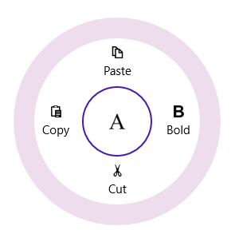
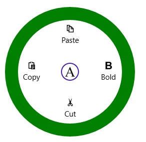

# Appearance and Styling in UWP Radial Menu (SfRadialMenu)

## Radius 

RadiusX and RadiusY properties in the SfRadialMenu can be used to define the X and Y axis radius to render the control. 





<navigation:SfRadialMenu x:Name="radialMenu" RadiusX="150" RadiusY="150" />









 radialMenu.RadiusX = 150;
 radialMenu.RadiusY = 150;
 




radialMenu.RadiusX = 150
radialMenu.RadiusY = 150
 




## CenterRimRadiusFactor

CenterRimRadiusFactor property can be used to define the radius of the center rim (inner circle). 





<navigation:SfRadialMenu x:Name="radialMenu"  CenterRimRadiusFactor="0.3" IsOpen="True" />









 radialMenu.CenterRimRadiusFactor = 0.3;
 




radialMenu.CenterRimRadiusFactor = 0.3
 




## RimBackground

RimBackground property used to fill the outer rim (outer circle).





<navigation:SfRadialMenu x:Name="radialMenu"  IsOpen="True" RimBackground="Green" />









 radialMenu.RimBackground = new SolidColorBrush(Colors.Green);
 




radialMenu.RimBackground = New SolidColorBrush(Colors.Green)





## RimActiveBrush

RimActiveBrush property used to fill the expander rim and this expander rim only visible when the items have sub items.   





<navigation:SfRadialMenu x:Name="radialMenu" RimActiveBrush="Red" RimBackground="Green" IsOpen="True" />









 radialMenu.RimActiveBrush = new SolidColorBrush(Colors.Red);
 




radialMenu.RimActiveBrush = New SolidColorBrush(Colors.Red)





## RimRadiusFactor

RimRadiusFactor property of SfRadialMenu can be used to set the radius of the items panel. Lowest values to this factor increases the thickness of the outer rim. Highest values to this factor decreases the thickness of the outer rim. 





<navigation:SfRadialMenu x:Name="radialMenu" RimActiveBrush="Red" RimRadiusFactor="0.7" RimBackground="Green"   IsOpen="True" />









 radialMenu.RimRadiusFactor = 0.7 ;
 




radialMenu.RimRadiusFactor = 0.7 





## Navigation Button Style

The navigation button displayed in the center of SfRadialMenu can be styled using NavigationButtonStyle property. 





<syncfusion:SfRadialMenu NavigationButtonStyle="{StaticResource NavigationButtonStyle}"

IsOpen="True" />





## Editing SubMenu Items Programmatically

With the DrillDownItem property, you can access and edit submenu items of SfRadialMenu at various hierarchy levels programmatically. The following code example and screen shot illustrate this.



<Page xmlns:navigation="using:Syncfusion.UI.Xaml.Controls.Navigation">

     <Grid Background="{StaticResource ApplicationPageBackgroundThemeBrush}">

<navigation:SfRadialMenu  x:Name="radialmenu">

<navigation:SfRadialMenuItem Header="Edit" x:Name="edit">

<navigation:SfRadialMenuItem Header="Cut"/>

<navigation:SfRadialMenuItem Header="Copy"/>

<navigation:SfRadialMenuItem Header="Paste"/>

</navigation:SfRadialMenuItem>

<navigation:SfRadialMenuItem Header="Bold"/>

<navigation:SfRadialMenuItem Header="Italics"/>

<navigation:SfRadialMenuItem Header="Underline"/>

</navigation:SfRadialMenu>

     </Grid>

</Page>









radialMenu.DrillDownItem = edit;





radialMenu.DrillDownItem = edit





