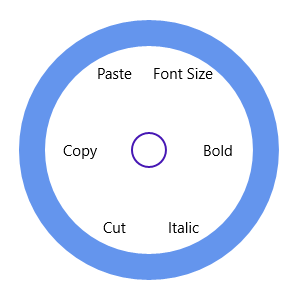

# Checkable Items in UWP Radial Menu (SfRadialMenu)

SfRadialMenu items can be checked.  

## Check Mode

The CheckMode property for a radial menu item includes the following options: 

* None: If the CheckMode is set to None, then that item can’t be checked. 
* CheckBox: If the CheckMode is set to CheckBox, then more than one item in the same level can be in checkable state. 
* RadioButton: If the CheckMode is set to RadioButton, then only one item can be checked in the same level. 

## Group Name

The GroupName property of the SfRadialMenu item can be used to group the items in the same level. This property is useful when the CheckMode property of those items is set to RadioButton. 

### IsChecked

IsChecked property of SfRadialMenu item can be used to get or set the checked state of an item. 





<navigation:SfRadialMenu IsOpen="True" RimBackground="CornflowerBlue">

 	<navigation:SfRadialMenuItem  CheckMode="CheckBox" Header="Bold" />

       <navigation:SfRadialMenuItem  CheckMode="CheckBox" Header="Italic" />

       <navigation:SfRadialMenuItem  CheckMode="RadioButton" GroupName="Clipboard" 						   Header="Cut" />

       <navigation:SfRadialMenuItem  CheckMode="RadioButton" GroupName="Clipboard" 						   Header="Copy" />

       <navigation:SfRadialMenuItem  CheckMode="RadioButton" GroupName="Clipboard" 						   Header="Paste" />

       <navigation:SfRadialMenuItem  CheckMode="None" Header="Font Size" />

</navigation:SfRadialMenu>









SfRadialMenu radialMenu = new SfRadialMenu() { IsOpen = true, RimBackground = new SolidColorBrush(Colors.CornflowerBlue) };

SfRadialMenuItem radialMenuItem1 = new SfRadialMenuItem() { CheckMode=CheckMode.CheckBox, Header="Bold" };

SfRadialMenuItem radialMenuItem2 = new SfRadialMenuItem() { CheckMode = CheckMode.CheckBox, Header = "Italic" };

SfRadialMenuItem radialMenuItem3 = new SfRadialMenuItem() { CheckMode = CheckMode.RadioButton, Header = "Cut", GroupName = "Clipboard" };

SfRadialMenuItem radialMenuItem4 = new SfRadialMenuItem() { CheckMode = CheckMode.RadioButton, Header = "Copy", GroupName = "Clipboard" };

SfRadialMenuItem radialMenuItem5 = new SfRadialMenuItem() { CheckMode = CheckMode.RadioButton, Header = "Paste", GroupName = "Clipboard" };

SfRadialMenuItem radialMenuItem6 = new SfRadialMenuItem() { CheckMode = CheckMode.None, Header = "Font Size" };

radialMenu.Items.Add(radialMenuItem1);

radialMenu.Items.Add(radialMenuItem2);

radialMenu.Items.Add(radialMenuItem3);

radialMenu.Items.Add(radialMenuItem4);

radialMenu.Items.Add(radialMenuItem5);

radialMenu.Items.Add(radialMenuItem6);





Dim radialMenu As New SfRadialMenu() With {
	.IsOpen = True,
	.RimBackground = New SolidColorBrush(Colors.CornflowerBlue)
}

Dim radialMenuItem1 As New SfRadialMenuItem() With {
	.CheckMode=CheckMode.CheckBox,
	.Header="Bold"
}

Dim radialMenuItem2 As New SfRadialMenuItem() With {
	.CheckMode = CheckMode.CheckBox,
	.Header = "Italic"
}

Dim radialMenuItem3 As New SfRadialMenuItem() With {
	.CheckMode = CheckMode.RadioButton,
	.Header = "Cut",
	.GroupName = "Clipboard"
}

Dim radialMenuItem4 As New SfRadialMenuItem() With {
	.CheckMode = CheckMode.RadioButton,
	.Header = "Copy",
	.GroupName = "Clipboard"
}

Dim radialMenuItem5 As New SfRadialMenuItem() With {
	.CheckMode = CheckMode.RadioButton,
	.Header = "Paste",
	.GroupName = "Clipboard"
}

Dim radialMenuItem6 As New SfRadialMenuItem() With {
	.CheckMode = CheckMode.None,
	.Header = "Font Size"
}

radialMenu.Items.Add(radialMenuItem1)

radialMenu.Items.Add(radialMenuItem2)

radialMenu.Items.Add(radialMenuItem3)

radialMenu.Items.Add(radialMenuItem4)

radialMenu.Items.Add(radialMenuItem5)

radialMenu.Items.Add(radialMenuItem6)





