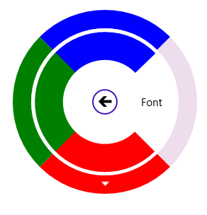

# Populating Color Palette in UWP Radial Menu (SfRadialMenu)

Color Palette can be formed in SfRadialMenu with the Radial Color Items. 





<navigation:SfRadialMenu IsOpen="True" >

    <navigation:SfRadialMenuItem Header="Font Color">

       <navigation:SfRadialMenuItem Header="Font"/>

       <navigation:SfRadialColorItem Color="Red">

           <navigation:SfRadialColorItem Color="DarkRed"/>

           <navigation:SfRadialColorItem Color="IndianRed"/>

           <navigation:SfRadialColorItem Color="OrangeRed"/>

           <navigation:SfRadialColorItem Color="MediumVioletRed"/>

       </navigation:SfRadialColorItem>

       <navigation:SfRadialColorItem Color="Green"/>

       <navigation:SfRadialColorItem Color="Blue"/>

     </navigation:SfRadialMenuItem>

</navigation:SfRadialMenu>









 SfRadialMenu radialMenu = new SfRadialMenu() { IsOpen = true };

 SfRadialMenuItem radialMenuItem = new SfRadialMenuItem() { Header = "Font Color" };

 SfRadialMenuItem radialMenuItem1 = new SfRadialMenuItem() { Header = "Font" };
           

 SfRadialColorItem radialColor1 = new SfRadialColorItem() { Color = Colors.Red };

 SfRadialColorItem radialColor11 = new SfRadialColorItem() { Color = Colors.DarkRed };
 SfRadialColorItem radialColor12 = new SfRadialColorItem() { Color = Colors.IndianRed };
 SfRadialColorItem radialColor13 = new SfRadialColorItem() { Color = Colors.OrangeRed };
 SfRadialColorItem radialColor14 = new SfRadialColorItem() { Color = Colors.MediumVioletRed };

 SfRadialColorItem radialColor2 = new SfRadialColorItem() { Color = Colors.Green };
 SfRadialColorItem radialColor3 = new SfRadialColorItem() { Color = Colors.Blue };

 radialColor1.Items.Add(radialColor11);
 radialColor1.Items.Add(radialColor12);
 radialColor1.Items.Add(radialColor13);
 radialColor1.Items.Add(radialColor14);

 radialMenuItem.Items.Add(radialMenuItem1);

 radialMenuItem.Items.Add(radialColor1);

 radialMenuItem.Items.Add(radialColor2);

 radialMenuItem.Items.Add(radialColor3);
           

 radialMenu.Items.Add(radialMenuItem);
 




Dim radialMenu As New SfRadialMenu() With {.IsOpen = True}

 Dim radialMenuItem As New SfRadialMenuItem() With {.Header = "Font Color"}

 Dim radialMenuItem1 As New SfRadialMenuItem() With {.Header = "Font"}

 Dim radialColor1 As New SfRadialColorItem() With {.Color = Colors.Red}

 Dim radialColor11 As New SfRadialColorItem() With {.Color = Colors.DarkRed}
 Dim radialColor12 As New SfRadialColorItem() With {.Color = Colors.IndianRed}
 Dim radialColor13 As New SfRadialColorItem() With {.Color = Colors.OrangeRed}
 Dim radialColor14 As New SfRadialColorItem() With {.Color = Colors.MediumVioletRed}

 Dim radialColor2 As New SfRadialColorItem() With {.Color = Colors.Green}
 Dim radialColor3 As New SfRadialColorItem() With {.Color = Colors.Blue}

 radialColor1.Items.Add(radialColor11)
 radialColor1.Items.Add(radialColor12)
 radialColor1.Items.Add(radialColor13)
 radialColor1.Items.Add(radialColor14)

 radialMenuItem.Items.Add(radialMenuItem1)

 radialMenuItem.Items.Add(radialColor1)

 radialMenuItem.Items.Add(radialColor2)

 radialMenuItem.Items.Add(radialColor3)

 radialMenu.Items.Add(radialMenuItem)





