# Appearance and Styling in UWP Radial Slider (SfRadialSlider)

## Inner Rim 

Inner Rim term denotes the circle in the center of SfRadialSlider.  Following properties can be used to customize the Inner Rim. 

### Inner Rim Radius Factor

InnerRimRadiusFactor property decides the radius of Inner Rim from the total radius available to render the Radial Slider.

### Inner Rim Stroke

InnerRimStroke property can be used to set the stroke color of the Inner Rim. 

### Inner Rim Stroke Thickness

InnerRimStrokeThickness property can be used to set the thickness of the Inner Rim.

### Inner Rim Fill

InnerRimFill property can be used the set the fill color of the Inner Rim. 





  <syncfusion:SfRadialSlider

InnerRimFill="LightGray" x:Name="radialSlider"

            InnerRimRadiusFactor="0.25"

            InnerRimStroke="LightSkyBlue"

            InnerRimStrokeThickness="4" />









radialSlider.InnerRimRadiusFactor = 0.25;
radialSlider.InnerRimStroke = new SolidColorBrush(Colors.SkyBlue);
radialSlider.InnerRimStrokeThickness = 4;





radialSlider.InnerRimRadiusFactor = 0.25
radialSlider.InnerRimStroke = New SolidColorBrush(Colors.SkyBlue)
radialSlider.InnerRimStrokeThickness = 4





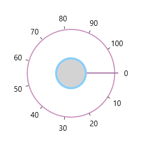

## Outer Rim 

Outer Rim term denotes circular track (outer circle) of SfRadialSlider.  Following properties can be used to customize the Inner Rim

### Outer Rim Radius Factor

OuterRimRadiusFactor property decides the radius of Outer Rim from the total radius available to render the SfRadialSlider. 

### Outer Rim Stroke 

OuterRimStroke property can be used to set the stroke color of the Outer Rim. 

### Outer Rim Stroke Thickness 

OuterRimStrokeThickness property can be used to set the thickness of the Outer Rim. 

### Background

Background property can be used to fill the Outer Rim.





<syncfusion:SfRadialSlider x:Name="radialSlider"

            Background="LightGray"

            OuterRimRadiusFactor="0.8"

            OuterRimStroke="LightSkyBlue"

            OuterRimStrokeThickness="4" />









radialSlider.OuterRimRadiusFactor = 0.8;
radialSlider.OuterRimStroke = new SolidColorBrush(Colors.SkyBlue);
radialSlider.OuterRimStrokeThickness = 4;





 radialSlider.OuterRimRadiusFactor = 0.8
 radialSlider.OuterRimStroke = New SolidColorBrush(Colors.SkyBlue)
 radialSlider.OuterRimStrokeThickness = 4





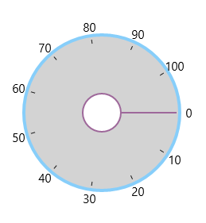

## Ticks

Ticks displayed along the circular path can be customized using the following properties. 

### Tick Template

Ticks can be customized using the TickTemplate property. 



<syncfusion:SfRadialSlider>

            <syncfusion:SfRadialSlider.TickTemplate>

                <DataTemplate>

                    <Border Background="Red"></Border>

                </DataTemplate>

            </syncfusion:SfRadialSlider.TickTemplate>

 </syncfusion:SfRadialSlider>



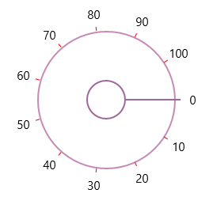

### Tick Radius Factor

TickRadiusFactor property decides the radius of the ticks from the total radius available to render the SfRadialSlider. 





<syncfusion:SfRadialSlider x:Name="radialSlider"  TickRadiusFactor="0.75"  />









radialSlider.TickRadiusFactor = 0.25;





radialSlider.TickRadiusFactor = 0.25





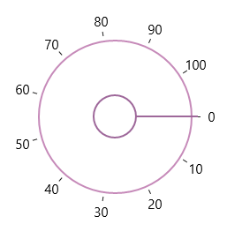

### Tick Visibility

Visibility of ticks can be controlled by TickVisibility property. 





<syncfusion:SfRadialSlider x:Name="radialSlider" TickVisibility="Collapsed" />









radialSlider.TickVisibility = Visibility.Collapsed;





radialSlider.TickVisibility = Visibility.Collapsed





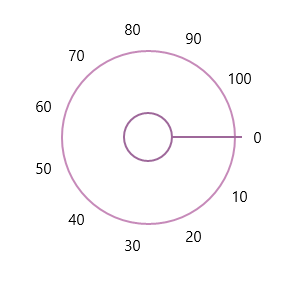

## Labels

Labels displayed along the circular path in the Radial slider can be customized by the following properties. 

### Label Template

The LabelTemplate property can be used to customize the label object. 



<syncfusion:SfRadialSlider>

<syncfusion:SfRadialSlider.LabelTemplate>

           <DataTemplate>

               <TextBlock Text="{Binding}" Foreground="DodgerBlue"></TextBlock>

           </DataTemplate>

       </syncfusion:SfRadialSlider.LabelTemplate>

</syncfusion:SfRadialSlider>



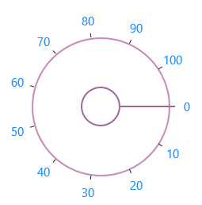

### Label Radius Factor

LabelRadiusFactor property decides the radius of the labels from the total radius available to render the SfRadialSlider. 

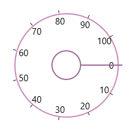





<syncfusion:SfRadialSlider x:Name="radialSlider" LabelRadiusFactor="0.7" />









 radialSlider.LabelRadiusFactor = 0.7;





 radialSlider.LabelRadiusFactor = 0.7





### Label Visibility

Visibility of ticks can be controlled by LabelVisibility property. 





<syncfusion:SfRadialSlider x:Name="radialSlider"  LabelVisibility="Collapsed" />









  radialSlider.LabelVisibility = Visibility.Collapsed;





  radialSlider.LabelVisibility = Visibility.Collapsed





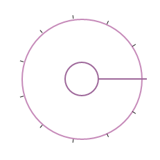

## Pointer
The Pointer that is used for the select the value by dragging in circular track can be customized with the following properties. 

### Pointer Radius Factor

The PointerRadiusFactor property decides the radius of the Pointer from the total radius available to render the SfRadialSlider. 





<syncfusion:SfRadialSlider x:Name="radialSlider"  PointerRadiusFactor="0.5" />









   radialSlider.PointerRadiusFactor = 0.5;





  radialSlider.PointerRadiusFactor = 0.5





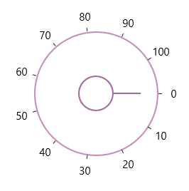

### Pointer Style

Style of the Pointer can be customized using the PointerStyle property. 



<syncfusion:SfRadialSlider>

<syncfusion:SfRadialSlider.PointerStyle>

                

            </syncfusion:SfRadialSlider.PointerStyle>

</syncfusion:SfRadialSlider>



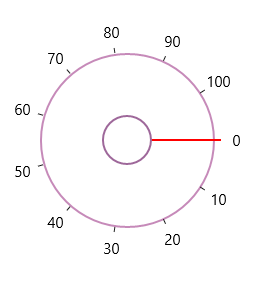

### Preview Pointer Style

The Preview Pointer that appears when hovering over the SfRadialSlider can be customized using the PreviewPointerStyle property. 



<syncfusion:SfRadialSlider

            Minimum="0" 

            Maximum="100"  >

            <syncfusion:SfRadialSlider.PreviewPointerStyle>

                

            </syncfusion:SfRadialSlider.PreviewPointerStyle>

</syncfusion:SfRadialSlider>



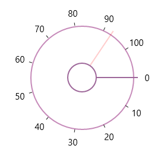

