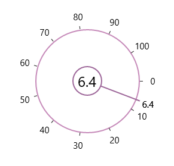

# Content in UWP Radial Slider (SfRadialSlider)

The Content property can be used to place any content inside the Inner Rim. 



<syncfusion:SfRadialSlider x:Name="rSlider1">

    <TextBlock Text="{Binding ElementName=rSlider1,Path=Value}" FontSize="24"/>

</syncfusion:SfRadialSlider>



