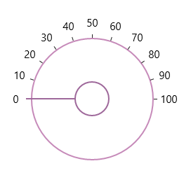

# End Angle in UWP Radial Slider (SfRadialSlider)

The EndAngle property can be used to set the ending position for the ticks in the circular track. 





<syncfusion:SfRadialSlider  x:Name="radialSlider" StartAngle="180" EndAngle="360" />









 radialSlider.StartAngle = 180;

 radialSlider.EndAngle = 360;





radialSlider.StartAngle = 180

radialSlider.EndAngle = 360





