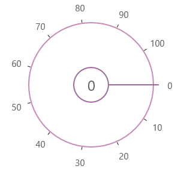

# About Syncfusion® UWP Radial Slider (SfRadialSlider) Control

The SfRadialSlider provides an optimized interface for selecting a numeric value using touch interface.

## Key Features

* Customization – Can customize outer rim, inner rim, labels, ticks, pointer. 
* Content – Can place content inside the inner rim. 
