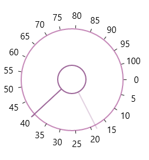
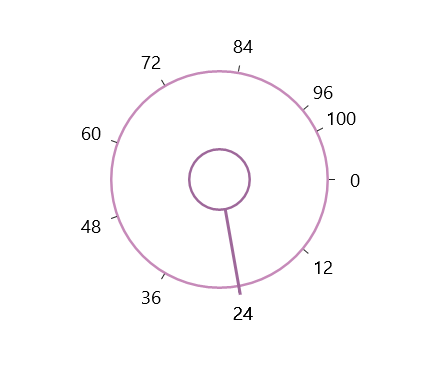

# Ticks in UWP Radial Slider (SfRadialSlider)

Ticks are placed along the round track in a uniform manner. The position of tick marks can be customized.

## Tick Frequency

The Tick Frequency property is used to define the number of ticks along the track, based on Minimum and Maximum values.





<syncfusion:SfRadialSlider Minimum="0" Maximum="100"  x:Name="radialSlider"

TickFrequency="5" />









radialSlider.TickFrequency = 5;





radialSlider.TickFrequency = 5





## Displaying Maximum Value

Maximum Value of SfRadialSlider can be displayed even the difference between Maximum and Minimum value of SfRadialSlider is not divisible by TickFrequency. This behavior can be enabled by setting the ShowMaximumValue property of SfRadialSlider to true.





<navigation:SfRadialSlider x:Name="sfradialslider" Maximum="100" 
                                   TickFrequency="12" ShowMaximumValue="true"/>





SfRadialSlider radialSlider = new SfRadialSlider() { Maximum = 100, TickFrequency = 12, ShowMaximumValue = true };





Dim radialSlider As New SfRadialSlider() With { _
	Key .Maximum = 100, _
	Key .TickFrequency = 12, _
	Key .ShowMaximumValue = True _
}





