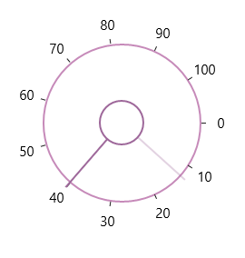

# Value in UWP Radial Slider (SfRadialSlider)

Gets or sets the value of the SfRadialSlider.





<syncfusion:SfRadialSlider x:Name="radialSlider"

            Minimum="0"  Maximum="100" Value="40" />









radialSlider.Value = 40;





radialSlider.Value = 40





The value can be changed by dragging the pointer along the circular track. 

