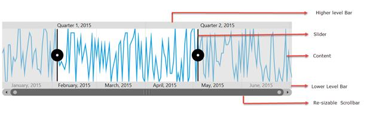
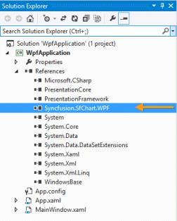
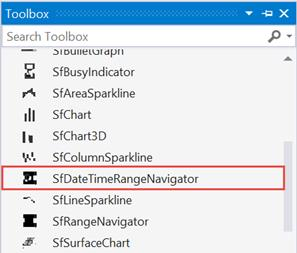
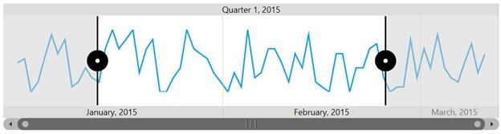

# Getting Started with UWP Range Selector (SfDateTimeRangeNavigator)

## Visual Structure 

A SfDateTimeRangeNavigator is composed of various elements such as higher level bar, lower level bar, content, resizable scrollbar.

* Higher level bar - Contains timespan format one level higher than the lower level bar DateTime values. E.g.  If higher level bar contains year format (yyyy) then the lower level bar contains the month format (MMM).
* Lower level bar – Contains timespan format one lever lower than higher level bar DateTime values. E.g. If lower level bar contains month format (MMM) then the higher level bar contains the year format (yyyy).
* Content – Can hold any type of UI element inside the navigator.
* Resizable scrollbar – Used to zoom and scroll the content and label bars.

These steps were explained below for both XAML and code behind.

## Create a SfDateTimeRangeNavigator from XAML

The following steps explain how to create a SfDateTimeRangeNavigator in XAML.

### Adding the assembly reference

1. Open the Add Reference window from your project.
2. Choose Windows > Extensions > SyncfusionControls for UWP XAML.

Add the following namespace in your XAML window.


xmlns:syncfusion="using:Syncfusion.UI.Xaml.Charts"


### Add SfDateTimeRangeNavigator from Toolbox

Drag and drop the SfDateTimeRangeNavigator control from the Toolbox to your application.

### Initializing SfDateTimeRangeNavigator



<chart:SfDateTimeRangeNavigator>

</chart:SfDateTimeRangeNavigator>



### Creating a Data Source



public class Model

{

public DateTime Date { get; set; }

public double High { get; set; }

public double Low { get; set; }

public double Open { get; set; }

public double Close { get; set; }

}

public class ViewModel

{

public ViewModel()

{

this.StockPriceDetails = new ObservableCollection<Model>();

DateTime date = new DateTime(2015, 1, 1);

Random rd = new Random();

for (int i = 0; i < 70; i++)

{

this.StockPriceDetails.Add(new Model() { Date = date.AddDays(i), 

Open = rd.Next(870, 875), High = rd.Next(876, 890),

Low = rd.Next(850, 855), Close = rd.Next(856, 860) });

}

}

public ObservableCollection<Model> StockPriceDetails { get; set; }     

}



### Setting ItemsSource for SfDateTimeRangeNavigator

Since initializing will produce an empty SfDateTimeRangeNavigator, we need to set the ItemsSource and XBindingPath for the SfDateTimeRangeNavigator. The ItemsSource must implement the IEnumerable interface.

Defining the ItemsSource for Range Navigator in XAML.





<chart:SfDateTimeRangeNavigator x:Name="RangeNavigator" 

ItemsSource="{Binding StockPriceDetails}"                                           

XBindingPath="Date">                                 

</chart:SfDateTimeRangeNavigator>                                            





SfDateTimeRangeNavigator rangeNavigator = new SfDateTimeRangeNavigator()
{

        ItemsSource = new ViewModel().StockPriceDetails,

        XBindingPath ="Date"

};





### Adding Content

Content which needs to be displayed inside a SfDateTimeRangeNavigator can be of any control. Here SfLineSparkline control has been added.

The following properties are used to add content.

* [`ItemsSource`](https://help.syncfusion.com/cr/uwp/Syncfusion.UI.Xaml.Charts.SfDateTimeRangeNavigator.html#Syncfusion_UI_Xaml_Charts_SfDateTimeRangeNavigator_ItemsSource) - Gets or sets an IEnumerable source used to render range.
* [`XBindingPath`](https://help.syncfusion.com/cr/uwp/Syncfusion.UI.Xaml.Charts.SfDateTimeRangeNavigator.html#Syncfusion_UI_Xaml_Charts_SfDateTimeRangeNavigator_XBindingPath) - Gets or sets the property path of the x data in ItemsSource.
* [`Content`](https://help.syncfusion.com/cr/uwp/Syncfusion.UI.Xaml.Charts.SfRangeNavigator.html#Syncfusion_UI_Xaml_Charts_SfRangeNavigator_Content) - Gets or sets the content that needs to be hosted inside the Navigator, the content can be any UI element.





<chart:SfDateTimeRangeNavigator x:Name="RangeNavigator" 

ItemsSource="{Binding StockPriceDetails}"                                           

XBindingPath="Date">                                

<chart:SfDateTimeRangeNavigator.Content >

<chart:SfLineSparkline ItemsSource="{Binding StockPriceDetails}" 

Margin="20"   YBindingPath="High" >

</chart:SfLineSparkline>

</chart:SfDateTimeRangeNavigator.Content>

</chart:SfDateTimeRangeNavigator>





SfLineSparkline sparkline = new SfLineSparkline()
{
    ItemsSource = new ViewModel().StockPriceDetails,

    XBindingPath = "Date",

    YBindingPath = "High"

};

SfDateTimeRangeNavigator rangeNavigator = new SfDateTimeRangeNavigator()
{

    ItemsSource = new ViewModel().StockPriceDetails,

    XBindingPath ="Date"

};

rangeNavigator.Content = sparkline;





The following output is displayed as a result of the above code example.

## Create a SfDateTimeRangeNavigator from Code Behind

The following steps explain how to create a SfDateTimeRangeNavigator from code behind.

### Adding the assembly reference

1. Open the Add Reference window from your project.
2. Choose Windows > Extensions > SyncfusionControls for UWP XAML.
3. Add the following namespace in code behind



using Syncfusion.UI.Xaml.Charts;



### Initializing SfDateTimeRangeNavigator



SfDateTimeRangeNavigator navigator = new SfDateTimeRangeNavigator();



### Creating a  Data Source



public class Model

{

public DateTime Date { get; set; }

public double High { get; set; }

public double Low { get; set; }

public double Open { get; set; }

public double Close { get; set; }

}

public class ViewModel

{

public ViewModel()

{

this.StockPriceDetails = new ObservableCollection<Model>();

DateTime date = new DateTime(2015, 1, 1);

Random rd = new Random();

for (int i = 0; i < 70; i++)

{

this.StockPriceDetails.Add(new Model() { Date = date.AddDays(i), 

Open = rd.Next(870, 875), High = rd.Next(876, 890),

Low = rd.Next(850, 855), Close = rd.Next(856, 860) });

}

}

public ObservableCollection<Model> StockPriceDetails { get; set; }     

}



### Applying ItemsSource to Range Navigator



ViewModel viewModel = new ViewModel();

SfDateTimeRangeNavigator navigator = new SfDateTimeRangeNavigator();   

navigator.ItemsSource = viewModel.StockPriceDetails;

navigator.XBindingPath = "Date";



### Adding Content

Add the content that needs to be displayed inside SfDateTimeRangeNavigator using the Content property.



SfLineSparkline sparkline = new SfLineSparkline();

sparkline.ItemsSource = viewModel.StockPriceDetails;

sparkline.XBindingPath = "Date";

sparkline.YBindingPath = "High";      

SfDateTimeRangeNavigator navigator = new SfDateTimeRangeNavigator();                                                                  

navigator.ItemsSource = viewModel.StockPriceDetails;

navigator.XBindingPath = "Date";

navigator.Content = sparkline;           

this.MainGrid.Children.Add(navigator);



The following output is displayed as a result of the above code example.

