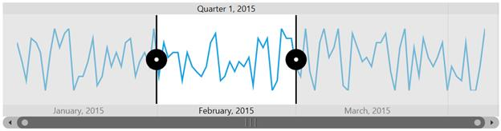
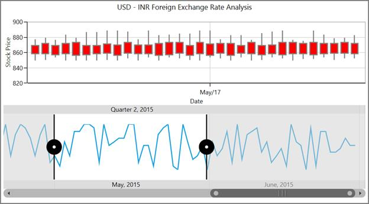
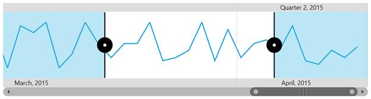

# Interactivity in UWP Range Selector (SfDateTimeRangeNavigator)

The SfDateTimeRangeNavigator helps the user to visualize large data in a simplified manner. The timespan of the data is represented in the higher level bar and lower level bar. The timespan in default is calculated smartly and provide suitable DateTime format and Interval for the given data. It can hold any type of UI element inside the Navigator.

The following properties are used while selecting the range of data from the SfDateTimeRangeNavigator.

* [`ViewRangeStart`](https://help.syncfusion.com/cr/uwp/Syncfusion.UI.Xaml.Charts.SfRangeNavigator.html#Syncfusion_UI_Xaml_Charts_SfRangeNavigator_ViewRangeStart)- Gets or sets Navigator's Start Thumb value, Value can be DateTime if Minimum and Maximum are set as DateTime values.
* [`ViewRangeEnd`](https://help.syncfusion.com/cr/uwp/Syncfusion.UI.Xaml.Charts.SfRangeNavigator.html#Syncfusion_UI_Xaml_Charts_SfRangeNavigator_ViewRangeEnd)- Gets or sets Navigator's End Thumb value, Value can be DateTime if Minimum and Maximum are set as DateTime values.





<chart:SfDateTimeRangeNavigator x:Name="RangeNavigator" 

Width="700" Height="179" 

ViewRangeStart="February,2015" 

ViewRangeEnd="March,2015"

XBindingPath="Date" 

ItemsSource="{Binding StockPriceDetails}">

</chart:SfDateTimeRangeNavigator>                             





SfDateTimeRangeNavigator rangeNavigator = new SfDateTimeRangeNavigator()
{

    ItemsSource = new ViewModel().StockPriceDetails,

    XBindingPath = "Date",

    ViewRangeStart = new DateTime(2015,02,01),

    ViewRangeEnd = new DateTime(2015, 03, 01)

};





## Region Selection

In two ways the selected region of the SfDateTimeRangeNavigator can be viewed in the chart.

1. By using ZoomFactor and ZoomPosition.
2. By binding the SelectedData.

Both the ways produce the same result.

* [`ZoomPosition`](https://help.syncfusion.com/cr/uwp/Syncfusion.UI.Xaml.Charts.SfRangeNavigator.html#Syncfusion_UI_Xaml_Charts_SfRangeNavigator_ZoomPosition)- Gets or sets zoom position. Value must fall within 0 to 1. It determines starting value of visible range.
* [`ZoomFactor`](https://help.syncfusion.com/cr/uwp/Syncfusion.UI.Xaml.Charts.SfRangeNavigator.html#Syncfusion_UI_Xaml_Charts_SfRangeNavigator_ZoomFactor)- Gets or sets zoom factor. Value must fall within 0 to 1. It determines delta of visible range.

The ZoomPosition and ZoomFactor of the chart axis can be bind with the SfDateTimeRangeNavigator.





<chart:SfChart VerticalAlignment="Bottom" 

AreaBorderThickness="0,1,1,1"

Height="200"  Width="700" x:Name="financialChart"

Grid.Row="0">

<chart:SfChart.Header>

<TextBlock FontSize="14"   Foreground="Black" 

FontFamily="Segoe UI" Margin="0,0,0,20">

USD – INR   Foreign   Exchange Rate Analysis</TextBlock>

</chart:SfChart.Header>

<chart:SfChart.PrimaryAxis>

<chart:CategoryAxis Name="axis1" PlotOffset="25"  FontSize="12" 

ZoomFactor="{Binding ElementName=RangeNavigator,

Path=ZoomFactor, Mode=TwoWay}" 

ZoomPosition="{Binding 

ElementName=RangeNavigator,

Path=ZoomPosition, Mode=TwoWay}"

Header="Date" LabelFormat="MMM/dd" />                           

</chart:SfChart.PrimaryAxis>

<chart:SfChart.SecondaryAxis>

<chart:NumericalAxis Minimum="820" Interval="20" 

Maximum="900" 

FontSize="12"

StartRangeFromZero="False" x:Name="axis2" 

Header="Stock Price" />                                   

</chart:SfChart.SecondaryAxis>

<chart:CandleSeries Name="series" ItemsSource="{Binding StockPriceDetails}" 
                   XBindingPath="Date"  High="High" Open="Open" 
                   Close="Close" Low="Low"  Label="CandleSeries">

</chart:CandleSeries>

</chart:SfChart>

<Grid Grid.Row="1" >

<chart:SfDateTimeRangeNavigator x:Name="RangeNavigator" Width="700" Height="130"
                                ItemsSource="{Binding StockPriceDetails}" 
                                XBindingPath="Date" 
                                VerticalAlignment="Top">

<chart:SfDateTimeRangeNavigator.Content>

<chart:SfLineSparkline ItemsSource="{Binding StockPriceDetails}"
                       YBindingPath="High" >

</chart:SfLineSparkline>

</chart:SfDateTimeRangeNavigator.Content>

</chart:SfDateTimeRangeNavigator>      

</Grid>    





SfDateTimeRangeNavigator rangeNavigator = new SfDateTimeRangeNavigator()
{

    ItemsSource = new ViewModel().StockPriceDetails,

    XBindingPath = "Date",

    VerticalAlignment = VerticalAlignment.Top

};

SfLineSparkline sparkline = new SfLineSparkline()
{

    ItemsSource = new ViewModel().StockPriceDetails,

    YBindingPath = "High"

};

rangeNavigator.Content = sparkline;

Grid.SetColumn(rangeNavigator, 1);

SfChart chart = new SfChart()
{

    VerticalAlignment = VerticalAlignment.Bottom,

    AreaBorderThickness = new Thickness(1, 1, 1, 1),

    Header = "USD – INR   Foreign Exchange Rate Analysis"

};

chart.PrimaryAxis = new CategoryAxis()
{

    PlotOffset = 25,

    Header = "Date",

    LabelFormat = "MMM/dd",

    ZoomPosition = rangeNavigator.ZoomPosition,

    ZoomFactor = rangeNavigator.ZoomFactor

};

chart.SecondaryAxis = new NumericalAxis()
{

    Minimum = 820,

    Interval = 20,

    Maximum = 900,

    FontSize = 12,

    StartRangeFromZero = false,

    Header = "Stock Price"

};

CandleSeries candleSeries=new CandleSeries ()
{

    ItemsSource = new ViewModel().StockPriceDetails,

    High ="High", Low = "Low",

    Open ="Open", Close ="Close",

    XBindingPath ="Date",

    Label ="CandleSeries"

};

chart.Series.Add(candleSeries);





* [`SelectedData`](https://help.syncfusion.com/cr/uwp/Syncfusion.UI.Xaml.Charts.SfDateTimeRangeNavigator.html#Syncfusion_UI_Xaml_Charts_SfDateTimeRangeNavigator_SelectedData)- Gets an IEnumerable source for the particular selected region.

Displays the selected data alone from the SfDateTimeRangeNavigator, into the chart.





<chart:SfChart VerticalAlignment="Bottom" AreaBorderThickness="0,1,1,1" 
               Height="200" 
               Width="700" x:Name="financialChart" Grid.Row="0">

<chart:SfChart.Header>

<TextBlock FontSize="14"   Foreground="Black" FontFamily="Segoe UI"
           Margin="0,0,0,20">USD - INR Foreign  Exchange Rate Analysis</TextBlock>

</chart:SfChart.Header>

<chart:SfChart.PrimaryAxis>

<chart:CategoryAxis Name="axis1" PlotOffset="25"  FontSize="12"                              
                   Header="Date" LabelFormat="MMM/dd" />                           

</chart:SfChart.PrimaryAxis>

<chart:SfChart.SecondaryAxis>

<chart:NumericalAxis Minimum="820" Interval="20" 
                   Maximum="900"  FontSize="12"                     
                   StartRangeFromZero="False" x:Name="axis2" 
                   Header="Stock Price" />                                   

</chart:SfChart.SecondaryAxis>

<chart:CandleSeries Name="series" ItemsSource="{Binding
                   ElementName=RangeNavigator, Path=SelectedData}" 
                   XBindingPath="Date"  High="High" Open="Open" 
                   Close="Close" Low="Low"  Label="CandleSeries">

</chart:CandleSeries>

</chart:SfChart>

<Grid Grid.Row="1" >

<chart:SfDateTimeRangeNavigator x:Name="RangeNavigator" Width="700"
            Height="130" XBindingPath="Date"  VerticalAlignment="Top"
            ItemsSource="{Binding StockPriceDetails}">                              
                                             

<chart:SfDateTimeRangeNavigator.Content>

<chart:SfLineSparkline ItemsSource="{Binding StockPriceDetails}"
                       YBindingPath="High" >

</chart:SfLineSparkline>

</chart:SfDateTimeRangeNavigator.Content>               

</chart:SfDateTimeRangeNavigator>       

</Grid>  









The following output is displayed as the result of above code sample.

The following are the properties used to provide interactive features.

* [`ShowGridLines`](https://help.syncfusion.com/cr/uwp/Syncfusion.UI.Xaml.Charts.SfDateTimeRangeNavigator.html#Syncfusion_UI_Xaml_Charts_SfDateTimeRangeNavigator_ShowGridLines)- Gets or sets a value that indicates whether to show grid lines inside the content.
* [`RangePadding`](https://help.syncfusion.com/cr/uwp/Syncfusion.UI.Xaml.Charts.SfDateTimeRangeNavigator.html#Syncfusion_UI_Xaml_Charts_SfDateTimeRangeNavigator_RangePadding)- Gets or sets value which is used to shift the SfDateTimeRangeNavigator axis range inside or outside.
* [`OverlayBrush`](https://help.syncfusion.com/cr/uwp/Syncfusion.UI.Xaml.Charts.SfRangeNavigator.html#Syncfusion_UI_Xaml_Charts_SfRangeNavigator_OverlayBrush)- Gets or sets the overlay brush color.





<chart:SfDateTimeRangeNavigator x:Name="RangeNavigator"  ShowGridLines="True"
                                XBindingPath="Date" OverlayBrush="#5534b4e3" >                                                                               
</chart:SfDateTimeRangeNavigator>





SfDateTimeRangeNavigator rangeNavigator = new SfDateTimeRangeNavigator()
{

    ItemsSource = new ViewModel().StockPriceDetails,

    XBindingPath = "Date",

    ShowGridLines = true,

    OverlayBrush = new SolidColorBrush(Color.FromArgb(55,34,0xb4,0xe3))

};





## Resizable Scrollbar

SfDateTimeRangeNavigator provides interactive features such as zooming, panning. The navigator has a resizable scrollbar which is used to zoom in large amount of data and also helps to navigate to particular timespan by moving the scrollbar.

* [`EnableDeferredUpdate`](https://help.syncfusion.com/cr/uwp/Syncfusion.UI.Xaml.Charts.SfDateTimeRangeNavigator.html#Syncfusion_UI_Xaml_Charts_SfDateTimeRangeNavigator_EnableDeferredUpdate)- Gets or sets a value that indicates whether to defer the ValueChanged notification.
* [`ScrollbarVisibility`](https://help.syncfusion.com/cr/uwp/Syncfusion.UI.Xaml.Charts.SfRangeNavigator.html#Syncfusion_UI_Xaml_Charts_SfRangeNavigator_ScrollbarVisibility) – Gets or sets bool value whether enable or disable the scrollbar.
* [`DeferredUpdateDelay`](https://help.syncfusion.com/cr/uwp/Syncfusion.UI.Xaml.Charts.SfDateTimeRangeNavigator.html#Syncfusion_UI_Xaml_Charts_SfDateTimeRangeNavigator_DeferredUpdateDelay) - Gets or sets the delay value, when EnableDeferredUpdate is enabled.

## Events

<table>
<tr>
<td>
Event  </td><td>
Parameters  </td><td>
Description  </td></tr>
<tr>
<td>
{{'[`ValueChanged`](https://help.syncfusion.com/cr/uwp/Syncfusion.UI.Xaml.Charts.SfRangeNavigator.html)'| markdownify }}  </td><td>
ValueChanged(Object sender, EventArgs e)  </td><td>
This event is triggered when the position of the scrollbar changed.  </td></tr>
<tr>
<td>
`LowerBarLabelsCreated`  </td><td>
LowerBarLabelsCreated(Object sender, LowerBarLabelsCreatedEventArgs e)  </td><td>
This event is triggered when the lower bar labels gets created.  </td></tr>
<tr>
<td>
`UpperBarLabelsCreated`  </td><td>
UpperBarLabelsCreated(Object sender, UpperBarLabelsCreatedEventArgs e)  </td><td>
This event is triggered when the upper bar labels gets created.  </td></tr>
</table>
