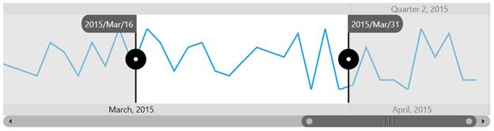

# ToolTip Support in UWP Range Selector (SfDateTimeRangeNavigator)

DateTimeRangeNavigator control provides ToolTip support for Sliders. Sliders are used to select a particular region of data in the DateTimeRangeNavigator control. ToolTips for sliders show the selected start and end date time values. You can even view exact date values to the precision of milliseconds.

The following properties are used to customize the ToolTip settings for the DateTimeRangeNavigator control.

* [`ShowToolTip`](https://help.syncfusion.com/cr/uwp/Syncfusion.UI.Xaml.Charts.SfDateTimeRangeNavigator.html#Syncfusion_UI_Xaml_Charts_SfDateTimeRangeNavigator_ShowToolTip)- Gets or sets to show ToolTip.
* [`ToolTipLabelFormat`](https://help.syncfusion.com/cr/uwp/Syncfusion.UI.Xaml.Charts.SfDateTimeRangeNavigator.html#Syncfusion_UI_Xaml_Charts_SfDateTimeRangeNavigator_ToolTipLabelFormat)-Gets or sets label format for ToolTip.
* [`LeftToolTipTemplate`](https://help.syncfusion.com/cr/uwp/Syncfusion.UI.Xaml.Charts.SfDateTimeRangeNavigator.html#Syncfusion_UI_Xaml_Charts_SfDateTimeRangeNavigator_LeftToolTipTemplate)-Gets or sets template for the left side ToolTip.
* [`RightToolTipTemplate`](https://help.syncfusion.com/cr/uwp/Syncfusion.UI.Xaml.Charts.SfDateTimeRangeNavigator.html#Syncfusion_UI_Xaml_Charts_SfDateTimeRangeNavigator_RightToolTipTemplate)- Gets or sets template for the right side ToolTip.

Default tool tip template of SfDateTimeRangeNavigator.

The following code illustrates the customization of tool tip.





<chart:SfDateTimeRangeNavigator x:Name="RangeNavigator" Width="700" Height="179"                                      

ItemsSource="{Binding StockPriceDetails}"

ShowToolTip="True" 

ToolTipLabelFormat="yyyy/MMM/dd"  

XBindingPath="Date" >

<Grid x:Name="grid">

    <Grid.Resources>
            
        <DataTemplate x:Key="tooltipTemplate1">

                <Border BorderBrush="Black" BorderThickness="0.5" Background="SeaGreen"  Width="100" Height="30" CornerRadius="10">

                    <TextBlock Width="90" VerticalAlignment="Center" HorizontalAlignment="Center" FontSize="15" Foreground="White" Text="{Binding}">

                    </TextBlock>

                </Border>

       </DataTemplate>

        <DataTemplate x:Key="tooltipTemplate2">

                <Border BorderThickness="0.5" BorderBrush="Black" Background="SeaGreen"  Width="100" Height="30" CornerRadius="10">

                    <TextBlock Width="90" VerticalAlignment="Center" HorizontalAlignment="Center" FontSize="15" Foreground="White" Text="{Binding}">

                    </TextBlock>

                </Border>

        </DataTemplate>

   </Grid.Resources>

<syncfusion:SfDateTimeRangeNavigator LeftToolTipTemplate="{StaticResource tooltipTemplate1}"
                                             
                                     RightToolTipTemplate="{StaticResource tooltipTemplate2}"/>
</Grid>





SfDateTimeRangeNavigator rangeNavigator = new SfDateTimeRangeNavigator()
{

    ItemsSource = new ViewModel().StockPriceDetails,

    XBindingPath = "Date",

    ShowToolTip = true,

    ToolTipLabelFormat = "yyyy/MMM/dd",

    LeftToolTipTemplate = grid.Resources["tooltipTemplate"] as DataTemplate

};





