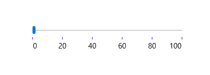

# Dealing with Ticks in UWP Range Slider (SfRangeSlider)

It is possible to place tick marks along the track in a uniform manner. The position of tick marks can be customized. 

## Tick Frequency 

The Tick Frequency property is used to define the number of ticks along the track, based on Minimum and Maximum values. 





<editors:SfRangeSlider x:Name="rangeSlider" Width="200"  Minimum="0"  Maximum="100" TickFrequency="20" Value="40" />









   rangeSlider.TickFrequency = 20;





  rangeSlider.TickFrequency = 20





N>  When the SnapsTo property is set to Ticks, the TickFrequency is used to specify the interval between snap points.

## Step Frequency  

When the SnapsTo property is set to StepValues, the StepFrequency property is used to specify the interval between snap points. 





<editors:SfRangeSlider x:Name="rangeSlider" Width="200" VerticalAlignment="Center" Minimum="0"  Maximum="100" StepFrequency="20" Value="40"/>









   rangeSlider.StepFrequency = 20;





   rangeSlider.StepFrequency = 20





## Snaps To 

The SnapsTo property determines whether the RangeSlider snaps to steps or ticks. Available options for this property are 

1. StepValues 
2. Ticks 

Default option is StepValues and StepFrequency property is used to specify the interval between snap points in this case. If the SnapsTo property is set to Ticks, the TickFrequency property is used to specify the interval between snap points.  

## Tick Placement 

The TickPlacement property used to determine where to draw tick marks in relation to the track. Available options for this property are 

1. BottomRight 
2. Inline 
3. None 
4. Outside 
5. TopLeft 

The default option is Inline.  

### BottomRight  

Tick marks placed either below the track in horizontal orientation or right of the track in vertical orientation. 





<editors:SfRangeSlider Width="200" Minimum="0"   Maximum="100"   x:Name="rangeSlider"                                                   

TickFrequency="20" TickPlacement="BottomRight" Value="40"   />









   rangeSlider.TickPlacement = Syncfusion.UI.Xaml.Controls.Input.TickPlacement.BottomRight;





  rangeSlider.TickPlacement = Syncfusion.UI.Xaml.Controls.Input.TickPlacement.BottomRight





N>  In Vertical Orientation, this option will place the ticks to right side. 

### TopLeft  

Tick marks placed either above the track in horizontal orientation or left of the track in vertical orientation. 





<editors:SfRangeSlider x:Name="rangeSlider" Width="200"  Minimum="0"   Maximum="100" TickFrequency="20" TickPlacement="TopLeft"  Value="40"   />









   rangeSlider.TickPlacement = Syncfusion.UI.Xaml.Controls.Input.TickPlacement.TopLeft;





  rangeSlider.TickPlacement = Syncfusion.UI.Xaml.Controls.Input.TickPlacement.TopLeft





N>  In Vertical Orientation, this option will place the ticks to left side.

### Outside 

Tick marks placed on both sides of the track either in horizontal or vertical orientation.  





<editors:SfRangeSlider x:Name="rangeSlider" Width="200" Minimum="0" Maximum="100" TickFrequency="20"  TickPlacement="Outside" Value="40"/>









   rangeSlider.TickPlacement = Syncfusion.UI.Xaml.Controls.Input.TickPlacement.Outside;





   rangeSlider.TickPlacement = Syncfusion.UI.Xaml.Controls.Input.TickPlacement.Outside





### Inline 

Ticks are placed inside the track.  





<editors:SfRangeSlider x:Name="rangeSlider" Width="200" Minimum="0" Maximum="100" TickFrequency="20" TickPlacement="Inline" Value="40" />









   rangeSlider.TickPlacement = Syncfusion.UI.Xaml.Controls.Input.TickPlacement.Inline;





  rangeSlider.TickPlacement = Syncfusion.UI.Xaml.Controls.Input.TickPlacement.Inline





### None 

Tick marks not appear.  





<editors:SfRangeSlider x:Name="rangeSlider" Width="200" Minimum="0" Maximum="100" TickFrequency="20" TickPlacement="None" Value="40" />









   rangeSlider.TickPlacement = Syncfusion.UI.Xaml.Controls.Input.TickPlacement.None;





   rangeSlider.TickPlacement = Syncfusion.UI.Xaml.Controls.Input.TickPlacement.None





## Customizing tick color

The range slider control provides the `TickBarFill` property to customize the color of ticks in tick bar.





<Page
    x:Class="RangeSlider_Sample.MainPage"
    xmlns="http://schemas.microsoft.com/winfx/2006/xaml/presentation"
    xmlns:x="http://schemas.microsoft.com/winfx/2006/xaml"
    xmlns:local="using:RangeSlider_Sample"
    xmlns:d="http://schemas.microsoft.com/expression/blend/2008"
    xmlns:mc="http://schemas.openxmlformats.org/markup-compatibility/2006"
    xmlns:input="using:Syncfusion.UI.Xaml.Controls.Input"
    mc:Ignorable="d">

    <Grid Background="{ThemeResource ApplicationPageBackgroundThemeBrush}">
        <input:SfRangeSlider x:Name="rangeSlider"  Width="300" HorizontalAlignment="Center"  VerticalAlignment="Center" TickFrequency="20" TickPlacement="BottomRight"  LabelPlacement="BottomRight" Orientation="Horizontal"
         TickBarFill="Blue" ShowValueLabels="True" ValuePlacement="BottomRight"/>
    </Grid>
</Page>









using Syncfusion.UI.Xaml.Controls.Input;
using Windows.UI;
using Windows.UI.Xaml;
using Windows.UI.Xaml.Controls;
using Windows.UI.Xaml.Media;

namespace RangeSlider_Sample
{
    /// 

    /// An empty page that can be used on its own or navigated to within a Frame.
    /// 

    public sealed partial class MainPage : Page
    {
        public MainPage()
        {
            this.InitializeComponent();
            SfRangeSlider rangeSlider = new SfRangeSlider()
            {
                Width = 300,
                HorizontalAlignment = HorizontalAlignment.Center,
                VerticalAlignment = VerticalAlignment.Center,
                TickFrequency = 20,
                TickPlacement = Syncfusion.UI.Xaml.Controls.Input.TickPlacement.BottomRight,
                LabelPlacement = LabelPlacement.BottomRight,
                Orientation = Orientation.Horizontal,
                TickBarFill = new SolidColorBrush(Color.FromArgb(255, (byte)0, (byte)0, (byte)255)),
                ShowValueLabels = true,
                ValuePlacement = ValuePlacement.BottomRight
            };
            this.Content = rangeSlider;
        }
    }
}





Imports Syncfusion.UI.Xaml.Controls.Input
Imports Windows.UI
''' 

''' An empty page that can be used on its own or navigated to within a Frame.
''' 

Public NotInheritable Class MainPage
    Inherits Page
    Public Sub New()
        InitializeComponent()
        Dim rangeSlider As New SfRangeSlider()
        rangeSlider.Width = 300
        rangeSlider.HorizontalAlignment = HorizontalAlignment.Center
        rangeSlider.VerticalAlignment = VerticalAlignment.Center
        rangeSlider.TickFrequency = 20
        rangeSlider.TickPlacement = Syncfusion.UI.Xaml.Controls.Input.TickPlacement.BottomRight
        rangeSlider.LabelPlacement = LabelPlacement.BottomRight
        rangeSlider.Orientation = Orientation.Horizontal
        rangeSlider.ShowValueLabels = True
        rangeSlider.ValuePlacement = ValuePlacement.BottomRight
        rangeSlider.TickBarFill = New SolidColorBrush(Color.FromArgb(255, 0, 0, 255))
        Me.Content = rangeSlider
    End Sub
End Class





