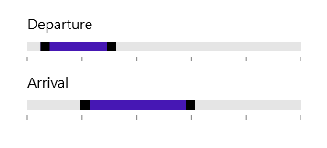

# UWP Range Slider (SfRangeSlider) Overview

The range slider control for UWP allows you select a range of values within the specified minimum and maximum limits. The range can be selected by moving the thumb along track.

### Key features

Provides support to select values as a range.
 
Restricts values to choose within a minimum and maximum constraints.
 
Supports to change the tick intervals in uniform pattern.
 
Provides user-friendly customization support to customize ticks and labels.

