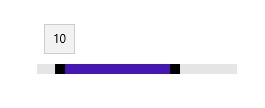
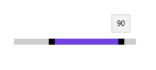

# Setting Range in UWP Range Slider (SfRangeSlider)

The SfRangeSlider control supports to select range of value using two Thumbs.  

## ShowRange  

When ShowRange property is set to true, two Thumbs are placed in the track. One Thumb is used to update the start of the range selection and another thumb is used to update the end of the range selection.  





<editors:SfRangeSlider x:Name="rangeSlider" Width="200" VerticalAlignment="Center" Minimum="0" Maximum="100" ShowRange="True" RangeStart="40" RangeEnd="70"/>









   rangeSlider.ShowRange = true;





   rangeSlider.ShowRange = True





## RangeStart  

Gets or sets the start value of the range start.  





<editors:SfRangeSlider x:Name="rangeSlider" Width="200" VerticalAlignment="Center" Minimum="0" Maximum="100" ShowRange="True" RangeStart="10" RangeEnd="70"/>









   rangeSlider.RangeStart = 10;





  rangeSlider.RangeStart = 10





## RangeEnd 

Gets or sets the end value of the range end.  





<editors:SfRangeSlider x:Name="rangeSlider" Width="200" VerticalAlignment="Center" Minimum="0" Maximum="100" ShowRange="True" RangeStart="30" RangeEnd="90"  />









   rangeSlider.RangeEnd = 90;





  rangeSlider.RangeEnd = 90





