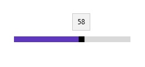

# Thumb ToolTip in UWP Range Slider (SfRangeSlider)

The Thumb tooltip shows the current value on which the Thumb stands. 

## Thumb ToolTip Precision  

ThumbToolTipPrecision property is used to define the precision of the value displayed in the tooltip.  





<editors:SfRangeSlider x:Name="rangeSlider" Width="200" VerticalAlignment="Center" Minimum="0" Maximum="100" Value="50" ThumbToolTipPrecision="2"/>









   rangeSlider.ThumbToolTipPrecision = 2;





   rangeSlider.ThumbToolTipPrecision = 2





## Thumb ToolTip Position 

The position of the Thumb tooltip in relation to the Thumb can be controlled by the ThumbToolTipPlacement property. It has the following options.  

1. BottomRight 
2. TopLeft 
3. None 

### BottomRight  

Tooltip placed either below the Thumb in horizontal orientation or right of the Thumb in vertical orientation. 





<editors:SfRangeSlider x:Name="rangeSlider" Width="200" Minimum="0" Maximum="100" Value="50" ThumbToolTipPlacement="BottomRight" />









   rangeSlider.ThumbToolTipPlacement = Syncfusion.UI.Xaml.Controls.Input.ThumbToolTipPlacement.BottomRight;





   rangeSlider.ThumbToolTipPlacement = Syncfusion.UI.Xaml.Controls.Input.ThumbToolTipPlacement.BottomRight





N>  This option will show tooltip to right in vertical orientation.

### TopLeft 

Tooltip placed either above the Thumb in horizontal orientation or left of the Thumb in vertical orientation. 





<editors:SfRangeSlider x:Name="rangeSlider" Width="200" Minimum="0" Maximum="100" Value="50" ThumbToolTipPlacement="TopLeft" />









   rangeSlider.ThumbToolTipPlacement = Syncfusion.UI.Xaml.Controls.Input.ThumbToolTipPlacement.TopLeft;





   rangeSlider.ThumbToolTipPlacement = Syncfusion.UI.Xaml.Controls.Input.ThumbToolTipPlacement.TopLeft





N>  This option will show tooltip to left in vertical orientation.

### None 

Tooltip will not appear. 

