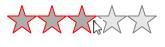
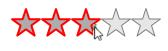
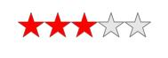
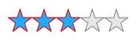
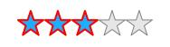
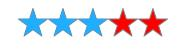
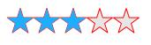
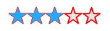

# Appearance and Styling in UWP Rating (SfRating)

Rating items are customizable in much simpler and easier way. The following properties of `SfRatingItem` are accessible in SfRating.ItemContainerStyle.

## PointerOverFill

`PointerOverFill` property fills the pointer over area with the specified solid color. 





<input:SfRating ItemsCount="5">

<input:SfRating.ItemContainerStyle>

</input:SfRating.ItemContainerStyle>

</input:SfRating>





##  PointerOverStroke

``PointerOverStroke` sets the stroke for the pointer over area with the specified solid color.





<input:SfRating ItemsCount="5">

<input:SfRating.ItemContainerStyle>

</input:SfRating.ItemContainerStyle>

</input:SfRating>





## PointerOverStrokeThickness

`PointerOverStrokeThickness` sets the stroke thickness for the pointer over area with the specified thickness.





<input:SfRating ItemsCount="5">

<input:SfRating.ItemContainerStyle>

</input:SfRating.ItemContainerStyle>

</input:SfRating>





## RatedFill

`RatedFill` property fills the rated area with the specified solid color. 





<input:SfRating ItemsCount="5">

<input:SfRating.ItemContainerStyle>

</input:SfRating.ItemContainerStyle>

</input:SfRating>





## RatedStroke

`RatedStroke` sets the stroke for the rated area with the specified solid color. 





<input:SfRating ItemsCount="5">

<input:SfRating.ItemContainerStyle>

</input:SfRating.ItemContainerStyle>

</input:SfRating>





## Rated StrokeThickness

`RatedStrokeThickness` sets the stroke thickness for the rated area with the specified value. 





<input:SfRating ItemsCount="5">

<input:SfRating.ItemContainerStyle>

</input:SfRating.ItemContainerStyle>

</input:SfRating>





## Unrated Fill

`UnratedFill` property fills the unrated area with the specified solid color. 





<input:SfRating ItemsCount="5">

<input:SfRating.ItemContainerStyle>

</input:SfRating.ItemContainerStyle>

</input:SfRating>





## Unrated Stroke

`UnRatedStroke` sets the stroke for the unrated area with the specified solid color. 





<input:SfRating ItemsCount="5">

<input:SfRating.ItemContainerStyle>

</input:SfRating.ItemContainerStyle>

</input:SfRating>





## Unrated StrokeThickness

`UnRatedStrokeThickness` sets the stroke thickness for the unrated area with the specified value. 





<input:SfRating ItemsCount="5">

<input:SfRating.ItemContainerStyle>

</input:SfRating.ItemContainerStyle>

</input:SfRating>





