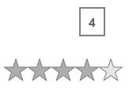

# Dealing with Value in UWP Rating (SfRating)

## Setting the rated value

`Value` property is used to get or set the rate value in `SfRating` control.





<input:SfRating ItemsCount="5" Value="2" x:Name="rating"/>









rating.ItemsCount = 5;

rating.Value = 2;





rating.ItemsCount = 5

rating.Value = 2





## Previewing the rate

`PreviewValue` property is used to get the pointer over value in SfRating control, and this value is displayed as tool tip content.

## ValueChanged event

`ValueChanged` event fires whenever the value is changed in rating control. Event arguments contain old value and new value.





<input:SfRating ItemsCount="5" ValueChanged="rating_ValueChanged"/>









private void rating_ValueChanged(object sender, ValueChangedEventArgs e)

{
            
}





Private Sub rating_ValueChanged(ByVal sender As Object, ByVal e As ValueChangedEventArgs)

End Sub





## Read only Rating control

`SfRating` can also restrict user from changing the rates in control using the `IsReadOnly` property. But preview value changes when pointer moves over the control.





<input:SfRating ItemsCount="5" Value="2" IsReadOnly="true" x:Name="rating"/>









rating.ItemsCount = 5;

rating.Value = 2;

rating.IsReadOnly = true;





rating.ItemsCount = 5

rating.Value = 2

rating.IsReadOnly = True




