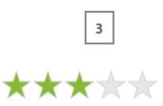

# Getting Started with UWP Rating (SfRating)

This section explains how to create a group of visual symbols used for rating with `SfRating` control.

## Adding SfRating control

Create a Universal Windows Platform project in Visual Studio and refer to the following assemblies.

* Syncfusion.SfInput.UWP
* Syncfusion.SfShared.UWP

1.Include the namespace for Syncfusion.SfInput.UWP assembly in MainPage.xaml





<Page xmlns="http://schemas.microsoft.com/winfx/2006/xaml/presentation"
xmlns:x="http://schemas.microsoft.com/winfx/2006/xaml"
xmlns:input="using:Syncfusion.UI.Xaml.Controls.Input">





2.Now add the `SfRating` control with a required optimal name using the included namespace





<input:SfRating x:Name="rating">





 SfRating rating = new SfRating();





 Dim rating As New SfRating()





N> This will yield a blank output screen unless `ItemsCount` is set

## Set the number of items

Set the `ItemsCount` property to specify the number of rating items in control. 





<input:SfRating ItemsCount="5" x:Name="rating">

<input:SfRating.Resources>

</input:SfRating.Resources>

</input:SfRating>





