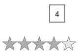

# ToolTips in UWP Rating (SfRating)

## Enable/Disable Tooltip

Tooltips in SfRating control shows the rating value. Tooltips can be enabled or disabled using the property `ShowToolTip`.





<input:SfRating ItemsCount="5" ShowToolTip="true" x:Name="rating"/>









rating.ShowToolTip = true;





rating.ShowToolTip = True





## Tooltip Precision

The number of decimal digits displayed in tooltips is determined by `AutoTooltipPrecision` property. Decimal digits are not possible in Standard precision type and one decimal digit decimal 





<input:SfRating ItemsCount="5" ShowToolTip="True"
                AutoToolTipPrecision="3" Precision="Exact"
				x:Name="rating"/>









rating.ItemsCount = 5;

rating.ShowToolTip = true;

rating.Precision = Syncfusion.UI.Xaml.Primitives.Precision.Exact;

rating.AutoToolTipPrecision = 3;





rating.ItemsCount = 5

rating.ShowToolTip = True

rating.Precision = Syncfusion.UI.Xaml.Primitives.Precision.Exact

rating.AutoToolTipPrecision = 3




