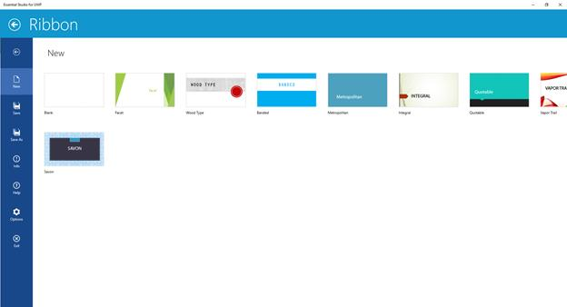
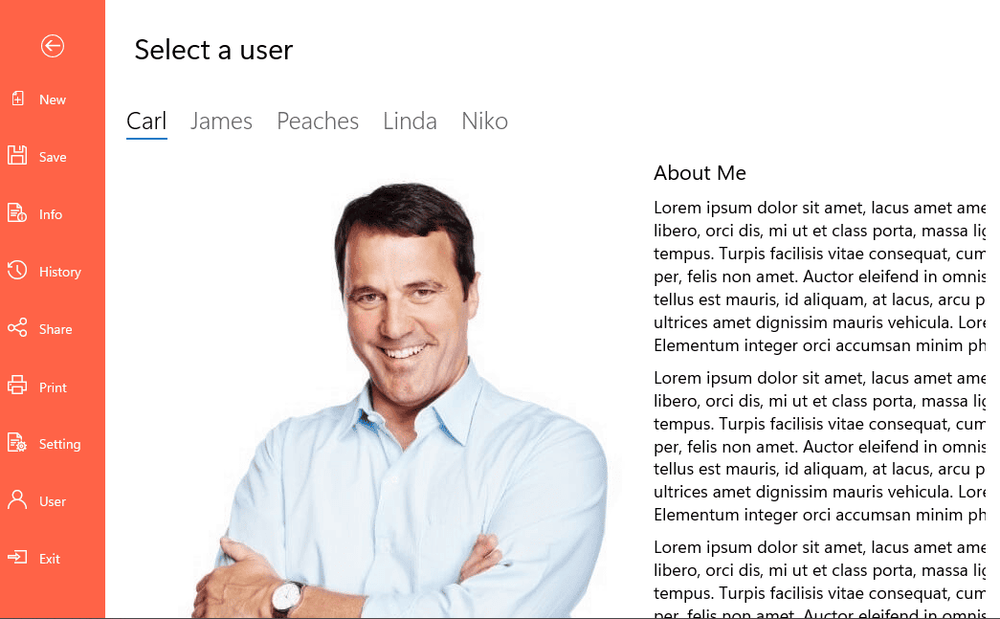
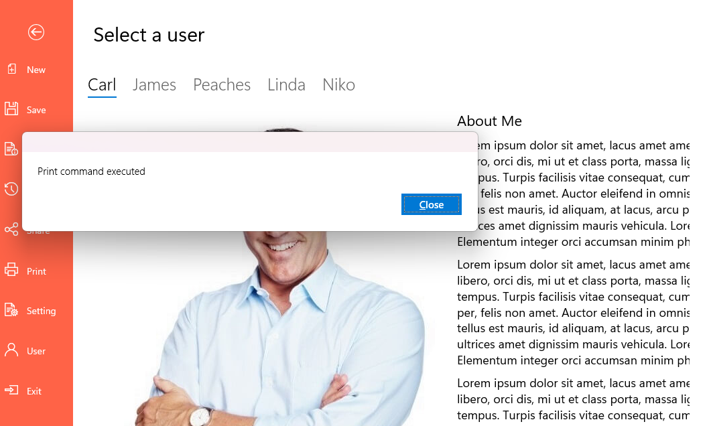

# BackStage in UWP Ribbon (SfRibbon(Touch Ribbon))

Commands can be added to the BackStage similar to the Office UI. The BackStage is completely customizable. To navigate to the BackStage, click on the BackStage button at the left end of the Ribbon Tab Items panel. BackStageTabItems can be easily navigated using the scroll buttons. To navigate back from the BackStage, click on the back button in the top-left corner. The BackStage can be opened and closed programmatically using the `OpenBackStage()` and `CloseBackStage()` methods.

BackStageButton and BackStage TabItems can be added as follows,





<ribbon:SfRibbon.BackStage>

<ribbon:SfBackstage>

<ribbon:SfBackStageTabItem Header="Save" Icon="Assets/Save.png"/>

<ribbon:SfBackStageButton Label="Exit" Icon="Assets/Exit.png"/>

</ribbon:SfBackstage>

</ribbon:SfRibbon.BackStage>









 SfBackstage Ribbon_backstage = new SfBackstage();

 SfBackStageTabItem Save_backstageTab = new SfBackStageTabItem() { Header = "SaveAs", Icon = new BitmapImage(new Uri("ms-appx:///Assets/Save.png"))};

 SfBackStageButton Exit_backstagebutton = new SfBackStageButton() { Label= "Exit", Icon = new BitmapImage(new Uri("ms-appx:///Assets/Exit.png"))};

 _ribbon.BackStage = Ribbon_backstage;
         
 Ribbon_backstage.Items.Add(Save_backstageTab);

 Ribbon_backstage.Items.Add(Exit_backstagebutton);





Dim Ribbon_backstage As New SfBackstage()

Dim Save_backstageTab As New SfBackStageTabItem() With { _
    .Header = "SaveAs", _
    .Icon = New BitmapImage(New Uri("ms-appx:///Assets/Save.png")) _
}

Dim Exit_backstagebutton As New SfBackStageButton() With { _
    .Label = "Exit", _
    .Icon = New BitmapImage(New Uri("ms-appx:///Assets/Exit.png")) _
}

_ribbon.BackStage = Ribbon_backstage

Ribbon_backstage.Items.Add(Save_backstageTab)

Ribbon_backstage.Items.Add(Exit_backstagebutton)





## Loading content in a BackStageTabItem

* In the case of a BackStageTabItem, the BackStage page is displayed by loading the Content Control inside it as shown below.





   <syncfusion:SfBackStageTabItem FontIconFontFamily="ms-appx:///Ribbon/FontIcons/BackStageIcons.ttf#BackStageIcons"  Header="New" FontIconSize="15" Foreground="White" FontIcon="1" >
            
            <ContentControl>
                    <local:NewView Foreground="{Binding ElementName=mainribbon, Path=AccentBrush}"/>
            </ContentControl>

    </syncfusion:SfBackStageTabItem>





### Handling the click of a BackStageButton

* In the case of a BackStageButton, the BackStage page is displayed in the click event of the BackStage button as follows.





  <syncfusion:SfBackStageButton Label="Print" FontFamily="ms-appx:///Ribbon/FontIcons/BackStageIcons.ttf#BackStageIcons"  FontIcon="5" FontIconFontFamily="ms-appx:///Ribbon/FontIcons/BackStageIcons.ttf#BackStageIcons" Click="SfBackStageButton_Click" />









private async void SfBackStageButton_Click(object sender, RoutedEventArgs e)

{
    var dialog = new MessageDialog("Print command executed");
    await dialog.ShowAsync();

}





