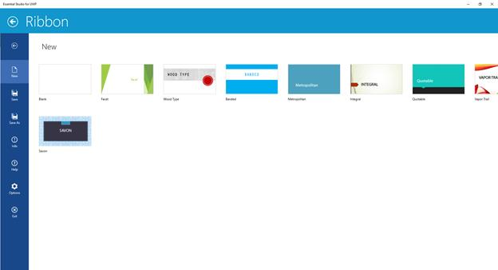

# BackStage in UWP Ribbon (SfRibbon(Touch Ribbon))

Commands can be added to BackStage similar to office UI. Backstage is completely customizable. For navigating to backstage click on backstage button in left end on Ribbon Tab Items panel. BackStageTabItems can be easily navigated using the scroll buttons. To navigate back from BackStage click on the back button in top left corner. BackStage can be opened and closed programmatically using the methods “OpenBackStage()” and “CloseBackStage()”.

BackStageButton and BackStage TabItems can be added as follows,



<ribbon:SfRibbon.BackStage>

<ribbon:SfBackstage>

<ribbon:SfBackStageTabItem Header="Save" Icon="Assets/Save.png"/>

<ribbon:SfBackStageButton Label="Exit" Icon="Assets/Exit.png"/>

</ribbon:SfBackstage>

</ribbon:SfRibbon.BackStage>







 SfBackstage Ribbon_backstage = new SfBackstage();

 SfBackStageTabItem Save_backstageTab = new SfBackStageTabItem() { Header = "SaveAs", Icon = new BitmapImage(new Uri("ms-appx:///Assets//Save.png"))};

 SfBackStageButton Exit_backstagebutton = new SfBackStageButton() { Label= "Exit", Icon = new BitmapImage(new Uri("ms-appx:///Assets//Exit.png"))};

 _ribbon.BackStage = Ribbon_backstage;
         
 Ribbon_backstage.Items.Add(Save_backstageTab);

 Ribbon_backstage.Items.Add(Exit_backstagebutton);





Dim Ribbon_backstage As New SfBackstage()

Dim Save_backstageTab As New SfBackStageTabItem() With { _
	Key .Header = "SaveAs", _
	Key .Icon = New BitmapImage(New Uri("ms-appx:///Assets//Save.png")) _
}

Dim Exit_backstagebutton As New SfBackStageButton() With { _
	Key .Label = "Exit", _
	Key .Icon = New BitmapImage(New Uri("ms-appx:///Assets//Exit.png")) _
}

_ribbon.BackStage = Ribbon_backstage

Ribbon_backstage.Items.Add(Save_backstageTab)

Ribbon_backstage.Items.Add(Exit_backstagebutton)





## BackStage in UWP Ribbon (SfRibbon(Touch Ribbon))

* In case of BackStageTabItem, BackStage page has been displayed by loading the Content Control inside it as like below 





   <syncfusion:SfBackStageTabItem FontIconFontFamily="ms-appx:///Ribbon/FontIcons/BackStageIcons.ttf#BackStageIcons"  Header="New" FontIconSize="15" Foreground="White" FontIcon="1" >
            
            <ContentControl>
                    <local:NewView Foreground="{Binding ElementName=mainribbon, Path=AccentBrush}"/>
            </ContentControl>

    </syncfusion:SfBackStageTabItem>





### BackStage in UWP Ribbon (SfRibbon(Touch Ribbon))

* In case of BackStageButton, BackStage page has been displayed in the click event of BackStage button as follow





  <syncfusion:SfBackStageButton Content="Print" FontFamily="ms-appx:///Ribbon/FontIcons/BackStageIcons.ttf#BackStageIcons"  FontIcon="5" FontIconFontFamily="ms-appx:///Ribbon/FontIcons/BackStageIcons.ttf#BackStageIcons" Click="SfBackStageButton_Click" />









private async void SfBackStageButton_Click(object sender, RoutedEventArgs e)

{
    var dialog = new MessageDialog("Print command executed");
    await dialog.ShowAsync();

}





