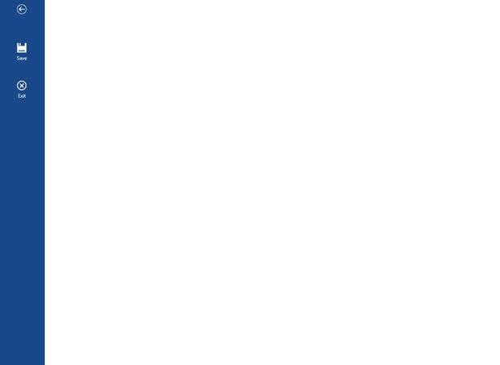

# Getting Started with UWP Ribbon (SfRibbon(Touch Ribbon))

This section explains you on how to add SfRibbon in your application.

## Add Ribbon

Create a Universal Windows Platform project in Visual Studio and refer to the following assemblies.

* Syncfusion.SfRibbon.UWP

1.Include the namespace for Syncfusion.SfRibbon.UWP assembly in MainPage.xaml




<Page xmlns="http://schemas.microsoft.com/winfx/2006/xaml/presentation"

xmlns:x="http://schemas.microsoft.com/winfx/2006/xaml"

xmlns:Ribbon="using:Syncfusion.UI.Xaml.Controls.SfRibbon">





2.Now add the `SfRibbon` control with a required optimal name using the included namespace





<Page xmlns:Ribbon="using:Syncfusion.UI.Xaml.Controls.SfRibbon">

<Grid Background="{ThemeResource ApplicationPageBackgroundThemeBrush}">

<Ribbon:SfRibbon x:Name="_ribbon"/>

</Grid>

</Page>





SfRibbon _ribbon = new SfRibbon();





Dim _ribbon As New SfRibbon()





Execute the above code to render the following output.

## Add Ribbon Tab

SfRibbon control accept RibbonTab as children.The following code example illustrates on how to add RibbonTab 




<Page xmlns:ribbon="using:Syncfusion.UI.Xaml.Controls.SfRibbon">

<Grid Background="{ThemeResource ApplicationPageBackgroundThemeBrush}">

<ribbon:SfRibbon x:Name="_ribbon">

<ribbon:SfRibbonTab Caption="Home"/>

<ribbon:SfRibbonTab Caption="Insert"/>

</ribbon:SfRibbon>

</Grid>

</Page>









SfRibbon _ribbon = new SfRibbon();

_ribbon.Items.Add(new SfRibbonTab() { Caption = "Home" });

_ribbon.Items.Add(new SfRibbonTab() { Caption = "Insert" });





Dim _ribbon As New SfRibbon()

_ribbon.Items.Add(New SfRibbonTab() With {.Caption = "Home"})

_ribbon.Items.Add(New SfRibbonTab() With {.Caption = "Insert"})





Execute the above code to render the following output.

## How to capture the click of SfRibbonTab?

SfRibbonTab's click can be identified by using the event named `Tapped` as like below





<syncfusion:SfRibbonTab Caption="Sales" Tapped="SfRibbonTab_Tapped">









private async void SfRibbonTab_Tapped(object sender, TappedRoutedEventArgs e)

{

    var dialog = new MessageDialog("SfRibbonTab:" + " "  + (sender as SfRibbonTab).Caption.ToString() + " " + "click has been detected");
    await dialog.ShowAsync();
        
}





## Add Ribbon Bar

RibbonTab accepts RibbonBar as children, here five RibbonBar Controls are added inside “HOME” RibbonTab





<Page xmlns:ribbon="using:Syncfusion.UI.Xaml.Controls.SfRibbon">

<Grid Background="{ThemeResource ApplicationPageBackgroundThemeBrush}">

<ribbon:SfRibbon x:Name="_ribbon">

<ribbon:SfRibbonTab Caption="Home">

<ribbon:SfRibbonBar  Header="New"/>

<ribbon:SfRibbonBar  Header="Delete"/>

</ribbon:SfRibbonTab>

<ribbon:SfRibbonTab Caption="Insert"/>

</ribbon:SfRibbon>

</Grid>

</Page>









SfRibbon _ribbon = new SfRibbon();

SfRibbonTab _ribbonTab = new SfRibbonTab() { Caption = "Home" };

_ribbonTab.Items.Add(new SfRibbonBar() { Header = "New" });

_ribbonTab.Items.Add(new SfRibbonBar() { Header = "Delete" });

_ribbon.Items.Add(_ribbonTab);

_ribbon.Items.Add(new SfRibbonTab() { Caption = "Insert" });





Dim _ribbon As New SfRibbon()

Dim _ribbonTab As New SfRibbonTab() With {.Caption = "Home"}

_ribbonTab.Items.Add(New SfRibbonBar() With {.Header = "New"})

_ribbonTab.Items.Add(New SfRibbonBar() With {.Header = "Delete"})

_ribbon.Items.Add(_ribbonTab)

_ribbon.Items.Add(New SfRibbonTab() With {.Caption = "Insert"})





Execute the above code to render the following output.

## Add Ribbon controls to RibbonBar

The following code example illustrates on how to add ribbon controls to the Ribbon bar from code-behind and XAML,





<Page xmlns:Ribbon="using:Syncfusion.UI.Xaml.Controls.SfRibbon">

<Grid Background="{ThemeResource ApplicationPageBackgroundThemeBrush}">

<ribbon:SfRibbon x:Name="_ribbon">

<ribbon:SfRibbonTab Caption="Home">

<ribbon:SfRibbonBar>

<ribbon:SfRibbonButton Icon="Assets/Bold.png"/>

</ribbon:SfRibbonBar>

<ribbon:SfRibbonBar>

<ribbon:SfRibbonButton Icon="Assets/Bullets.png"/>

</ribbon:SfRibbonBar>

</ribbon:SfRibbonTab>

<ribbon:SfRibbonTab Caption="Insert"/>

</ribbon:SfRibbon>

</Grid>

</Page>









SfRibbon _ribbon = new SfRibbon();

SfRibbonTab _ribbonTab = new SfRibbonTab() { Caption = "Home" };

SfRibbonBar _ribbonBar = new SfRibbonBar();

_ribbonBar.Items.Add(new SfRibbonButton() { Icon = new BitmapImage(new Uri("ms-appx:/Assets/Bold.png", UriKind.RelativeOrAbsolute)) });

SfRibbonBar _ribbonBar1 = new SfRibbonBar();

_ribbonBar1.Items.Add(new SfRibbonButton() { Icon = new BitmapImage(new Uri("ms-appx:/Assets/Bullets.png", UriKind.RelativeOrAbsolute)) });

_ribbonTab.Items.Add(_ribbonBar);

_ribbonTab.Items.Add(_ribbonBar1);

_ribbon.Items.Add(_ribbonTab);

_ribbon.Items.Add(new SfRibbonTab() { Caption = "Insert" });





Dim _ribbon As New SfRibbon()

Dim _ribbonTab As New SfRibbonTab() With {.Caption = "Home"}

Dim _ribbonBar As New SfRibbonBar()

_ribbonBar.Items.Add(New SfRibbonButton() With {.Icon = New BitmapImage(New Uri("ms-appx:/Assets/Bold.png", UriKind.RelativeOrAbsolute))})

Dim _ribbonBar1 As New SfRibbonBar()

_ribbonBar1.Items.Add(New SfRibbonButton() With {.Icon = New BitmapImage(New Uri("ms-appx:/Assets/Bullets.png", UriKind.RelativeOrAbsolute))})

_ribbonTab.Items.Add(_ribbonBar)

_ribbonTab.Items.Add(_ribbonBar1)

_ribbon.Items.Add(_ribbonTab)

_ribbon.Items.Add(New SfRibbonTab() With {.Caption = "Insert"})





Execute the above code to render the following output.

## Configure QAT

QAT items can be added as follows,




<ribbon:SfRibbon x:Name="_ribbon" QATVisibility="Visible">

<ribbon:SfRibbon.QuickAccessToolBar>

<ribbon:QuickAccessToolBar DisplayItemsCount="3">

<Grid>

<StackPanel Orientation="Horizontal" x:Name="PART_QAT">

<ribbon:SfRibbonButton Icon="Assets/Undo.png"> 

</ribbon:SfRibbonButton>

<ribbon:SfRibbonButton Icon="Assets/Redo.png"> 

</ribbon:SfRibbonButton>

</StackPanel>

</Grid>

</ribbon:QuickAccessToolBar>

</ribbon:SfRibbon.QuickAccessToolBar>





You can limit the number of viewable items in QAT by setting DisplayItemsCount property. When the total number of items exceeds DisplayItemsCount, scroll QAT for viewing the items.

## Configure BackStage

BackStageButton and BackStage TabItems can be added as follows,




<ribbon:SfRibbon.BackStage>

<ribbon:SfBackstage>

<ribbon:SfBackStageTabItem Header="Save" Icon="Assets/Save.png"/>

<ribbon:SfBackStageButton Label="Exit" Icon="Assets/Exit.png"/>

</ribbon:SfBackstage>

</ribbon:SfRibbon.BackStage>





