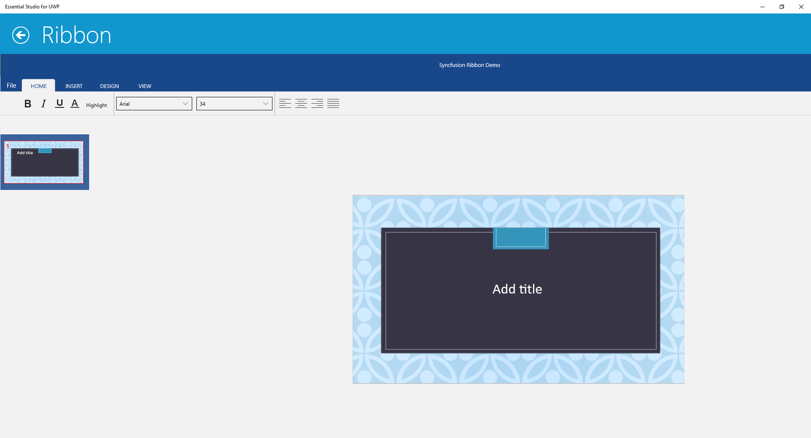

# UWP Ribbon (SfRibbon(Touch Ribbon)) Overview

SfRibbon allows the user to implement a Touch based Ribbon layout and functionality. It exposes most of the features of the WinRT touch style. Configuring and designing the layout is very easy through XAML code.

* [BackStage](https://help.syncfusion.com/uwp/ribbon/backstage) is provided for placing the items that provide a UI similar to Office.
* [QuickAccessToolBar (QAT)](https://help.syncfusion.com/uwp/ribbon/quick-access-toolbar) customization can be done. Commands can be added, removed and rearranged in the tool bar.
* [State Persistence](https://help.syncfusion.com/uwp/ribbon/state-persistence) support is provided for QAT items, QAT state, Ribbon State and the selected Ribbon tab.
* Several [Ribbon controls](https://help.syncfusion.com/uwp/ribbon/ribbon-controls) are provided with three size forms: Extra-Small, Small and Large.

