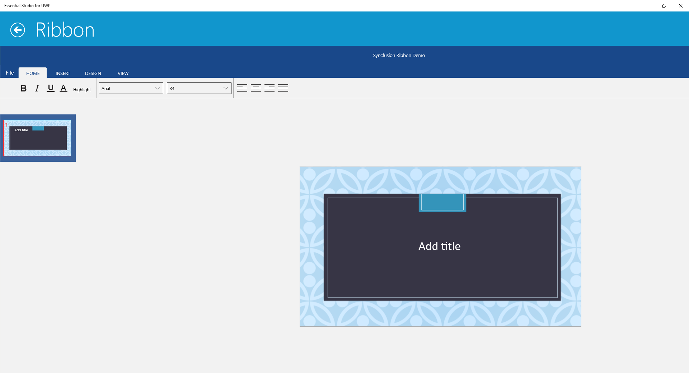

# About Syncfusion® UWP Ribbon Control

The UWP Ribbon enables the creation of touch-based layouts and interactions. It supports most WinRT touch-style features and offers simple configuration and customization through XAML.

* [BackStage](https://help.syncfusion.com/uwp/ribbon/backstage) is provided for placing the items that provide a UI similar to Office.
* [QuickAccessToolBar (QAT)](https://help.syncfusion.com/uwp/ribbon/quick-access-toolbar) customization can be done. Commands can be added, removed and rearranged in the tool bar.
* [State Persistence](https://help.syncfusion.com/uwp/ribbon/state-persistence) support is provided for QAT items, QAT state, UWP Ribbon State and the selected tab.
* Several [Ribbon controls](https://help.syncfusion.com/uwp/ribbon/ribbon-controls) are provided with three size forms: Extra-Small, Small and Large.

