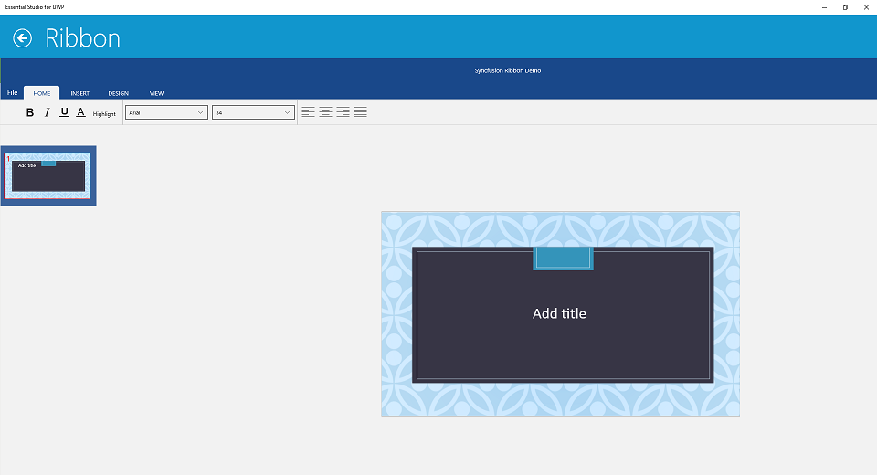

# UWP Ribbon (SfRibbon(Touch Ribbon)) Overview

SfRibbon allows the user to implement Touch based Ribbon layout and functionality. It exposes most of the features of WinRT touch style. Configuring and designing the layout is very easy through XAML code.

* BackStage is provided for placing the items that provides an UI similar to Office.
* QuickAccessToolBar(QAT) customization can be done. Commands can be added, removed and rearranged in tool bar.
* State Persistence support is provided for QAT items, QAT state, Ribbon State and Selected Ribbon tab.
* Several Ribbon controls are provided with three size forms Extra-Small, Small and Large.

