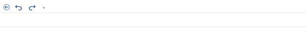

# Quick Access Toolbar in UWP Ribbon (SfRibbon(Touch Ribbon))

The Quick Access Toolbar in the ribbon instance is used to group the most commonly used commands and access the commands easily without searching for them in the menu bar. The position of the QAT can also be moved above or below the ribbon dynamically.

## Add Default QAT Items

QAT items can be added as follows,





<ribbon:SfRibbon x:Name="_ribbon" QATVisibility="Visible">

<ribbon:SfRibbon.QuickAccessToolBar>

<ribbon:QuickAccessToolBar DisplayItemsCount="3">

<Grid>

<StackPanel Orientation="Horizontal" x:Name="PART_QAT">

<ribbon:SfRibbonButton Icon="Assets/Undo.png">

</ribbon:SfRibbonButton>

<ribbon:SfRibbonButton Icon="Assets/Redo.png">

</ribbon:SfRibbonButton>

</StackPanel>

</Grid>

</ribbon:QuickAccessToolBar>

</ribbon:SfRibbon.QuickAccessToolBar>





