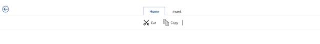
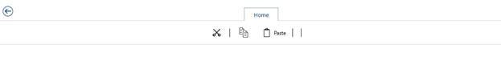
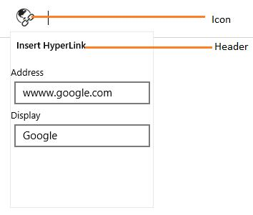
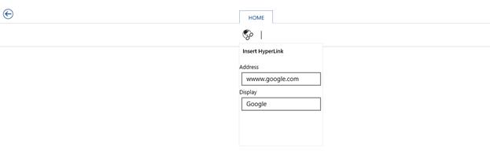
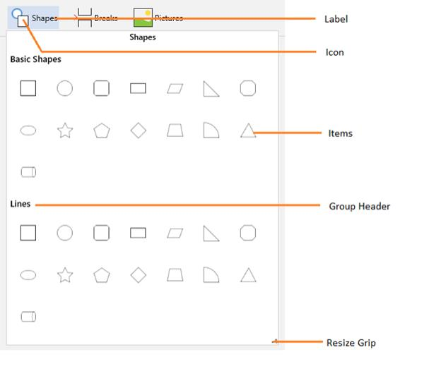
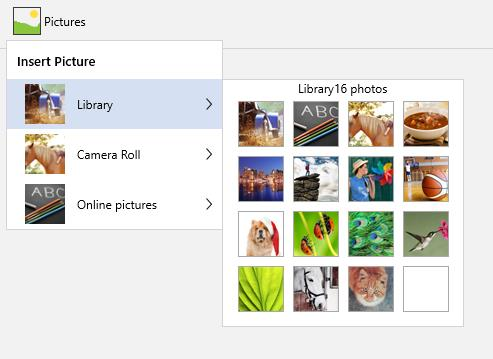
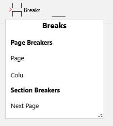
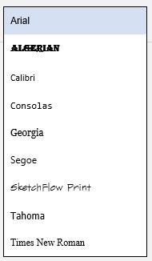
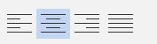

# Ribbon Controls in UWP Ribbon (SfRibbon(Touch Ribbon))

Several Ribbon controls are provided to add in Ribbon Bar. Button controls are provided with 3 size forms Extra-Small, Small and Large.

* SfRibbonButton
* SfDropDownButton
* SfRibbonGallery
* SfRibbonMenu
* SfRibbonGroupBar
* SfRibbonComboBox
* SfRibbonToggleButton

## SfRibbonButton

SfRibbonButton provides functionalities like normal Button. It can place inside the RibbonBar and provides SizeForm Property for different sizes. SizeMode.Small displays icon alone where as SizeMode.Large displays icon along with label.




<ribbon:SfRibbon x:Name="_ribbon">

<ribbon:SfRibbonTab Caption="Home">

<ribbon:SfRibbonBar   Header="Edit">

<ribbon:SfRibbonButton Icon="Assets/Cut.png" SizeMode="Large" Label="Cut"/>

<ribbon:SfRibbonButton Icon="Assets/Copy.png" Label="Copy" SizeMode="Large"/>

</ribbon:SfRibbonBar>

</ribbon:SfRibbonTab>

<ribbon:SfRibbonTab Caption="Insert"/>

</ribbon:SfRibbon>









SfRibbon _ribbon = new SfRibbon();

SfRibbonTab _ribbonTab = new SfRibbonTab() { Caption = "Home" };

SfRibbonBar _ribbonBar = new SfRibbonBar();

_ribbonBar.Items.Add(new SfRibbonButton() { Label="Cut",SizeMode=SizeMode.Large, Icon = new BitmapImage(new Uri("ms-appx:/Assets/Cut.png", UriKind.RelativeOrAbsolute)) });

SfRibbonBar _ribbonBar1 = new SfRibbonBar();

_ribbonBar1.Items.Add(new SfRibbonButton() { Label = "Copy", SizeMode = SizeMode.Large, Icon = new BitmapImage(new Uri("ms-appx:/Assets/Copy.png", UriKind.RelativeOrAbsolute)) });

_ribbonTab.Items.Add(_ribbonBar);

_ribbonTab.Items.Add(_ribbonBar1);

_ribbon.Items.Add(_ribbonTab);





Dim _ribbon As New SfRibbon()

Dim _ribbonTab As New SfRibbonTab() With {.Caption = "Home"}

Dim _ribbonBar As New SfRibbonBar()

_ribbonBar.Items.Add(New SfRibbonButton() With {
	.Label="Cut",
	.SizeMode=SizeMode.Large,
	.Icon = New BitmapImage(New Uri("ms-appx:/Assets/Cut.png", UriKind.RelativeOrAbsolute))
})

Dim _ribbonBar1 As New SfRibbonBar()

_ribbonBar1.Items.Add(New SfRibbonButton() With {
	.Label = "Copy",
	.SizeMode = SizeMode.Large,
	.Icon = New BitmapImage(New Uri("ms-appx:/Assets/Copy.png", UriKind.RelativeOrAbsolute))
})

_ribbonTab.Items.Add(_ribbonBar)

_ribbonTab.Items.Add(_ribbonBar1)

_ribbon.Items.Add(_ribbonTab)





### Set various sizes for RibbonButton

SfRibbonButton have three types of size modes. You can set size forms using its SizeMode Property.




<ribbon:SfRibbon x:Name="_ribbon">

<ribbon:SfRibbonTab Caption="Home">

<ribbon:SfRibbonBar   Header="Edit">

<ribbon:SfRibbonButton Icon="Assets/Cut.png"  SizeMode="ExtraSmall" Label="Cut"/>

<ribbon:SfRibbonButton Icon="Assets/Copy.png" Label="Copy" SizeMode="Small"/>

<ribbon:SfRibbonButton Icon="Assets/Paste.png" Label="Paste" SizeMode="Large"/>

</ribbon:SfRibbonBar>

</ribbon:SfRibbonTab>

<ribbon:SfRibbonTab Caption="Insert"/>

</ribbon:SfRibbon>








SfRibbon _ribbon = new SfRibbon();

SfRibbonTab _ribbonTab = new SfRibbonTab() { Caption = "Home" };

SfRibbonBar _ribbonBar = new SfRibbonBar();

_ribbonBar.Items.Add(new SfRibbonButton() { Label = "Cut", SizeMode = SizeMode.ExtraSmall, Icon = new BitmapImage(new Uri("ms-appx:/Assets/Cut.png", UriKind.RelativeOrAbsolute)) });

SfRibbonBar _ribbonBar1 = new SfRibbonBar();

_ribbonBar1.Items.Add(new SfRibbonButton() { Label = "Copy", SizeMode = SizeMode.Small, Icon = new BitmapImage(new Uri("ms-appx:/Assets/Copy.png", UriKind.RelativeOrAbsolute)) });

SfRibbonBar _ribbonBar2 = new SfRibbonBar();

_ribbonBar1.Items.Add(new SfRibbonButton() { Label = "Paste", SizeMode = SizeMode.Large, Icon = new BitmapImage(new Uri("ms-appx:/Assets/Paste.png", UriKind.RelativeOrAbsolute)) });

_ribbonTab.Items.Add(_ribbonBar);

_ribbonTab.Items.Add(_ribbonBar1);

_ribbonTab.Items.Add(_ribbonBar2);

_ribbon.Items.Add(_ribbonTab);




Dim _ribbon As New SfRibbon()

Dim _ribbonTab As New SfRibbonTab() With {.Caption = "Home"}

Dim _ribbonBar As New SfRibbonBar()

_ribbonBar.Items.Add(New SfRibbonButton() With {
	.Label = "Cut",
	.SizeMode = SizeMode.ExtraSmall,
	.Icon = New BitmapImage(New Uri("ms-appx:/Assets/Cut.png", UriKind.RelativeOrAbsolute))
})

Dim _ribbonBar1 As New SfRibbonBar()

_ribbonBar1.Items.Add(New SfRibbonButton() With {
	.Label = "Copy",
	.SizeMode = SizeMode.Small,
	.Icon = New BitmapImage(New Uri("ms-appx:/Assets/Copy.png", UriKind.RelativeOrAbsolute))
})

Dim _ribbonBar2 As New SfRibbonBar()

_ribbonBar1.Items.Add(New SfRibbonButton() With {
	.Label = "Paste",
	.SizeMode = SizeMode.Large,
	.Icon = New BitmapImage(New Uri("ms-appx:/Assets/Paste.png", UriKind.RelativeOrAbsolute))
})

_ribbonTab.Items.Add(_ribbonBar)

_ribbonTab.Items.Add(_ribbonBar1)

_ribbonTab.Items.Add(_ribbonBar2)

_ribbon.Items.Add(_ribbonTab)





## SfDropDownButton

DropDownButton appears like normal button that contains a drop arrow. It will open a popup, while click on it.




<ribbon:SfRibbon Name="_ribbon" HorizontalAlignment="Stretch" VerticalAlignment="Top">

<ribbon:SfRibbonTab Caption="HOME" >

<ribbon:SfRibbonBar Name="_ribbonBar1">

<ribbon:SfDropDownButton  Icon="Assets/HyperLink.png" Label="HyperLink" Header="Insert HyperLink">

<Grid Width="200" Height="200"  Margin="0,20,0,0" >

<Grid.RowDefinitions>

<RowDefinition Height="Auto"/>

<RowDefinition Height="Auto"/>

<RowDefinition Height="Auto"/>

<RowDefinition Height="Auto"/>

</Grid.RowDefinitions>

<TextBlock Text="Address"  />

<TextBox Margin="5" Text="wwww.google.com" Grid.Row="1" />

<TextBlock Text="Display" Grid.Row="2" />

<TextBox Margin="5"  Text="Google" Grid.Row="3" />

</Grid>

</ribbon:SfDropDownButton>

</ribbon:SfRibbonBar>

</ribbon:SfRibbonTab>

</ribbon:SfRibbon>





## SfRibbonGallery

SfRibbonGallery displays items with good look and feel and it also used to classify the items as groups for easy navigation. Ribbon Gallery popup can be re-sized using the re-size grip at right bottom.

### SfRibbonGalleryItem

Ribbon Gallery Items are the contents of the Ribbon Gallery Group and it does not restrict the type of content to be added to it. Use the following code example to add a Ribbon Gallery Items. 




<ribbon:SfRibbonGalleryItem>

<Image Source="SampleImages/Apex.png"/>

</ribbon:SfRibbonGalleryItem>





### SfRibbonGalleryGroup

Ribbon Gallery Group is a collection of Ribbon Gallery Items. The items are grouped in the Ribbon Gallery control based on some classifications. Use the following code to add a Ribbon Gallery Group to the Ribbon Gallery control. 




<ribbon:SfRibbonGallery Icon="Assets/Shapes.png"  Header="Shapes" Label="Shapes">

<ribbon:SfRibbonGalleryGroup Header="First group">

<ribbon:SfRibbonGalleryItem>

<Image Source="Assets/Apex.png"/>

</ribbon:SfRibbonGalleryItem>

.. ..

</ribbon:SfRibbonGalleryGroup>

.. ..

</ribbon:SfRibbonGallery>









SfRibbonGallery _ribbonGallery = new SfRibbonGallery() { Header = "Shapes", Label = "Shapes",Icon = new BitmapImage(new Uri("ms-appx:/Assets/Shapes.png", UriKind.RelativeOrAbsolute)) };

SfRibbonGalleryGroup _ribbongalleryGroup = new SfRibbonGalleryGroup() { Header = "First group" };

SfRibbonGalleryItem _ribbongalleryItem = new SfRibbonGalleryItem();

Image img = new Image() { Source = new BitmapImage(new Uri("ms-appx:/Assets/Apex.png", UriKind.RelativeOrAbsolute)) };

_ribbongalleryItem.Content = img;

_ribbongalleryGroup.Items.Add(_ribbongalleryItem);

_ribbonGallery.Items.Add(_ribbongalleryGroup);





Dim _ribbonGallery As New SfRibbonGallery() With {
	.Header = "Shapes",
	.Label = "Shapes",
	.Icon = New BitmapImage(New Uri("ms-appx:/Assets/Shapes.png", UriKind.RelativeOrAbsolute))
}

Dim _ribbongalleryGroup As New SfRibbonGalleryGroup() With {.Header = "First group"}

Dim _ribbongalleryItem As New SfRibbonGalleryItem()

Dim img As New Image() With {.Source = New BitmapImage(New Uri("ms-appx:/Assets/Apex.png", UriKind.RelativeOrAbsolute))}

_ribbongalleryItem.Content = img

_ribbongalleryGroup.Items.Add(_ribbongalleryItem)

_ribbonGallery.Items.Add(_ribbongalleryGroup)





## SfRibbonMenu

SfRibbonMenu control is used to display items. It can contain sub menu items. The following code example is used to add a Ribbon menu control to the application. 




<ribbon:SfRibbonMenu Label="Pictures" Icon="Assets/Picture.png">

<ribbon:SfRibbonMenuItem Header="Camera roll"/>

<ribbon:SfRibbonMenuItem Header="Library"/>

</ribbon:SfRibbonMenu >









SfRibbonMenu _ribbonMenu = new SfRibbonMenu() { Label = "Pictures", Icon = new BitmapImage(new Uri("ms-appx:/Assets/Picture.png", UriKind.RelativeOrAbsolute)) };

SfRibbonMenuItem _ribbonmenuItem1 = new SfRibbonMenuItem() { Header = "Camera roll" };

SfRibbonMenuItem _ribbonmenuItem2 = new SfRibbonMenuItem() { Header = "Library" };

_ribbonMenu.Items.Add(_ribbonmenuItem1);

_ribbonMenu.Items.Add(_ribbonmenuItem2);





Dim _ribbonMenu As New SfRibbonMenu() With {
	.Label = "Pictures",
	.Icon = New BitmapImage(New Uri("ms-appx:/Assets/Picture.png", UriKind.RelativeOrAbsolute))
}

Dim _ribbonmenuItem1 As New SfRibbonMenuItem() With {.Header = "Camera roll"}

Dim _ribbonmenuItem2 As New SfRibbonMenuItem() With {.Header = "Library"}

_ribbonMenu.Items.Add(_ribbonmenuItem1)

_ribbonMenu.Items.Add(_ribbonmenuItem2)





## SfRibbonGroupBar

SfRibbonGroupBar control is used to group list of items.The items are grouped in the RibbonGroupBar based on classifications.

### Add RibbonGroupBarItem to RibbonGroupView

In RibbonGroupBar, similar items can be grouped together and separated from other items using RibbonGroupView.




<ribbon:SfRibbonGroupBar Label="Breaks" Header="Breaks" Icon="Assets/Icons/Page brake.png">

<ribbon:SfRibbonGroupView Header="Page Breakers" Orientation="Vertical">

<ribbon:SfRibbonGroupBarItem>

<TextBlock Text="Page"/>

</ribbon:SfRibbonGroupBarItem>

</ribbon:SfRibbonGroupView>

</ribbon:SfRibbonGroupBar>









SfRibbonGroupBar _ribbonGroup = new SfRibbonGroupBar() { Label = "Breaks", Header = "Breaks", Icon = new BitmapImage(new Uri("ms-appx:/Assets/Icons/Page brake.png", UriKind.RelativeOrAbsolute)) };

SfRibbonGroupView _ribbongroupView = new SfRibbonGroupView() { Header = "Page Breakers", Orientation = Orientation.Vertical };

SfRibbonGroupBarItem _ribbongroupItem = new SfRibbonGroupBarItem();

TextBlock textblock = new TextBlock() { Text = "Page" };

_ribbongroupItem.Content = textblock;

_ribbongroupView.Items.Add(_ribbongroupItem);

_ribbonGroup.Items.Add(_ribbongroupView);





Dim _ribbonGroup As New SfRibbonGroupBar() With {
	.Label = "Breaks",
	.Header = "Breaks",
	.Icon = New BitmapImage(New Uri("ms-appx:/Assets/Icons/Page brake.png", UriKind.RelativeOrAbsolute))
}

Dim _ribbongroupView As New SfRibbonGroupView() With {
	.Header = "Page Breakers",
	.Orientation = Orientation.Vertical
}

Dim _ribbongroupItem As New SfRibbonGroupBarItem()

Dim textblock As New TextBlock() With {.Text = "Page"}

_ribbongroupItem.Content = textblock

_ribbongroupView.Items.Add(_ribbongroupItem)

_ribbonGroup.Items.Add(_ribbongroupView)





## SfRibbonComboBox

RibbonComboBox control is used to display the list of items, as drop-down menu in Ribbon instance. You can add any number of items to the RibbonComboBox. It is similar to ComboBox control except the style. You can use the following code example to add RibbonComboBox and items to RibbonComboBox respectively. 




<ribbon:SfRibbonComboBox Width="100">

<ribbon:SfRibbonComboBoxItem>Arial</ribbon:SfRibbonComboBoxItem>

<ribbon:SfRibbonComboBoxItem>Tahoma</ribbon:SfRibbonComboBoxItem>

</ribbon:SfRibbonComboBox>








SfRibbonComboBox _ribbonComboBox = new SfRibbonComboBox() { Width = 100 };

SfRibbonComboBoxItem _ribbonComboBoxItem1 = new SfRibbonComboBoxItem() { Content = "Arial" };

SfRibbonComboBoxItem _ribbonComboBoxItem2 = new SfRibbonComboBoxItem() { Content = "Tahoma" };

_ribbonComboBox.Items.Add(_ribbonComboBoxItem1);

_ribbonComboBox.Items.Add(_ribbonComboBoxItem2);




Dim _ribbonComboBox As New SfRibbonComboBox() With {.Width = 100}

Dim _ribbonComboBoxItem1 As New SfRibbonComboBoxItem() With {.Content = "Arial"}

Dim _ribbonComboBoxItem2 As New SfRibbonComboBoxItem() With {.Content = "Tahoma"}

_ribbonComboBox.Items.Add(_ribbonComboBoxItem1)

_ribbonComboBox.Items.Add(_ribbonComboBoxItem2)





## SfRibbonToggleButton

A RibbonToggleButton is a switch control with two states equivalent to true or false.




<ribbon:SfRibbonToggleButton Icon="Assets/HyperLink.png" Header="Chart" Label="Chart"/>









SfRibbon _ribbon = new SfRibbon();

SfRibbonTab _ribbonTab = new SfRibbonTab() { Caption = "Home" };

SfRibbonBar _ribbonBar = new SfRibbonBar();

_ribbonBar.Items.Add(new SfRibbonToggleButton() { Icon = new BitmapImage(new Uri("ms-appx:/Assets/picture.png", UriKind.RelativeOrAbsolute)) });

_ribbonTab.Items.Add(_ribbonBar);

_ribbon.Items.Add(_ribbonTab);





Dim _ribbon As New SfRibbon()

Dim _ribbonTab As New SfRibbonTab() With {.Caption = "Home"}

Dim _ribbonBar As New SfRibbonBar()

_ribbonBar.Items.Add(New SfRibbonToggleButton() With {.Icon = New BitmapImage(New Uri("ms-appx:/Assets/picture.png", UriKind.RelativeOrAbsolute))})

_ribbonTab.Items.Add(_ribbonBar)

_ribbon.Items.Add(_ribbonTab)





