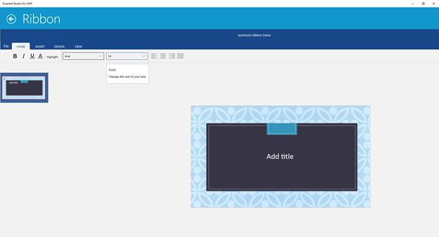

# ToolTip Support in UWP Ribbon

Ribbon Controls supports tooltip that is used to display small information while hovering mouse on it


<ribbon:SfRibbon  Name="_ribbon" HorizontalAlignment="Stretch" VerticalAlignment="Top">

<ribbon:SfRibbonTab Caption="HOME" >

<ribbon:SfRibbonBar Name="_ribbonBar1">

<ribbon:SfDropDownButton ToolTip="Provides additional information" Icon="Assets/HyperLink.png" Label="HyperLink" Header="Insert HyperLink">

<Grid Width="200" Height="200"  Margin="0,20,0,0" >

<Grid.RowDefinitions>

<RowDefinition Height="Auto"/>

<RowDefinition Height="Auto"/>

<RowDefinition Height="Auto"/>

<RowDefinition Height="Auto"/>

</Grid.RowDefinitions>

<TextBlock Text="Address"  />

<TextBox Margin="5" Text="wwww.google.com" Grid.Row="1" />

<TextBlock Text="Display" Grid.Row="2" />

<TextBox Margin="5"  Text="Google" Grid.Row="3" />

</Grid>

</ribbon:SfDropDownButton>

<ribbon:SfRibbonMenu ToolTip="Change the picture" Label="Pictures" Icon="Assets/Picture.png">

<ribbon:SfRibbonMenuItem Header="Camera roll"/>

<ribbon:SfRibbonMenuItem Header="Library"/>

</ribbon:SfRibbonMenu >

<ribbon:SfRibbonComboBox  ToolTip="Pick a new font for your text" Width="100">

<ribbon:SfRibbonComboBoxItem>Arial</ribbon:SfRibbonComboBoxItem>

<ribbon:SfRibbonComboBoxItem>Tahoma</ribbon:SfRibbonComboBoxItem>

</ribbon:SfRibbonComboBox>

<ribbon:SfRibbonGallery ToolTip="Change the shape" Icon="Assets/Shapes.png"  Header="Shapes" Label="Shapes">

<ribbon:SfRibbonGalleryGroup Header="First group">

<ribbon:SfRibbonGalleryItem>

<Image Source="Assets/Apex.png"/>

</ribbon:SfRibbonGalleryItem>

</ribbon:SfRibbonGalleryGroup>

</ribbon:SfRibbonGallery>

</ribbon:SfRibbonBar>

</ribbon:SfRibbonTab>

</ribbon:SfRibbon>



****

