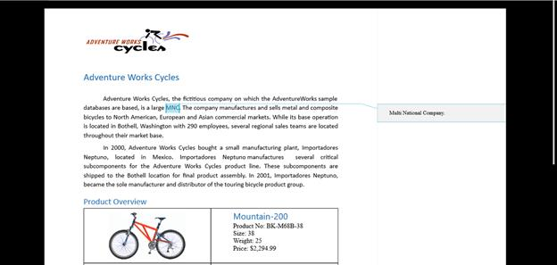
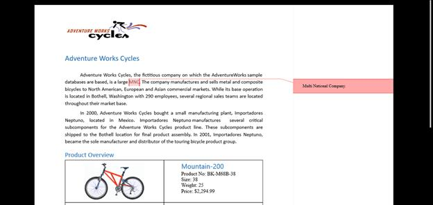

# Comment in UWP RichTextBox (SfRichTextBoxAdv)

A Comment is a note or annotation that an author or reviewer can add to the document. The SfRichTextBoxAdv control supports viewing and editing the comments in the document. It renders the comments present in the document in review pane, similar to the Microsoft Word.

N> Currently, the SfRichTextBoxAdv shows comments on pages layout type only.

## UI Commands for accessing comment

The following operations can be performed through command binding in SfRichTextBoxAdv control:

* Insert a new comment.

* Delete an existing comment.

* Navigate to the next comment.

* Navigate to the previous comment.

* Show/Hide review pane.

The following code example demonstrates how to bind commands for accessing comment in SfRichTextBoxAdv document.


<!-- Binds button to the ShowCommentsCommand -->
<Button Content="Show Comments" Command="{Binding ElementName=richTextBoxAdv, Path=ShowCommentsCommand, Mode=TwoWay}" />
<!-- Binds button to the NewCommentCommand -->
<Button Content="New Comment" Command="{Binding ElementName= richTextBoxAdv, Path=NewCommentCommand, Mode=TwoWay}" />
<!-- Binds button to the DeleteCommentCommand -->
<Button Content="Delete Comment" Command="{Binding ElementName=richTextBoxAdv, Path=DeleteCommentCommand, Mode=TwoWay}"/>
<!-- Binds button to the PreviousCommentCommand -->
<Button Content="Previous Comment" Command="{Binding ElementName=richTextBoxAdv, Path=PreviousCommentCommand, Mode=TwoWay}" />
<!-- Binds button to the NextCommentCommand -->
<Button Content="Next Comment" Command="{Binding ElementName=richTextBoxAdv, Path=NextCommentCommand, Mode=TwoWay}" />





## Customizing comment visual style

The SfRichTextBoxAdv provides event support to notify whenever a comment is added to the document. With the help of it, you can customize the visual style for the comment. You can also set the author and initial of the comment.
The following code example demonstrates how to customize comment visual style using event.


// Hooks the CommentAdding event of RichTextBoxAdv.
richTextBoxAdv.CommentAdding += RichTextBoxAdv_CommentAdding;

// Unhooks the CommentAdding event of RichTextBoxAdv.
richTextBoxAdv.CommentAdding -= RichTextBoxAdv_CommentAdding;

// Handles the CommentAdding event of the richTextBoxAdv control.
private void RichTextBoxAdv_CommentAdding(object obj, CommentAddingEventArgs args)
{
    if (!isFileLoading)
    {
        //Defines the author and initial for the comment.
        args.Comment.Author = "Peter";
        args.Comment.Initial = "Frank";
    }

    // Defines the background brush for the comment.
    args.VisualStyle.BackgroundBrush = new SolidColorBrush(Color.FromArgb(0xff, 0xff, 0xa8, 0xa8));

    // Defines the border brush for the comment.
    args.VisualStyle.BorderBrush = new SolidColorBrush(Color.FromArgb(0xff, 0xFF, 0x01, 0x01));

    // Defines the highlight color for the commented content.
    args.VisualStyle.HighlightColor = Color.FromArgb(0xff, 0xFf, 0xa8, 0x8);

}





## Visibility of comment pane

The SfRichTextBoxAdv control allows you to determine the visibility of the comment pane using the IsCommentPaneVisible property of the EditorSettings class.

The following code example illustrates how to check whether the comment pane is currently visible or hidden:



SfRichTextBoxAdv richTextBoxAdv = new SfRichTextBoxAdv();
bool isCommentPaneVisible = richTextBoxAdv.EditorSettings.IsCommentPaneVisible;



Dim richTextBoxAdv As New SfRichTextBoxAdv()
Dim isCommentPaneVisible As Boolean = richTextBoxAdv.EditorSettings.IsCommentPaneVisible




