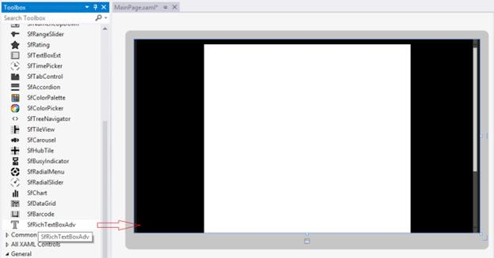

# Getting Started with UWP RichTextBox (SfRichTextBoxAdv)

SfRichTextBoxAdv is a control that allows you to view and edit rich text contents including table, text, images and hyperlinks. This section describes how to get started with SfRichTextBoxAdv control.

## Assembly Reference

You can find SfRichTextBoxAdv control from the following assembly under the namespace Syncfusion.UI.Xaml.RichTextBoxAdv

* Syncfusion.SfRichTextBoxAdv.UWP

The following assembly references are required to deploy SfRichTextBoxAdv control in your application.

* Syncfusion.DocIO.UWP

* Syncfusion.SfRadialMenu.UWP

* Syncfusion.SfShared.UWP

N> Starting with v16.2.0.41 (2018 Vol 2), if you reference Syncfusion assemblies from trial setup or from the NuGet feed, you also have to add "Syncfusion.Licensing" assembly reference and include a license key in your projects. Please refer to this [link](https://help.syncfusion.com/common/essential-studio/licensing/license-key) to know about registering Syncfusion license key in your UWP application to use our components.

## Adding SfRichTextBoxAdv to an application

After adding the aforementioned assembly references to your application, you can add SfRichTextBoxAdv as any normal control.
You can either drag the SfRichTextBoxAdv control from the toolbox window to the Design view or directly define the control in XAML view.



<RichTextBoxAdv:SfRichTextBoxAdv x:Name="richTextBoxAdv" ManipulationMode="All" xmlns:RichTextBoxAdv="using:Syncfusion.UI.Xaml.RichTextBoxAdv"/>




// Initializes a new instance of SfRichTextBoxAdv.
SfRichTextBoxAdv richTextBoxAdv = new SfRichTextBoxAdv();
richTextBoxAdv.ManipulationMode = ManipulationModes.All;





## Using SfRichTextBoxAdv as a standard RichTextBox

This section discusses about how to use the SfRichTextBoxAdv control as a standard RichTextBox control with rich text formatting options.


<Page>

    <Page.Resources>
        <RichTextBoxAdv:UnderlineToggleConverter x:Key="UnderlineToggleConverter"/>
        <RichTextBoxAdv:LeftAlignmentToggleConverter x:Key="LeftAlignmentToggleConverter"/>
        <RichTextBoxAdv:CenterAlignmentToggleConverter x:Key="CenterAlignmentToggleConverter"/>
        <RichTextBoxAdv:RightAlignmentToggleConverter x:Key="RightAlignmentToggleConverter"/>
        <RichTextBoxAdv:JustifyAlignmentToggleConverter x:Key="JustifyAlignmentToggleConverter"/>
        
        
    </Page.Resources>

    <Grid Background="#F1F1F1">
        <Grid.RowDefinitions>
            <RowDefinition Height="Auto"/>
            <RowDefinition Height="*"/>
        </Grid.RowDefinitions>
        <Grid>
            <!-- Defines the data context as RichTextBoxAdv -->
            <StackPanel Orientation="Horizontal" DataContext="{Binding ElementName=richTextBoxAdv}">
                <!-- UI option to perform Undo/Redo using command binding -->
                <StackPanel Orientation="Horizontal">
                    <Button Command="{Binding UndoCommand}" IsTabStop="False">
                        <Image Source="/Images/Undo.png" Height="40" Width="40" />
                    </Button>
                    <Button Command="{Binding RedoCommand}" IsTabStop="False">
                        <Image Source="/Images/Redo.png" Height="40" Width="40" />
                    </Button>
                </StackPanel>
                <!-- UI option to perform Clipboard operations using command binding -->
                <Border Width="2" Height="46" Background="#1F1F1F"/>
                <StackPanel Orientation="Horizontal">
                    <Button Command="{Binding CutCommand}" IsTabStop="False">
                        <Image Source="/Images/Cut.png" Height="40" Width="40" />
                    </Button>
                    <Button Command="{Binding CopyCommand}" IsTabStop="False">
                        <Image Source="/Images/Copy.png" Height="40" Width="40" />
                    </Button>
                    <Button Command="{Binding PasteCommand}" IsTabStop="False">
                        <Image Source="/Images/Paste.png" Height="40" Width="40" />
                    </Button>
                </StackPanel>
                <!-- UI option to apply character formatting using property binding -->
                <Border Width="2" Height="46" Background="#1F1F1F"/>
                <StackPanel Orientation="Horizontal">
                    <ToggleButton IsChecked="{Binding Selection.CharacterFormat.Bold}" IsTabStop="False">
                        <Image Source="/Images/Bold.png" Height="40" Width="40" />
                    </ToggleButton>
                    <ToggleButton IsChecked="{Binding Selection.CharacterFormat.Italic}" IsTabStop="False">
                        <Image Source="/Images/Italic.png" Height="40" Width="40" />
                    </ToggleButton>
                    <ToggleButton IsChecked="{Binding Selection.CharacterFormat.Underline, Converter={StaticResource UnderlineToggleConverter}}" IsTabStop="False">
                        <Image Source="/Images/Underline.png" Height="40" Width="40" />
                    </ToggleButton>
                </StackPanel>
                <Border Width="2" Height="46" Background="#1F1F1F"/>
                <!-- UI option to apply paragraph formatting using property binding -->
                <StackPanel Orientation="Horizontal">
                    <ToggleButton IsChecked="{Binding Selection.ParagraphFormat.TextAlignment, Converter={StaticResource LeftAlignmentToggleConverter}}" IsTabStop="False">
                        <Image Source="/Images/Left.png" Height="40" Width="40" />
                    </ToggleButton>
                    <ToggleButton IsChecked="{Binding Selection.ParagraphFormat.TextAlignment, Converter={StaticResource CenterAlignmentToggleConverter}}" IsTabStop="False">
                        <Image Source="/Images/Center.png" Height="40" Width="40" />
                    </ToggleButton>
                    <ToggleButton IsChecked="{Binding Selection.ParagraphFormat.TextAlignment, Converter={StaticResource RightAlignmentToggleConverter}}" IsTabStop="False">
                        <Image Source="/Images/Right.png" Height="40" Width="40" />
                    </ToggleButton>
                    <ToggleButton IsChecked="{Binding Selection.ParagraphFormat.TextAlignment, Converter={StaticResource JustifyAlignmentToggleConverter}}" IsTabStop="False">
                        <Image Source="/Images/Justify.png" Height="40" Width="40" />
                    </ToggleButton>
                </StackPanel>
            </StackPanel>
        </Grid>
        <RichTextBoxAdv:SfRichTextBoxAdv x:Name="richTextBoxAdv" Grid.Row="1" ManipulationMode="All" />
    </Grid>
</Page>




