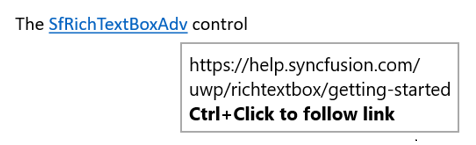
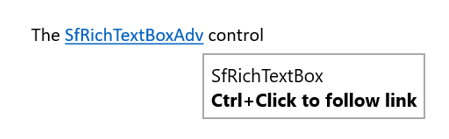
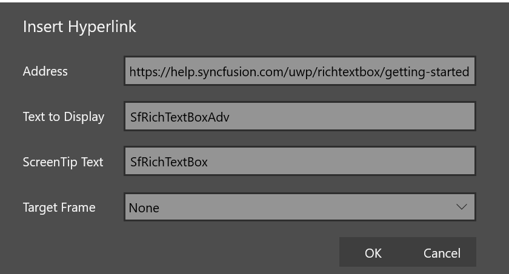

# Hyperlink in UWP RichTextBox (SfRichTextBoxAdv)

The SfRichTextBoxAdv supports hyperlink field similar to the Microsoft Word. You can link part of the document content to Internet or file location, mail address or any text.
The following code example illustrates how to insert a hyperlink field.


<RichTextBoxAdv:ParagraphAdv xmlns:RichTextBoxAdv="using:Syncfusion.UI.Xaml.RichTextBoxAdv">
    <RichTextBoxAdv:FieldBeginAdv></RichTextBoxAdv:FieldBeginAdv>
    <RichTextBoxAdv:SpanAdv Text=" HYPERLINK &quot;http://www.syncfusion.com&quot; "></RichTextBoxAdv:SpanAdv>
    <RichTextBoxAdv:FieldSeparatorAdv></RichTextBoxAdv:FieldSeparatorAdv>
    <RichTextBoxAdv:SpanAdv Text="Syncfusion">
        <RichTextBoxAdv:SpanAdv.CharacterFormat>
            <RichTextBoxAdv:CharacterFormat Underline="Single" FontColor="#ff0563c1"/>
        </RichTextBoxAdv:SpanAdv.CharacterFormat>
    </RichTextBoxAdv:SpanAdv>
    <RichTextBoxAdv:FieldEndAdv></RichTextBoxAdv:FieldEndAdv>
</RichTextBoxAdv:ParagraphAdv>




// Appends the field start.
paragraphAdv.Inlines.Add(new FieldBeginAdv());
// Appends the field code.
SpanAdv fieldCode = new SpanAdv();
string url = "www.syncfusion.com";
fieldCode.Text = " HYPERLINK \"" + url + "\" ";
paragraphAdv.Inlines.Add(fieldCode);
// Appends the field separator
paragraphAdv.Inlines.Add(new FieldSeparatorAdv());
// Appends the field result.
SpanAdv fieldResult = new SpanAdv();
fieldResult.Text = "Syncfusion";
fieldResult.CharacterFormat.Underline = Underline.Single;
fieldResult.CharacterFormat.FontColor = Windows.UI.Color.FromArgb(0xff, 0x05, 0x63, 0xc1);
paragraphAdv.Inlines.Add(fieldResult);
// Appends the field end.
paragraphAdv.Inlines.Add(new FieldEndAdv());





The following code example illustrates how to insert hyperlink field into SfRichTextBoxAdv Document through UI command.


<Button Content="Insert Hyperlink" Command="{Binding ElementName=richTextBoxAdv,Path=InsertHyperlinkCommand}"/>





## Hyperlink ScreenTip

In RichTextBox control ToolTip (ScreenTip) shows some information or navigation link, when the mouse hovers over that hyperlink and it disappears when the mouse is moved away from that hyperlink. By default, it shows navigation link of that hyperlink and you can set the text you want to use for your ScreenTip.

<table><tr><td>Without ScreenTipText</td><td>With ScreenTipText</td></tr><tr><td></td><td></td></tr></table>

The following code example illustrates how to insert a hyperlink field with ScreenTip.


<RichTextBoxAdv:ParagraphAdv>
    <RichTextBoxAdv:FieldBeginAdv></RichTextBoxAdv:FieldBeginAdv>
    <RichTextBoxAdv:SpanAdv Text=" HYPERLINK &quot;\http://www.syncfusion.com&quot; \o SfRichTextBox "></RichTextBoxAdv:SpanAdv>
    <RichTextBoxAdv:FieldSeparatorAdv></RichTextBoxAdv:FieldSeparatorAdv>
    <RichTextBoxAdv:SpanAdv Text="SfRichTextBoxAdv">
            <RichTextBoxAdv:SpanAdv.CharacterFormat>
                <RichTextBoxAdv:CharacterFormat Underline="Single" FontColor="#ff0563c1"/>
            </RichTextBoxAdv:SpanAdv.CharacterFormat>
    </RichTextBoxAdv:SpanAdv>
    <RichTextBoxAdv:FieldEndAdv></RichTextBoxAdv:FieldEndAdv>
</RichTextBoxAdv:ParagraphAdv>



ParagraphAdv paragraphAdv = new ParagraphAdv();
// Appends the field start.
paragraphAdv.Inlines.Add(new FieldBeginAdv());
// Appends the field code.
SpanAdv fieldCode = new SpanAdv();
string url = "www.syncfusion.com";
string screenTip = "SfRichTextBox";
fieldCode.Text = " HYPERLINK \"" + url + "\" \\o \"" + screenTip + "\" ";
paragraphAdv.Inlines.Add(fieldCode);
// Appends the field separator
paragraphAdv.Inlines.Add(new FieldSeparatorAdv());
// Appends the field result.
SpanAdv fieldResult = new SpanAdv();
fieldResult.Text = "SfRichTextBoxAdv";
fieldResult.CharacterFormat.Underline = Underline.Single;
fieldResult.CharacterFormat.FontColor = Color.FromArgb(0xff, 0x05, 0x63, 0xc1);
paragraphAdv.Inlines.Add(fieldResult);
// Appends the field end.
paragraphAdv.Inlines.Add(new FieldEndAdv());
richTextBoxAdv.Document.Sections[0].Blocks.Add(paragraphAdv);



' Appends the field start.
paragraphAdv.Inlines.Add(New FieldBeginAdv())
' Appends the field code.
Dim fieldCode As New SpanAdv()
Dim url As String = "www.syncfusion.com"
Dim screenTip As String = "SfRichTextBox"
fieldCode.Text = (Convert.ToString(" HYPERLINK """) & url) + """ ""o """ + (screenTip) + """ "
paragraphAdv.Inlines.Add(fieldCode)
' Appends the field separator
paragraphAdv.Inlines.Add(New FieldSeparatorAdv())
' Appends the field result.
Dim fieldResult As New SpanAdv()
fieldResult.Text = "SfRichTextBoxAdv"
fieldResult.CharacterFormat.Underline = Underline.[Single]
fieldResult.CharacterFormat.FontColor = Color.FromArgb(&Hff, &H5, &H63, &Hc1)
paragraphAdv.Inlines.Add(fieldResult)
' Appends the field end.
paragraphAdv.Inlines.Add(New FieldEndAdv())




The following code example illustrates how to insert hyperlink field with ScreenTip into RichTextBox Document through UI command.


richTextBoxAdv.InsertHyperlinkCommand.Execute(new string[3] { "www.syncfusion.com", "SfRichTextBoxAdv", "SfRichTextBox" });




The following section illustrates how to insert hyperlink field with ScreenTip in RichTextBox Document through built-in hyperlink dialog UI command like Microsoft Word application.
1. Open insert hyperlink dialog.




<!-- Binds button to the ShowHyperlinkDialogCommand -->
<Button Content="Hyperlink" Command="{Binding ElementName=richTextBoxAdv, Path=ShowHyperlinkDialogCommand}"/>




{{ codesnippet1 | OrderList_Indent_Level_1 }}

2. Enter the display text, URL link and ScreenTip text.
3. Click on OK to close the dialog box.

In the SfRichTextBoxAdv control, ToolTip (ScreenTip) will be shown by default when the mouse hovers over that hyperlink. You can disable ToolTip by using the [DisplayScreenTips](https://help.syncfusion.com/cr/uwp/Syncfusion.UI.Xaml.RichTextBoxAdv.EditorSettings.html#Syncfusion_UI_Xaml_RichTextBoxAdv_EditorSettings_DisplayScreenTips) property of [EditorSettings](https://help.syncfusion.com/cr/uwp/Syncfusion.UI.Xaml.RichTextBoxAdv.EditorSettings.html)class.

The following code example illustrates how to disable the ToolTip of the hyperlink.



<RichTextBoxAdv:SfRichTextBoxAdv x:Name="richTextBoxAdv">
    <RichTextBoxAdv:SfRichTextBoxAdv.EditorSettings>
        <RichTextBoxAdv:EditorSettings DisplayScreenTips="False" />
    </RichTextBoxAdv:SfRichTextBoxAdv.EditorSettings>
</RichTextBoxAdv:SfRichTextBoxAdv>



SfRichTextBoxAdv richTextBoxAdv = new SfRichTextBoxAdv();
richTextBoxAdv.EditorSettings.DisplayScreenTips = false;



Dim richTextBoxAdv As New SfRichTextBoxAdv()
richTextBoxAdv.EditorSettings.DisplayScreenTips = False




N> ScreenTip option is supported from V20.4.0.38

## Hyperlink Navigation

The SfRichTextBoxAdv supports event to identify whenever hyperlink navigation is requested. This allows you to easily customize the hyperlink navigation functionality.
The following code example demonstrates how to customize hyperlink navigation functionality for the SfRichTextBoxAdv instance.


//Hooks the event handler for RequestNavigate event.
richTextBoxAdv.RequestNavigate += RichTextBoxAdv_RequestNavigate;

/// 

/// Handles the RequestNavigate event of the richTextBoxAdv control.
/// 

/// <param name="obj">The source of the event.</param>
/// <param name="args">The <see cref="RequestNavigateEventArgs"/> instance containing the event data.</param>
private async void RichTextBoxAdv_RequestNavigate(object obj, RequestNavigateEventArgs args)
{
    if (args.Hyperlink.LinkType == HyperlinkType.Webpage || args.Hyperlink.LinkType == HyperlinkType.Email)
    {
        Uri uri = new Uri(args.Hyperlink.NavigationLink);
        await Windows.System.Launcher.LaunchUriAsync(uri);
    }
}




