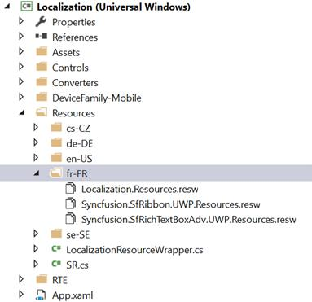
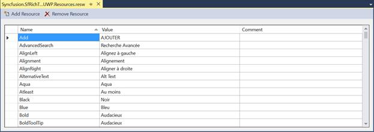
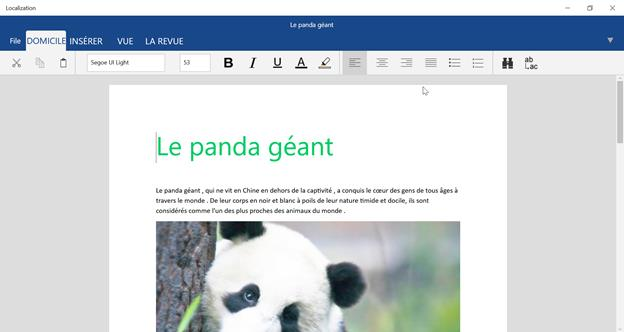

# Localization in UWP RichTextBox (SfRichTextBoxAdv)

Localization is the process of configuring the application to a specific language. SfRichTextBoxAdv provides support to localize all the static text in radial menu and all its dialogs. Localization can be done by adding resource file (Resw) and setting the specific culture in the application.

## Setting language in the app manifest file

The following steps illustrates you how to configure the app package for localization using the manifest designer

* In **Solution** **Explorer**, expand the project node of your UWP app.
* Double-click the **Package****.****appxmanifest** file. If the manifest file is already open in the XML code view, Visual Studio prompts you to close the file.
* Now specify the **Default** **language** on the **Application** tab as required to localize your app. Click on **More** **information** to know about the supported languages.

* Save the app manifest file after setting the default language.

## Adding Resource file

* Create a folder with name ‘Resources’ in your application.
* Create a folder with language (“en-US”, “fr-FR”, etc.) under ‘Resources’ to hold the resource file for the respective language.
* Add default English (“en-US”) [Resw](https://www.syncfusion.com/downloads/support/directtrac/general/ze/Resources_File-1713514901)(resource) file of SfRichTextBoxAdv and application (Localization) in the ‘en-US’ folder, named as Syncfusion.SfRichTextBoxAdv.UWP.Resources. resw, Syncfusion.SfRibbon. Resources.resw and Localization.Resources. resw respectively. For your reference, French(“fr-FR”) [Resw](https://www.syncfusion.com/downloads/support/directtrac/general/ze/Resources2076091381) file.

* Add the resource key such as name and its corresponding localized value in Resource Designer of Syncfusion.SfRichTextBoxAdv.UWP.Resources. resw, Syncfusion.SfRibbon. Resources.resw and Localization. Resources.resw file.

N> If you have not used SfRibbon in your application, you can skip Syncfusion.SfRibbon.UWP.[Culture name].resw file mentioned above.

The following screenshot shows the localization in SfRichTextBoxAdv

