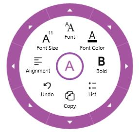
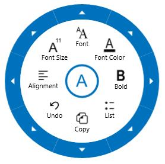

# Radial Menu in UWP RichTextBox (SfRichTextBoxAdv)

The SfRichTextBoxAdv supports built-in radial menu to provide rich text formatting options such as bold, italic etc.
The following screenshot shows built-in radial menu for SfRichTextBoxAdv control.

N> In Windows Phone device, the built-in radial menu is not supported.

## Enable/Disable Radial Menu

In SfRichTextBoxAdv, the built-in radial menu is enabled by default. It is possible to enable/disable the built-in radial menu. The following code example demonstrates how to disable the built-in radial menu in SfRichTextBoxAdv.


<RichTextBoxAdv:SfRichTextBoxAdv x:Name="richTextBoxAdv" ManipulationMode="All" EnableRadialMenu="True" xmlns:RichTextBoxAdv="using:Syncfusion.UI.Xaml.RichTextBoxAdv"/>




// Initializes a new instance of SfRichTextBoxAdv.
SfRichTextBoxAdv richTextBoxAdv = new SfRichTextBoxAdv();
richTextBoxAdv.ManipulationMode = ManipulationModes.All;

//Disables the built-in radial menu in RichTextBoxAdv.
richTextBoxAdv.EnableRadialMenu = false;




## Customizing Radial Menu Appearance

You can customize the appearance of built-in radial menu as per your requirement. This can be done by defining the custom styles for Radial menu under the resources of SfRichTextBoxAdv, which will override its default style.
The following code example demonstrates how to customize the appearance of navigation button, rim, radial slider and radial pointer in the built-in radial menu.


<RichTextBoxAdv:SfRichTextBoxAdv x:Name="richTextBox" ManipulationMode="All" AcceptsTab="True" xmlns:RichTextBoxAdv="using:Syncfusion.UI.Xaml.RichTextBoxAdv">
  <!-- Specify resources for this instance -->
  <RichTextBoxAdv:SfRichTextBoxAdv.Resources>
  
    <!-- Custom style for Radial Menu -->
    
    
    <!-- Custom Style for Radial Pointer -->
    
    
    <!-- Custom Style for Radial Slider -->
    
    
    <!-- Custom Style for Navigation Button -->
    
  </RichTextBoxAdv:SfRichTextBoxAdv.Resources>
</RichTextBoxAdv:SfRichTextBoxAdv>




The following screenshot shows the radial menu with customized style.

The sample to demonstrate customizing the style of built-in radial menu, can be downloaded from the following link.
[Sample](http://www.syncfusion.com/downloads/support/directtrac/general/ze/RadialMenuCustomization-1397995223# "Click here to download the sample")
