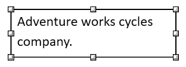

# Shapes in UWP RichTextBox (SfRichTextBoxAdv)
Shapes are drawing objects that include lines, curves, circles, rectangles, etc. It can be preset or custom geometry. Currently, SfRichTextBoxAdv does not have support for insert shapes. But while importing if the document contains shape, it will be preserved properly.

N> The shape element is supported from release version 18.3.0. X.

## Supported shapes
Currently, SfRichTextBoxAdv has preservation support for Text box and Rectangle shapes.

## Text box Shape
A text box is a rectangular area on the document where you can enter text. When you click in a text box, a flashing cursor is displayed, indicating you can begin typing. And it allows you to enter multiple lines of text with all text formatting.

## Resizing
The SfRichTextBoxAdv also supports a built-in shape resizer to resize the shapes present in the document to your wish. The shape resizer accepts both touch and mouse interactions.

## Text wrapping
Text wrapping refers to how shapes are positioned about to text in a document. Please [refer to this page](https://help.syncfusion.com/uwp/richtextbox/text-wrapping) for more information about text wrapping.

## Positioning
Currently, SfRichTextBoxAdv does not have support for change or move the position of the shape. The shape will move as text is added or removed if it is positioned relative to the line or paragraph.

N> The shape can be positioned anywhere in the document by drag and drop. if the shape’s wrapping style is in line with the text.

