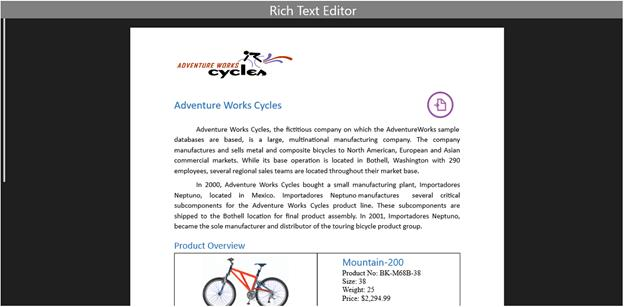

# Styles and Templates in UWP RichTextBox (SfRichTextBoxAdv)

This section describes the styles and templates for the SfRichTextBoxAdv control. The Template defines the structure of the SfRichTextBoxAdv control and the Style defines its visual appearance. You can modify the default Control template to define a unique appearance for the control.
The following XAML shows the default style and template for the SfRichTextBoxAdv control.







N> In the control template, you are allowed to reorder the template parts and to add your own elements. However, when changing the control template you should be careful to include all required parts. Usually required parts are marked with Name attribute. Omission of required parts may impact some of the functionality. 

## Styling the SfRichTextBoxAdv

You can define custom style for the SfRichTextBoxAdv control either by creating empty style and set it up on your own or by copying the default style and modifying it. 
The following example demonstrates how to customize the style for SfRichTextBoxAdv control.







The following code example demonstrates how to apply the custom style for RichTextBoxAdv control.


<RichTextBoxAdv:SfRichTextBoxAdv x:Name="richTextBoxAdv" ManipulationMode="All" Style="{StaticResource RichTextBoxAdvCustomStyle}" xmlns:RichTextBoxAdv="using:Syncfusion.UI.Xaml.RichTextBoxAdv"/>





The following screenshot shows the SfRichTextBoxAdv control with customized style.

