# Appearance and styling in UWP Schedule

## Date and TimeLine Customization

The Schedule date and time is used to specify the particular day to be identified and those date and time can be customized.

### Header Date Background Customization

In Schedule, header is used to displays the date within Schedule.

>**Note:-Header date background customization is only applicable for windows.**

#### Day/Week/TimeLine header date background customization 

The Header date background can be changed by **HeaderBackground** property.




    <Schedule:SfSchedule  ScheduleType="Week"
    HeaderBackground="Red" >
    </Schedule:SfSchedule>





    SfSchedule schedule = new SfSchedule();
    schedule.ScheduleType = ScheduleType.Week;
    schedule.HeaderBackground = new SolidColorBrush(Colors.Red);
    this.grid.Children.Add(schedule);
    



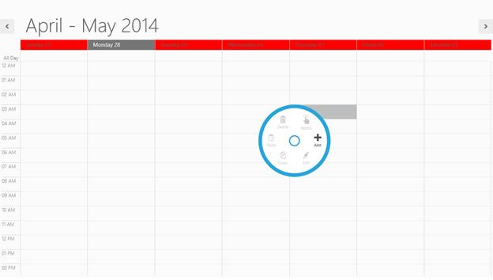

#### Month header date format customization

By default the date format in month cells will be displayed as date (for example: 22), the default date format of month view can be customized by using the **MonthHeaderDateFormat** property.                              



    <Schedule:SfSchedule  ScheduleType="Month"
    MonthHeaderDateFormat="dd MM" >   
    </Schedule:SfSchedule>


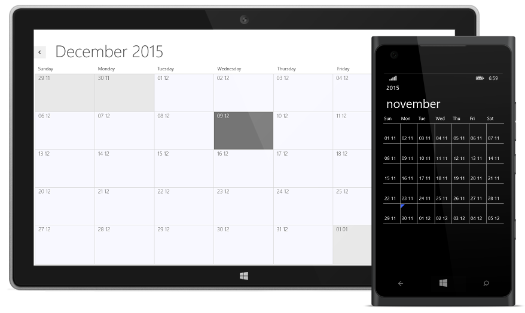

### Time Line Customization

In Schedule MajorTick Lines are used to displays the time as the hours, similarly MinorTick lines in Schedule are used to displays the time as the minutes. Major and Minor tick line can be customized by using the following properties.

>**Note:-TimeLine customization is only applicable in day, week , workweek and timeline views in windows and for Windows Phone it is applicable for day and timeline views.**

#### Time Format  

The default timespan format in Day, Week and Timeline view can be customized by using the **MajorTickTimeFormat** and **MinorTickTimeFormat** properties.

#### Interval Height

The height between the intervals can be set using **IntervalHeight** property and its default value is 40.

#### Time Interval

Time interval can be customized using the **TimeInterval** property. The default interval is One hour.

#### Major and Minor Tick Visibility

The major and minor tick visibility can be customized by **MajorTickVisibility** and **MinorTickVisibility** which is used to set the Visibility of Major and Minor ticks in day, Week and TimeLine view.




        <Schedule:SfSchedule  ScheduleType="Day"
                              MajorTickTimeFormat="hh tt"
                              MinorTickTimeFormat=":mm tt"
                              TimeInterval="ThirtyMin"  
                              IntervalHeight="40"
                              MajorTickVisibility="Visible"
                              MinorTickVisibility="Visible"/>





            SfSchedule schedule = new SfSchedule();
            schedule.ScheduleType = ScheduleType.Week;
            schedule.MajorTickTimeFormat = "hh tt";
            schedule.MinorTickTimeFormat = ":mm tt";
            schedule.TimeInterval = TimeInterval.ThirtyMin;
            schedule.IntervalHeight = 40;
            schedule.MajorTickVisibility = Visibility.Visible;
            schedule.MinorTickVisibility = Visibility.Visible;
            this.grid.Children.Add(schedule);




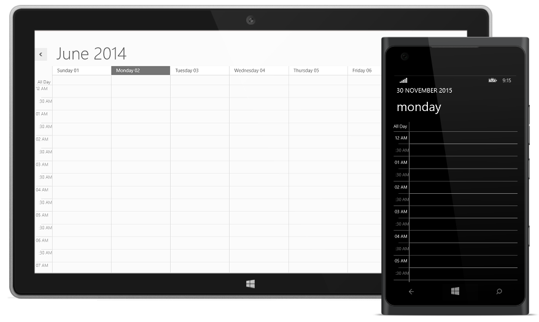

#### TimeMode 

TimeMode property is used to displays the Time mode in Twelve hours or twenty four hours format. The default value of TimeMode property in twelve-hour in Schedule.




    <Schedule:SfSchedule TimeMode="TwelveHours" TimeInterval="OneHour" >
    </Schedule:SfSchedule>





    SfSchedule schedule = new SfSchedule();
    schedule.ScheduleType = ScheduleType.Week;
    schedule.TimeMode = TimeModes.TwelveHours;
    schedule.TimeInterval = TimeInterval.OneHour;
    this.grid.Children.Add(schedule);




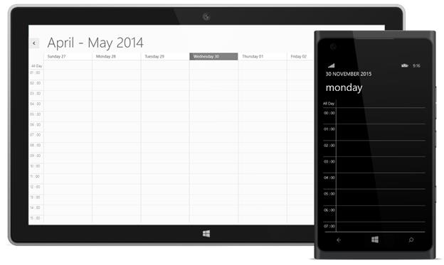

## Current Date and Time Highlighting

You can highlight the Current date and time which is used to differentiate the current date with rest of dates.

### Highlighting Current Date Background

The current date of Schedule can be highlighted by using **CurrentDateBackground** property.




    <Schedule:SfSchedule x:Name="schedule" ScheduleType="Week"
    CurrentDateBackground=" LightSkyBlue " /> 





    SfSchedule schedule = new SfSchedule();
    schedule.ScheduleType = ScheduleType.Week;
    schedule.CurrentDateBackground = new SolidColorBrush(Colors.LightSkyBlue);
    this.grid.Children.Add(schedule);




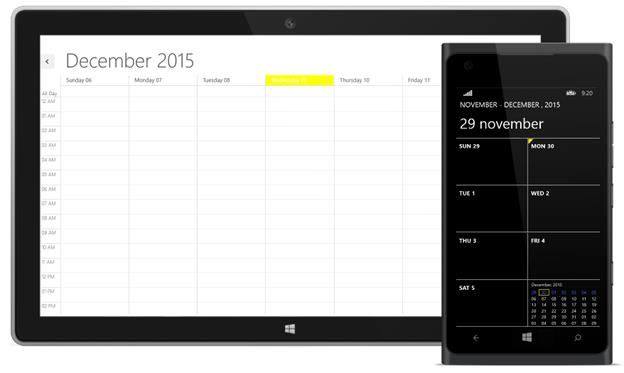

### Highlighting Current Date Foreground

The current date of Schedule foreground can be highlighted by using **CurrentDateForeground** property.

>**Note:-Highlighting current date foreground is only applicable for windows.**




    <Schedule:SfSchedule x:Name="schedule" ScheduleType="Week"
    CurrentDateForeground="Yellow" />
    




    SfSchedule schedule = new SfSchedule();
    schedule.ScheduleType = ScheduleType.Week;
    schedule.CurrentDateForeground = new SolidColorBrush(Colors.Yellow);
    this.grid.Children.Add(schedule);




**Windows**

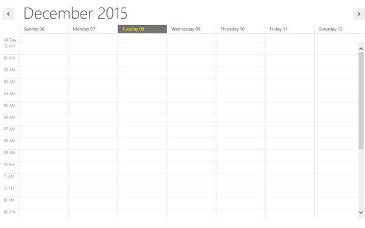

### Indicating Current Day and Time

The current time/Day can be indicated by setting **CurrentTimeIndicatorVisibility** property. you can point the indicator location on current day or current time using **CurrentTimeIndicatorLocation** property,in default **CurrentTimeIndicatorLocation** is positioned on current time.

The CurrentTimeIndicator is displayed only when the **CurrentTimeIndicatorVisibility** property is set to true. The default value of **CurrentTimeIndicatorVisibility** property is collapsed.

>**Note:-CurrentTimeIndicator is only applicable in day,week,workweek and timeline views in windows,and for Windows Phone it is applicable for day and timeline views.**




    <Schedule:SfSchedule ScheduleType="Week"                 
    CurrentTimeIndicatorVisibility="Visible"
    CurrentTimeIndicatorLocation="OnTimeLine"/>
    




    SfSchedule schedule = new SfSchedule();
    schedule.CurrentTimeIndicatorVisibility = Visibility.Visible;
    schedule.CurrentTimeIndicatorLocation = CurrentTimeIndicatorLocation.OnTimeLine;
    this.grid.Children.Add(schedule);




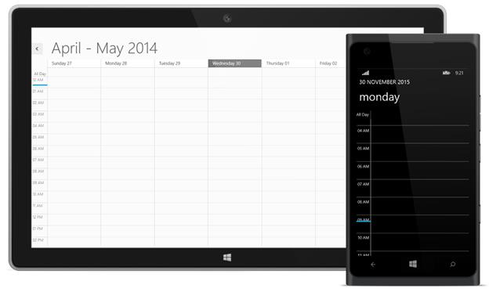

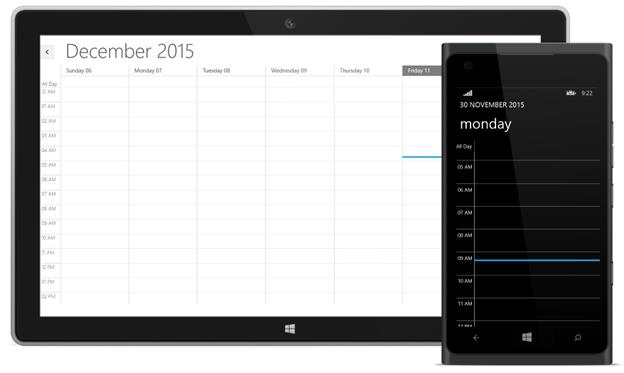

## Non-Working Hours and Days

Schedule allows you to differentiate the Business hours with non-Working hour’s timeslot by highlighting with different colors. 

>**Note:-Non-Working Hour TimeSlot customization is only applicable in day,week,workweek and timeline views in windows and for Windows Phone it is applicable for day and timeline views.**

##### Enabling Non-Working Hours and Days

**IsHighLightWorkingHours** property is used to indicating whether the working hours should be highlighted with Non-business hours. The default value of **IsHighLightWorkingHours** property is false.

### Non-Working Hour Brush

The Non-Working hour’s background brush can be customized using the **NonWorkingHourBrush** property. 

### Non-Working Hours 

The Work start and end hour of day can be declared by using the **WorkStartHour** and **WorkEndHour** properties respectively.




    <Schedule:SfSchedule IsHighLightWorkingHours="True" WorkStartHour="9"
    WorkEndHour="18" ScheduleType="Week"  NonWorkingHourBrush="LightBlue"/>





    SfSchedule schedule = new SfSchedule();
    schedule.IsHighLightWorkingHours = true;
    schedule.ScheduleType = ScheduleType.Week;
    schedule.WorkStartHour = 9;
    schedule.WorkEndHour = 18;
    schedule.NonWorkingHourBrush = new SolidColorBrush(Colors.LightBlue);
    this.grid.Children.Add(schedule);




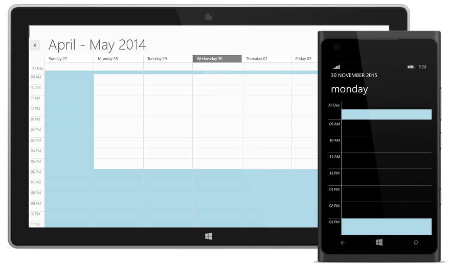

### Non-Working Days of Week

The Non-Working Days of the Week can be set using the property **NonWorkingDays**. The NonWorkingDays is string type, the default value of this property is “Sunday,Saturday”.

>**Note:-Non-Working days customization is only applicable in day,week,workweek and timeline views in windows and for Windows Phone it is applicable for day and timeline views.**




    <Schedule:SfSchedule IsHighLightWorkingHours="True" 
    ScheduleType="Week"  NonWorkingHourBrush="LightBlue"/>





    SfSchedule schedule = new SfSchedule();
    schedule.IsHighLightWorkingHours = true;
    schedule.ScheduleType = ScheduleType.Week;
    schedule.NonWorkingHourBrush = new SolidColorBrush(Colors.LightBlue);
    this.grid.Children.Add(schedule);




### NonWorkingDateCollection:

NonWorkingDateCollection property allows you to add the Non-Working Days of the week.



    SfSchedule schedule = new SfSchedule();
    schedule.IsHighLightWorkingHours = true;
    schedule.ScheduleType = ScheduleType.Week;
    schedule.NonWorkingDays = "Tuesday,Thursday,Friday";
    schedule.NonWorkingHourBrush = new SolidColorBrush(Colors.LightBlue);
    schedule.NonWorkingDateCollection.Add(DayOfWeek.Tuesday);
    schedule.NonWorkingDateCollection.Add(DayOfWeek.Thursday);
    this.grid.Children.Add(schedule);



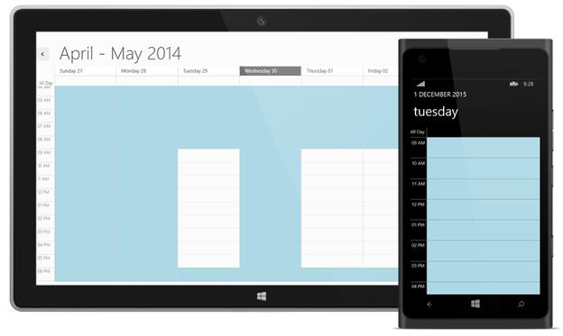

### Hiding Non-Working Hours

To hide non-working hours in the schedule, the **ShowNonWorkingHours** property in the schedule must be set as false. The working hours specified using the WorkStartHour and WorkEndHour properties are simply shown in the schedule without showing non-working hours.

>**Note:-Hiding-Non-Working _hour is only applicable in day,week,workweek and timeline views in windows and for Windows Phone it is applicable for day and timeline views.**




     <syncfusion:SfSchedule x:Name="schedule" Background="White"
                               ScheduleType="Week"
                               WorkStartHour="9" WorkEndHour="18"
                               ShowNonWorkingHours="False">
        </syncfusion:SfSchedule>      





            SfSchedule schedule = new SfSchedule();
            schedule.ScheduleType = ScheduleType.Week;
            schedule.WorkStartHour=9;
            schedule.WorkEndHour=18;
            schedule.ShowNonWorkingHours=false;
            this.grid.Children.Add(schedule);




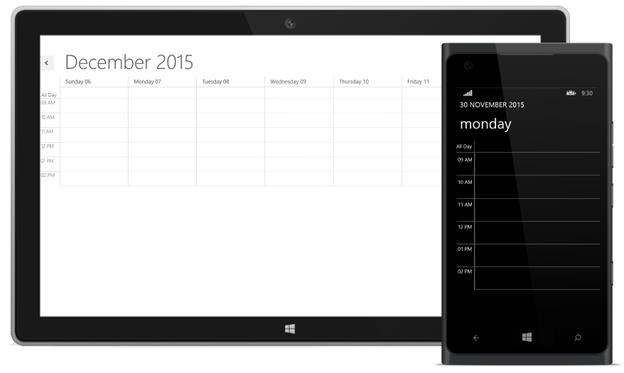

## CollapsedHours

For a particular Start and End time the selected Timeslot can be hidden by using **CollapsedHours** property of SfSchedule and you can differentiated Collapsed Hour Timeslot by using its Background property.

>**Note:-Hiding TimeSlot customization is only applicable in day,week,workweek and timeline views in windows and for Windows Phone it is applicable for day and timeline views.**





    <schedule:SfSchedule Background="White" x:Name="schedule" ScheduleType="Week">
    <schedule:SfSchedule.CollapsedHours>
                <schedule:ScheduleCollapsedHour StartHour="1" EndHour="5"  Background="Red"/>
            </schedule:SfSchedule.CollapsedHours>        
    </schedule:SfSchedule>
    




     SfSchedule schedule = new SfSchedule();
            schedule.ScheduleType = ScheduleType.Week;
            schedule.CollapsedHours.Add(new ScheduleCollapsedHour()
            {
                StartHour = 10,
                EndHour = 11,
                Background = new SolidColorBrush(Colors.Red)
            });
            this.grid.Children.Add(schedule);




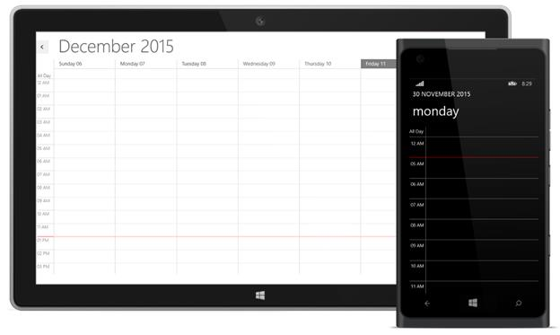

## NonAccessibleBlocks 

A particular Start and End timeslot can be blocked by setting the NonAccessibleBlocks property collection. And the corresponding block can be highlighted with different color and label by using Background and Label property of NonAccessibleBlock correspondingly. 

>**Note:-NonAccessible block is only applicable in day,week,workweek and timeline views in windows and for Windows Phone it is applicable for day and timeline views.**




              <Schedule:SfSchedule ScheduleType="Week"  IntervalHeight="30">
            <Schedule:SfSchedule.NonAccessibleBlocks>
                <Schedule:NonAccessibleBlock Background="LightPink" StartHour="6.00" EndHour="8.00" Label="Non Accessible Block">
                </Schedule:NonAccessibleBlock> 
            </Schedule:SfSchedule.NonAccessibleBlocks>
        </Schedule:SfSchedule>





            SfSchedule schedule = new SfSchedule();
            schedule.ScheduleType = ScheduleType.Week;
            schedule.NonAccessibleBlocks.Add(new NonAccessibleBlock()
            {
                Background = new SolidColorBrush(Colors.LightPink),
                StartHour = 6.00,
                EndHour = 8.00,
                Label = "Non Accessible Block"
            });
            this.grid.Children.Add(schedule);  




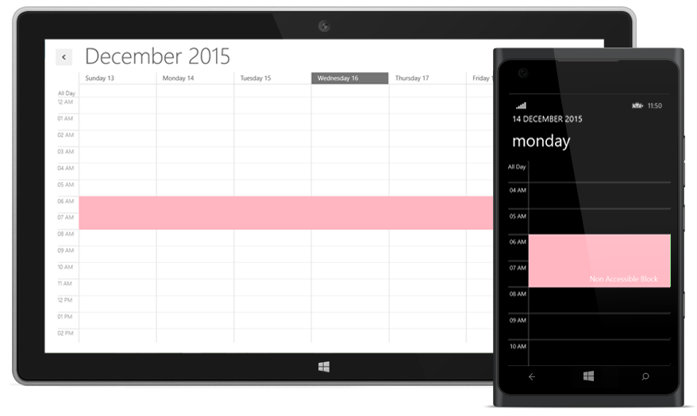

## Stroke Customization

In the SfSchedule control, major, minor, and horizontal lines drawn in the day and week views, and horizontal and vertical lines drawn in the month view can be customized.

In the day, week, work week, and time line views, the color of major lines can be customized by setting the Brush property **MajorTickStroke**, and a dashed line pattern can be set for major lines through **MajorTickStrokeDashArray**, a double collection property. Similarly, the color of minor lines and a dashed line pattern can be set through **MinorTickStroke** and **MinorTickStrokeDashArray**, respectively.The color of the vertical lines that separate dates in the week view can be customized through the **DayViewVerticalLineStroke** property. Major and minor tick labels can also be customized using **MajorTickLabelStroke** and **MinorTickLabelStroke**.

In the month view, the horizontal and vertical line strokes can be customized by using the **MonthViewLineStroke** property.

>**Note:-Stroke customization is only applicable in day,week,workweek and timeline views in windows and for Windows Phone it is applicable for day and timeline views.**

**Property Table**

<table>
<tr>
<td>
API Name</td><td>
Data Type</td><td>
Description</td></tr>
<tr>
<td>
MajorTickStroke</td><td>
Brush</td><td>
Used to customize the major line stroke of the day and time line views.
</td></tr>
<tr>
<td>
MinorTickStroke  </td><td>
Brush</td><td>
Used to customize the minor line stroke of the day and time line views.
</td></tr>
<tr>
<td>
MajorTickLabelStroke  </td><td>
Brush</td><td>
Used to customize the major line label stroke in the day and time line views.</td></tr>
<tr>
<td>
MinorTickLabelStroke</td><td>
Brush</td><td>
Used to customize the minor line label stroke of the day and time line views.</td></tr>
<tr>
<td>
MajorTickStrokeDashArray</td><td>
DoubleCollection</td><td>
Used to customize the major line stroke dash array of the day and time line views.</td></tr>
<tr>
<td>
MinorTickStrokeDashArray  </td><td>
DoubleCollection</td><td>
Used to customize the minor line stroke dash array of the day and time line views.</td></tr>
<tr>
<td>
DayViewVerticalLineStroke  </td><td>
Brush</td><td>
Used to customize the vertical line stroke of the day view.  </td></tr>
<tr>
<td>
MonthViewLineStroke  </td><td>
Brush</td><td>
Used to customize the line stroke of month view.  </td></tr>
</table>




         <syncfusion:SfSchedule x:Name="Schedule1" TimeInterval="ThirtyMin"IntervalHeight="40"
          ScheduleType="WorkWeek"
          MajorTickStroke="Red"
          MinorTickStroke="Green"
          MajorTickLabelStroke="Red"
          MinorTickLabelStroke="Green"
          DayViewVerticalLineStroke="Blue"
          MonthViewLineStroke="Orange"
          MajorTickStrokeDashArray="5,10"
          MinorTickStrokeDashArray="5,5">  </syncfusion:SfSchedule>





            SfSchedule schedule = new SfSchedule();
            schedule.TimeInterval = TimeInterval.ThirtyMin;
            schedule.IntervalHeight = 40;
            schedule.ScheduleType = ScheduleType.WorkWeek;
            schedule.MajorTickStroke = new SolidColorBrush(Colors.Red);
            schedule.MinorTickStroke = new SolidColorBrush(Colors.Green);
            schedule.MajorTickLabelStroke = new SolidColorBrush(Colors.Red);
            schedule.MinorTickLabelStroke = new SolidColorBrush(Colors.Green);
            schedule.DayViewVerticalLineStroke = new SolidColorBrush(Colors.Blue);
            schedule.MonthViewLineStroke = new SolidColorBrush(Colors.Orange); 
            schedule.MajorTickStrokeDashArray = new DoubleCollection() { 5,10};
            schedule.MinorTickStrokeDashArray = new DoubleCollection() {10,10 };
            this.grid.Children.Add(schedule);




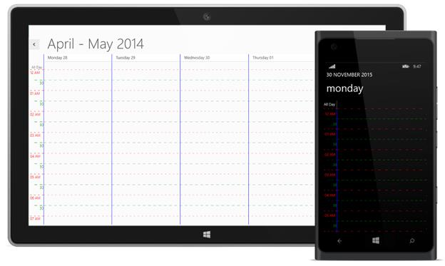

## Focused and Non-Focused Month Brush

In Schedule month view, date of the current selected month and date of previous/next months can be differentiated using the FocusedMonth and NonFocusedMonth properties respectively.

>**Note:-Focused and Non Focused Month Brush is only applicable for windows.**




    <Schedule:SfSchedule x:Name="schedule" FocusedMonth="White" 
    NonFocusedMonth="WhiteSmoke" ScheduleType="Month" />





    SfSchedule schedule = new SfSchedule();
    schedule.ScheduleType = ScheduleType.Month;
    schedule.FocusedMonth = new SolidColorBrush(Colors.White);
    schedule.NonFocusedMonth = new SolidColorBrush(Colors.WhiteSmoke);
    this.grid.Children.Add(schedule);




**Windows**

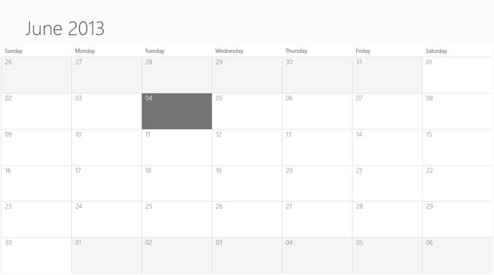

## Selection Brush

### Cell Selection

The Default cell selection brush can be customized by using **CellSelectionBrush** property and its default brush is Gray.




    <Schedule:SfSchedule x:Name="schedule" CellSelectionBrush="Pink"/>





    SfSchedule schedule = new SfSchedule();
    schedule.CellSelectionBrush = new SolidColorBrush(Colors.Pink);
    this.grid.Children.Add(schedule);




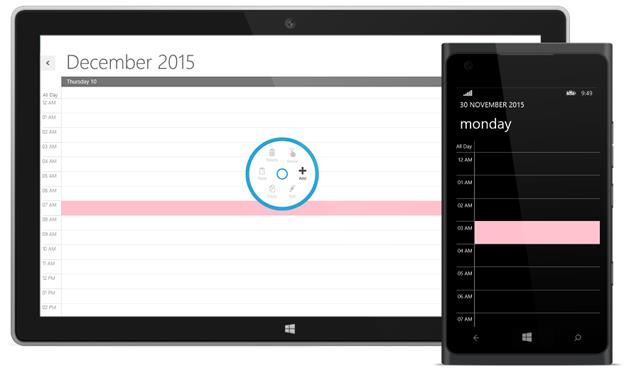

### Appointment Selection

The appointment selection brush can be customized by using **AppointmentSelectionBrush** property.




    <Schedule:SfSchedule x:Name="schedule" AppointmentSelectionBrush="LimeGreen"/>





    SfSchedule schedule = new SfSchedule();
    schedule.AppointmentSelectionBrush = new SolidColorBrush(Colors.LimeGreen);
    this.grid.Children.Add(schedule);




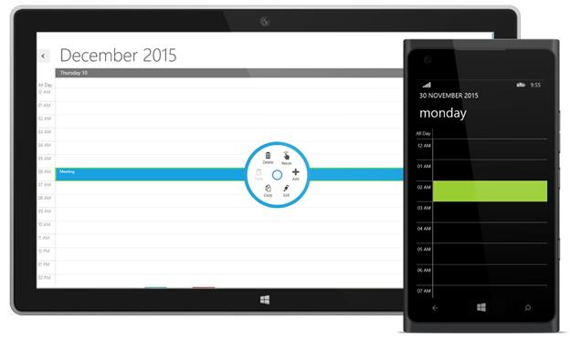

## Enabling Auto Formatting

When reducing the size of the schedule in week and month views, headers may be only partially shown. To avoid incompletely displayed headers, automatic formatting can be enabled by setting the **EnableAutoFormat** property of the SfSchedule control as true.

>**Note:-EnableAutoFormat is only applicable for windows.**




        <syncfusion:SfSchedule x:Name="schedule" Background="White"
                               Height="400" Width="500"
                               EnableAutoFormat="True"
                               ScheduleType="Week">                           
        </syncfusion:SfSchedule>





            SfSchedule schedule = new SfSchedule();
            schedule.Background = new SolidColorBrush(Colors.White);
            schedule.Height = 400;
            schedule.Width = 500;
            schedule.EnableAutoFormat = true;
            schedule.ScheduleType = ScheduleType.Week;
            this.grid.Children.Add(schedule);




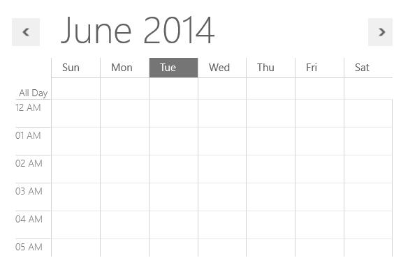

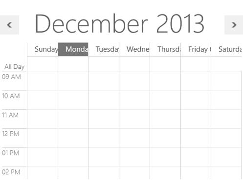

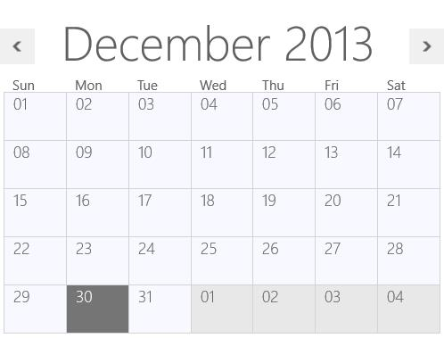

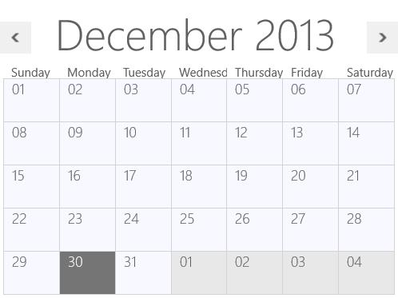

Hours in time line view can be automatically adjusted by enabling **EnableAutoFormat**. To automatically adjust size **IntervalHeight** should not be specified with a particular value. If IntervalHeight is specified for the SfSchedule control, then the width of the hours in the time line view will be sized with the specified IntervalHeight.




        <syncfusion:SfSchedule x:Name="schedule" Background="White"
                               Height="400" Width="500"
                               MajorTickTimeFormat="hh- mm- ss tt"
                               EnableAutoFormat="True"
                              ScheduleType="TimeLine">                           
        </syncfusion:SfSchedule>





            SfSchedule schedule = new SfSchedule();
            schedule.Background = new SolidColorBrush(Colors.White);
            schedule.Height = 400;
            schedule.Width = 500;
            schedule.MajorTickTimeFormat = "hh- mm- ss tt";
            schedule.EnableAutoFormat = true;
            schedule.ScheduleType = ScheduleType.TimeLine;
            this.grid.Children.Add(schedule);




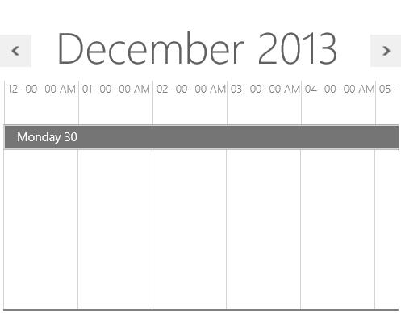

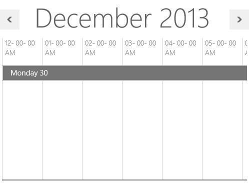
