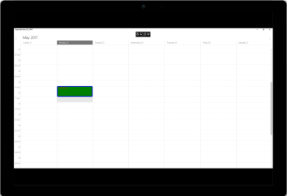

---

layout: post
title: Populating Appointments in Syncfusion SfSchedule control for UWP
description: Learn how to schedule the appointment and customize different kinds of Appointments in SfSchedule control.
platform: uwp
control: SfSchedule
documentation: ug

---

# Appointments in UWP Scheduler (SfSchedule)

[SfSchedule](https://help.syncfusion.com/cr/uwp/sfschedule) control has a built-in capability to handle the appointment arrangement internally based on the [ScheduleAppointmentCollection](https://help.syncfusion.com/cr/uwp/Syncfusion.UI.Xaml.Schedule.ScheduleAppointmentCollection.html). [ScheduleAppointment](https://help.syncfusion.com/cr/uwp/Syncfusion.UI.Xaml.Schedule.ScheduleAppointment.html) is a class, which holds the details about the appointment to be rendered in schedule.



    // Creating an instance for schedule appointment collection
            ScheduleAppointmentCollection scheduleAppointmentCollection = new ScheduleAppointmentCollection();
            //Adding schedule appointment in schedule appointment collection 
            scheduleAppointmentCollection.Add(new ScheduleAppointment()
            {
                StartTime = DateTime.Now.Date.AddHours(10),
                EndTime = DateTime.Now.Date.AddHours(12),
                Subject = "Meeting",
                Location = "Hutchison road",
            });
            //Adding schedule appointment collection to SfSchedule DataSource
            schedule.Appointments = scheduleAppointmentCollection;


N> 
* The Scheduler supports the functionality that arranges the appointments based on their start time and duration for the normal appointments in a day, week and work week views.
* In Timeline views, all the appointments (span, all day and normal) are ordered and rendered based on the start date-time of appointment that consists time duration of an appointment, followed by `IsSpanned,` `IsAllDay,` and normal appointments respectively.

## Mapping
Schedule supports full data binding to any type of IEnumerable source. Specify the [ScheduleAppointmentMapping](https://help.syncfusion.com/cr/uwp/Syncfusion.UI.Xaml.Schedule.ScheduleAppointmentMapping.html) attributes to map the properties in the underlying data source to the schedule appointments.

| Property Name | Description |
|------------------------------|---------------------------------------------------------------------------------------------------------------------------------|
| [StartTimeMapping](https://help.syncfusion.com/cr/uwp/Syncfusion.UI.Xaml.Schedule.ScheduleAppointmentMapping.html#Syncfusion_UI_Xaml_Schedule_ScheduleAppointmentMapping_StartTimeMappingProperty) | This property is to map the property name of custom class which is equivalent for StartTime of ScheduleAppointment. |
| [StartTimeZoneMapping](https://help.syncfusion.com/cr/uwp/Syncfusion.UI.Xaml.Schedule.ScheduleAppointmentMapping.html#Syncfusion_UI_Xaml_Schedule_ScheduleAppointmentMapping_StartTimeZoneMappingProperty) | This property is to map the property name of custom class which is equivalent for start time zone of ScheduleAppointment. |
| [EndTimeMapping](https://help.syncfusion.com/cr/uwp/Syncfusion.UI.Xaml.Schedule.ScheduleAppointmentMapping.html#Syncfusion_UI_Xaml_Schedule_ScheduleAppointmentMapping_EndTimeMappingProperty) | This property is to map the property name of custom class which is equivalent for EndTime of ScheduleAppointment. |
| [EndTimeZoneMapping](https://help.syncfusion.com/cr/uwp/Syncfusion.UI.Xaml.Schedule.ScheduleAppointmentMapping.html#Syncfusion_UI_Xaml_Schedule_ScheduleAppointmentMapping_EndTimeZoneMappingProperty) | This property is to map the property name of custom class which is equivalent for End Time zone of ScheduleAppointment. |
| [SubjectMapping](https://help.syncfusion.com/cr/uwp/Syncfusion.UI.Xaml.Schedule.ScheduleAppointmentMapping.html#Syncfusion_UI_Xaml_Schedule_ScheduleAppointmentMapping_SubjectMappingProperty) | This property is to map the property name of custom class which is equivalent for Subject of ScheduleAppointment. |
| [AppointmentBackgroundMapping](https://help.syncfusion.com/cr/uwp/Syncfusion.UI.Xaml.Schedule.ScheduleAppointmentMapping.html#Syncfusion_UI_Xaml_Schedule_ScheduleAppointmentMapping_AppointmentBackgroundMappingProperty) | This property is to map the property name of custom class which is equivalent for Background of ScheduleAppointment. |
| [AllDayMapping](https://help.syncfusion.com/cr/uwp/Syncfusion.UI.Xaml.Schedule.ScheduleAppointmentMapping.html#Syncfusion_UI_Xaml_Schedule_ScheduleAppointmentMapping_AllDayMappingProperty) | This property is to map the property name of custom class which is equivalent for IsAllDay of ScheduleAppointment. |
| [RecurrenceRuleMapping](https://help.syncfusion.com/cr/uwp/Syncfusion.UI.Xaml.Schedule.ScheduleAppointmentMapping.html#Syncfusion_UI_Xaml_Schedule_ScheduleAppointmentMapping_RecurrenceRuleMappingProperty) | This property is to map the property name of custom class which is equivalent for RecurrenceRule of ScheduleAppointment. |
| [NotesMapping](https://help.syncfusion.com/cr/uwp/Syncfusion.UI.Xaml.Schedule.ScheduleAppointmentMapping.html#Syncfusion_UI_Xaml_Schedule_ScheduleAppointmentMapping_NotesMappingProperty) | This property is to map the property name of custom class which is equivalent for Notes of ScheduleAppointment. |
| [LocationMapping](https://help.syncfusion.com/cr/uwp/Syncfusion.UI.Xaml.Schedule.ScheduleAppointmentMapping.html#Syncfusion_UI_Xaml_Schedule_ScheduleAppointmentMapping_LocationMappingProperty) | This property is to map the property name of custom class which is equivalent for Location of ScheduleAppointment. |
| [IsRecursiveMapping](https://help.syncfusion.com/cr/uwp/Syncfusion.UI.Xaml.Schedule.ScheduleAppointmentMapping.html#Syncfusion_UI_Xaml_Schedule_ScheduleAppointmentMapping_IsRecursiveMappingProperty) | This property is to map the property name of custom class which is equivalent for IsRecursive of ScheduleAppointment. |
| [DisplayNameMapping](https://help.syncfusion.com/cr/uwp/Syncfusion.UI.Xaml.Schedule.ScheduleAppointmentMapping.html#Syncfusion_UI_Xaml_Schedule_ScheduleAppointmentMapping_DisplayNameMappingProperty) | This property is to map the property name of custom class which is equivalent for Display Name of ScheduleAppointment. |
| [ReadOnlyMapping](https://help.syncfusion.com/cr/uwp/Syncfusion.UI.Xaml.Schedule.ScheduleAppointmentMapping.html#Syncfusion_UI_Xaml_Schedule_ScheduleAppointmentMapping_ReadOnlyMappingProperty) | This property is to map the property name of custom class which is equivalent for read only appointment of ScheduleAppointment. |
| [RecurrenceProperitesMapping](https://help.syncfusion.com/cr/uwp/Syncfusion.UI.Xaml.Schedule.ScheduleAppointmentMapping.html#Syncfusion_UI_Xaml_Schedule_ScheduleAppointmentMapping_RecurrenceProperitesMappingProperty) | This property is to map the property name of custom class which is equivalent for Recurrence Properites of ScheduleAppointment. |
| [RecurrenceTypeMapping](https://help.syncfusion.com/cr/uwp/Syncfusion.UI.Xaml.Schedule.ScheduleAppointmentMapping.html#Syncfusion_UI_Xaml_Schedule_ScheduleAppointmentMapping_RecurrenceTypeMappingProperty) | This property is to map the property name of custom class which is equivalent for RecurrenceType of ScheduleAppointment. |
| [ReminderTimeMapping](https://help.syncfusion.com/cr/uwp/Syncfusion.UI.Xaml.Schedule.ScheduleAppointmentMapping.html#Syncfusion_UI_Xaml_Schedule_ScheduleAppointmentMapping_ReminderTimeMappingProperty) | This property is to map the property name of custom class which is equivalent for ReminderTime of ScheduleAppointment. |
| [ResourceCollectionMapping](https://help.syncfusion.com/cr/uwp/Syncfusion.UI.Xaml.Schedule.ScheduleAppointmentMapping.html#Syncfusion_UI_Xaml_Schedule_ScheduleAppointmentMapping_ResourceCollectionMappingProperty) | This property is to map the property name of custom class which is equivalent for ResourceCollection of ScheduleAppointment. |
| [ResourceNameMapping](https://help.syncfusion.com/cr/uwp/Syncfusion.UI.Xaml.Schedule.ScheduleAppointmentMapping.html#Syncfusion_UI_Xaml_Schedule_ScheduleAppointmentMapping_ResourceNameMappingProperty) | This property is to map the property name of custom class which is equivalent for ResourceName of ScheduleAppointment. |
| [StatusMapping](https://help.syncfusion.com/cr/uwp/Syncfusion.UI.Xaml.Schedule.ScheduleAppointmentMapping.html#Syncfusion_UI_Xaml_Schedule_ScheduleAppointmentMapping_StatusMappingProperty) | This property is to map the property name of custom class which is equivalent for status of ScheduleAppointment. |
| [TypeNameMapping](https://help.syncfusion.com/cr/uwp/Syncfusion.UI.Xaml.Schedule.ScheduleAppointmentMapping.html#Syncfusion_UI_Xaml_Schedule_ScheduleAppointmentMapping_TypeNameMappingProperty) | This property is to map the property name of custom class which is equivalent for TypeName of ScheduleAppointment. |

N> CustomAppointment class should contain two DateTime fields and a string field as mandatory.

### Creating custom Appointments
You can create a custom class `Meeting` with mandatory fields `From`, `To` and `EventName`.


        /// 
   
        /// Represents custom data properties.   
        /// 
   

    public class Meeting
    {
        public string EventName { get; set; }
        public DateTime From { get; set; }
        public DateTime To { get; set; }
        public Brush Color { get; set; }
    }



N> You can inherit this class from `INotifyPropertyChanged` for dynamic changes in custom data.

You can map those properties of `Meeting` class with our SfSchedule control by using `ScheduleAppointmentMapping`.



        // Schedule data mapping for custom appointments
            ScheduleAppointmentMapping dataMapping = new ScheduleAppointmentMapping();
            dataMapping.SubjectMapping = "EventName";
            dataMapping.StartTimeMapping = "From";
            dataMapping.EndTimeMapping = "To";
            dataMapping.AppointmentBackgroundMapping = "Color";
            schedule.AppointmentMapping = dataMapping;


 
 
    <syncfusion:SfSchedule x:Name="schedule" ScheduleType="Week" ItemsSource="{Binding Meetings}">
            <syncfusion:SfSchedule.AppointmentMapping>
                <syncfusion:ScheduleAppointmentMapping
                    SubjectMapping="EventName" 
                    AppointmentBackgroundMapping="Color"
                    StartTimeMapping="From"
                    EndTimeMapping="To">
                </syncfusion:ScheduleAppointmentMapping>
            </syncfusion:SfSchedule.AppointmentMapping>
        </syncfusion:SfSchedule>
 
 
 

You can schedule meetings for a day by setting `From` and `To` of `Meeting` class. Create meetings of type `ObservableCollection <Meeting>` and assign those appointments collection `Meetings` to the `ItemsSource` property which is of `IEnumerable` type.



            // Creating instance for custom appointment class
            Meeting meeting = new Meeting();
            // Setting start time of an event
            meeting.From = DateTime.Now.Date.AddHours(10) ;
            // Setting end time of an event
            meeting.To = meeting.From.AddHours(1);
            // Setting start time for an event
            meeting.EventName = "Anniversary";
            // Setting color for an event
            meeting.Color = new SolidColorBrush(Colors.Green);
            // Creating instance for collection of custom appointments
           var  Meetings = new ObservableCollection<Meeting>();
            // Adding a custom appointment in CustomAppointmentCollection
            Meetings.Add(meeting);

           
            // Adding custom appointments in SfSchedule DataSource
            schedule.ItemsSource = Meetings;

 

You can get the custom appointment in `ScheduleTappedEventArgs` of `ScheduleTapped` event in recurrence appointment.



schedule.ScheduleTapped += Schedule_ScheduleTapped;
private void Schedule_ScheduleTapped(object sender, ScheduleTappedEventArgs e)
{
    var appointment = e.Appointment as Meeting;
}

 

## Spanned Appointments
Spanned Appointment is an appointment which lasts more than 24 hours.



            // Creating instance for custom appointment class
            Meeting meeting = new Meeting();
            // Setting start time of an event
            meeting.From = DateTime.Now.Date.AddHours(10) ;
            // Setting end time of an event
            meeting.To = meeting.From.AddDays(2).AddHours(1);
            // Setting start time for an event
            meeting.EventName = "Anniversary";
            // Setting color for an event
            meeting.Color = new SolidColorBrush(Colors.Green);
            // Creating instance for collection of custom appointments
           var  Meetings = new ObservableCollection<Meeting>();
            // Adding a custom appointment in CustomAppointmentCollection
            Meetings.Add(meeting);

 

N> 
* In an all day panel of the day, week and work week views, the Span appointments are ordered and rendered based on the start date-time, followed by the time duration of the appointment and `IsSpanned `appointments respectively.

## All Day Appointments
All-Day appointment is an appointment which is scheduled for a whole day. It can be set by using `IsAllDay` property in the `ScheduleAppointment`.



        // Creating an instance for schedule appointment collection
            ScheduleAppointmentCollection scheduleAppointmentCollection = new ScheduleAppointmentCollection();
            //Adding schedule appointment in schedule appointment collection 
            scheduleAppointmentCollection.Add(new ScheduleAppointment()
            {
                StartTime = new DateTime(2017, 05, 08, 10, 0, 0),
                EndTime = new DateTime(2017, 05, 10, 12, 0, 0),
                Subject = "Meeting",
                Location = "Hutchison road",
                AllDay = true
            });
            //Adding schedule appointment collection to DataSource of SfSchedule
            schedule.Appointments = scheduleAppointmentCollection;

 

* Appointment that lasts for an entire day (exact 24 hours) will be considered as an all-day appointment without setting the `IsAllDay` property. For example: From 06/29/2020 12:00AM to 06/30/2020 12:00AM.
* In an all-day panel of the day, week and work week views, the AllDay appointments are ordered and rendered based on the start date-time of the appointment, followed by the time duration and `IsAllDay` of the appointments respectively.

### All-Day Appointment Panel
All-day appointment doesn't block out entire time slot in SfSchedule, rather it will render in separate layout exclusively for all-day appointment. It can be enabled by setting `ShowAllDay` property of `SfSchedule`.



            schedule.ShowAllDay = true; 

 

All-Day panel background can be customized by setting `AllDayAppointmentPanelBrush` 
of the respective view settings.



         schedule.AllDayAppointmentPanelBrush = new SolidColorBrush(Colors.Green); 

 

## Recurrence Appointment
Recurring an appointment on a daily, weekly, monthly, or yearly interval. Recursive appointments can be created by enabling `IsRecursive` property in Schedule appointments. 

### Recurrence Pattern
Recurrence pattern used in the control are in iCal standard. Schedule control supports all four types of [recurrence patterns](https://help.syncfusion.com/cr/uwp/Syncfusion.UI.Xaml.Schedule.RecurrenceProperties.html).

| RecurrenceType | RecurrenceProperties | Description |
|----------------|-------------------------|---------------------------------------------------------------|
| Daily | DailyNDays | Gets or sets the event to recur on a daily N intervals basis. |
|  | IsDailyEveryNDays | Checks whether the event occurs Daily Every N days. |
| Weekly | IsWeeklySunday | Checks whether the event occurs every Sunday of week |
|  | IsWeeklyMonday | Checks whether the event occurs every Monday of week |
|  | IsWeeklyTuesday | Checks whether the event occurs every Tuesday of week |
|  | IsWeeklyWednesday | Checks whether the event occurs every Wednesday of week |
|  | IsWeeklyThursday | Checks whether the event occurs every Thursday of week |
|  | IIsWeeklyFriday | Checks whether the event occurs every Friday of week |
|  | IsWeeklySaturday | Checks whether the event occurs every Saturday of week |
|  | NthWeek | Gets or sets the event only nth week of the year. |
|  | WeekDay | Gets or sets the event every week day. |
|  | WeeklyEveryNWeeks | Gets or sets the event every N Weeks. |
| Monthly | SpecificMonth | Gets or sets the event in a specific month. |
|  | SpecificMonthDay | Gets or sets the event in a specific month day. |
|  | IsMonthlySpecific | Checks whether the event is Monthly specific event |
|  | MonthlyEveryNMonths | Gets or sets the event every N Months. |
|  | MonthlyNthWeek | Gets or sets the event nth week of every month. |
|  | MonthlySpecificMonthDay | Gets or sets the event specific month day of Month. |
|  | MonthlyWeekDay | Gets or sets the event every week day of month. |
| Yearly | IsYearlySpecific | Checks whether the event is Yearly Specific. |
|  | YearlyEveryNYears | Gets or sets the event occurs every N Years. |
|  | YearlyGenericMonth | Gets or sets the event occurs in generic month. |
|  | YearlyNthWeek | Gets or sets the event occurs yearly nth week. |
|  | YearlySpecificMonth | Gets or sets the event occurs yearly specific month. |
|  | YearlySpecificMonthDay | Gets or sets the event occurs yearly specific month day. |
|  | YearlyWeekDay | Gets or sets the event occurs yearly week day. |
|  | EveryNYears | Gets or sets the event every N Years. |
| Common | IsRangeEndDate | Checks whether the event has Range end date |
|  | IsRangeNoEndDate | Checks whether the event has No Range end date |
|  | IsRangeRecurrenceCount | Checks whether the event has recurrence count. |
|  | RangeEndDate | Gets or sets the event range end date. |
|  | RangeStartDate | Gets or sets the event range start date. |
|  | RangeRecurrenceCount | Gets or sets the event range recurrence count. |
|  | IsSpecific | Checks whether the event occurs in Specific recurrence type. |

### Adding Recurrence Appointment using Recurrence Builder
Schedule appointment [RecurrenceRule](https://help.syncfusion.com/cr/uwp/Syncfusion.UI.Xaml.Schedule.ScheduleAppointment.html#Syncfusion_UI_Xaml_Schedule_ScheduleAppointment_RecurrenceRuleProperty) is used to populate the required recursive appointment collection in a specific pattern. `RRULE` can be easily created through `RecurrenceBuilder` engine by simple APIs available in Schedule control.



   
                // Creating an instance for schedule appointment collection
            ScheduleAppointmentCollection scheduleAppointmentCollection = new ScheduleAppointmentCollection();
            //Adding schedule appointment in schedule appointment collection 
            var scheduleAppointment = new ScheduleAppointment()
            {
                StartTime = DateTime.Now.Date.AddHours(10),
                EndTime = DateTime.Now.Date.AddHours(12),
                Subject = "Occurs every alternate day",
                IsRecursive = true
            };

            //Adding schedule appointment in schedule appointment collection
            scheduleAppointmentCollection.Add(scheduleAppointment);

            // Creating recurrence rule
            RecurrenceProperties recurrenceProperties = new RecurrenceProperties();
            recurrenceProperties.RecurrenceType = RecurrenceType.Daily;
            recurrenceProperties.IsRangeRecurrenceCount = true;
            recurrenceProperties.DailyNDays = 2;
            recurrenceProperties.IsDailyEveryNDays = true;
            recurrenceProperties.IsWeeklySunday = false;
            recurrenceProperties.IsWeeklyMonday = true;
            recurrenceProperties.IsWeeklyTuesday = false;
            recurrenceProperties.IsWeeklyWednesday = false;
            recurrenceProperties.IsWeeklyThursday = false;
            recurrenceProperties.IsWeeklyFriday = false;
            recurrenceProperties.IsWeeklySaturday = false;
            recurrenceProperties.RangeRecurrenceCount = 10;
            recurrenceProperties.RecurrenceRule = ScheduleHelper.RRuleGenerator(recurrenceProperties, scheduleAppointment.StartTime, scheduleAppointment.EndTime);

            // Setting recurrence rule to schedule appointment
            scheduleAppointment.RecurrenceRule = recurrenceProperties.RecurrenceRule;

            //Adding schedule appointment collection to SfSchedule DataSource
            schedule.Appointments = scheduleAppointmentCollection

 

## Setting reminders
Schedule reminds you the appointment in the specified time by setting the EnableReminderTimer property is true. The remainder time can be set using the [ReminderTime](https://help.syncfusion.com/cr/uwp/Syncfusion.UI.Xaml.Schedule.ScheduleAppointment.html#Syncfusion_UI_Xaml_Schedule_ScheduleAppointment_ReminderTimeProperty) property of `ScheduleAppointment`.

N> Open package.appxmanifest file to the Application UI tab and select “Yes” from the “Toast capable” dropdown list to enable toast notifications in your application manifest.



                schedule.EnableReminderTimer = true;
            schedule.Appointments.Add(new ScheduleAppointment
            {
                StartTime = DateTime.Now.Date.AddHours(9),
                EndTime = DateTime.Now.Date.AddHours(12),
                AppointmentBackground = new SolidColorBrush(Color.FromArgb(0xFf, 0xA2, 0xC1, 0x39)),
                Subject = "Business Meeting",
                ReminderTime = ReminderTimeType.TenHours
            });
            schedule.Appointments.Add(new ScheduleAppointment
            {
                StartTime = currentDate.Date.AddDays(1).AddHours(10),
                EndTime = currentDate.Date.AddDays(1).AddHours(16),
                AppointmentBackground = new SolidColorBrush(Color.FromArgb(0xFf, 0xD8, 0x00, 0x73)),
                Subject = "Auditing",
                ReminderTime = ReminderTimeType.TwoDays
            });
            schedule.Appointments.Add(new ScheduleAppointment
            {
                StartTime = DateTime.Now.Date.AddDays(7).AddHours(10),
                EndTime = DateTime.Now.Date.AddDays(7).AddHours(13),
                AppointmentBackground = new SolidColorBrush(Color.FromArgb(0xFf, 0xF0, 0x96, 0x09)),
                Subject = "Conference",
                ReminderTime = ReminderTimeType.TwoWeeks
            });



## Editing appointment
The existing appointment can be edited by using the following ways.

•	Using Editor
•	Using Context menu

### Using Editor
To edit the existing appointment, we need to double click on corresponding appointment and modify the existing data of selected appointment by using the editor displayed.

### Using Context menu
The user can also use the Context menu to edit the selected appointment by selecting the Edit option in menu item, which opens the default editor of the schedule control.

## Appearance Customization
The default appearance of the appointment can be customized by using the [ScheduleAppointmentStyle](https://help.syncfusion.com/cr/uwp/Syncfusion.UI.Xaml.Schedule.ScheduleAppointmentStyle.html) property and [ScheduleAppointmentLoaded](https://help.syncfusion.com/cr/uwp/Syncfusion.UI.Xaml.Schedule.ScheduleAppointmentLoadedEventArgs.html). The event and property is used to customize or override the default template of the Appointments.

•	[Customize appearance using Style](https://help.syncfusion.com/uwp/sfschedule/appointments#customize-appearance-using-style) 
•	[Customize appearance using Event](https://help.syncfusion.com/uwp/sfschedule/appointments#customize-appearance-using-event)
•	[Customize appearance using Custom View](https://help.syncfusion.com/uwp/sfschedule/appointments#customize-appearance-using-custom-view)

### Customize appearance using Style
Schedule appointment can be customized by setting appointment style properties such as [AppointmentTextColor](https://help.syncfusion.com/cr/uwp/Syncfusion.UI.Xaml.Schedule.ScheduleAppointmentStyle.html#Syncfusion_UI_Xaml_Schedule_ScheduleAppointmentStyle_AppointmentTextColorProperty), [AppointmentFontStyle](https://help.syncfusion.com/cr/uwp/Syncfusion.UI.Xaml.Schedule.ScheduleAppointmentStyle.html#Syncfusion_UI_Xaml_Schedule_ScheduleAppointmentStyle_AppointmentFontStyleProperty), [BorderColor](https://help.syncfusion.com/cr/uwp/Syncfusion.UI.Xaml.Schedule.ScheduleAppointmentStyle.html#Syncfusion_UI_Xaml_Schedule_ScheduleAppointmentStyle_BorderColorProperty), [BorderCornerRadius](https://help.syncfusion.com/cr/uwp/Syncfusion.UI.Xaml.Schedule.ScheduleAppointmentStyle.html#Syncfusion_UI_Xaml_Schedule_ScheduleAppointmentStyle_BorderCornerRadiusProperty), [BorderThickness](https://help.syncfusion.com/cr/uwp/Syncfusion.UI.Xaml.Schedule.ScheduleAppointmentStyle.html#Syncfusion_UI_Xaml_Schedule_ScheduleAppointmentStyle_BorderThicknessProperty) to the `ScheduleAppointmentStyle` property of `SfSchedule`.



                //Creating Appointment style 
            ScheduleAppointmentStyle appointmentStyle = new ScheduleAppointmentStyle();
            appointmentStyle.AppointmentTextColor = new SolidColorBrush(Colors.Red);
            appointmentStyle.AppointmentFontStyle = Windows.UI.Text.FontStyle.Italic;
            appointmentStyle.BorderColor = new SolidColorBrush(Colors.Blue);
            appointmentStyle.BorderCornerRadius = new CornerRadius(5);
            appointmentStyle.BorderThickness = new Thickness(5);

            //Setting Appointment Style 
            schedule.ScheduleAppointmentStyle = appointmentStyle; 



### Customize appearance using Event
Schedule appointment can be customized during runtime using [ScheduleAppointmentLoadedEventArgs](https://help.syncfusion.com/cr/uwp/Syncfusion.UI.Xaml.Schedule.ScheduleAppointmentLoadedEventArgs.html). `ScheduleAppointment` style can be customized using the `ScheduleAppointmentStyle` property.

[ScheduleAppointmentLoadedEventArgs](https://help.syncfusion.com/cr/uwp/Syncfusion.UI.Xaml.Schedule.ScheduleAppointmentLoadedEventArgs.html) has below properties,

•	[ScheduleAppointment](https://help.syncfusion.com/cr/uwp/Syncfusion.UI.Xaml.Schedule.ScheduleAppointmentLoadedEventArgs.html#Syncfusion_UI_Xaml_Schedule_ScheduleAppointmentLoadedEventArgs_ScheduleAppointment) – Contains the appointments values.
•	[ScheduleAppointmentStyle](https://help.syncfusion.com/cr/uwp/Syncfusion.UI.Xaml.Schedule.ScheduleAppointmentLoadedEventArgs.html#Syncfusion_UI_Xaml_Schedule_ScheduleAppointmentLoadedEventArgs_ScheduleAppointmentStyle) – Gets and sets the appointments style.
•	[View](https://help.syncfusion.com/cr/uwp/Syncfusion.UI.Xaml.Schedule.ScheduleAppointmentLoadedEventArgs.html#Syncfusion_UI_Xaml_Schedule_ScheduleAppointmentLoadedEventArgs_View) -  Sets the Custom UI for Appointments.
•	[Bounds](https://help.syncfusion.com/cr/uwp/Syncfusion.UI.Xaml.Schedule.ScheduleAppointmentLoadedEventArgs.html#Syncfusion_UI_Xaml_Schedule_ScheduleAppointmentLoadedEventArgs_Bounds) – Contains the UI bounds of appointment.

 
 
           schedule.ScheduleAppointmentLoaded += Schedule_ScheduleAppointmentLoaded;

     private void Schedule_ScheduleAppointmentLoaded(object sender, ScheduleAppointmentLoadedEventArgs args)
    {
        if (args.ScheduleAppointment != null && (args.ScheduleAppointment).Subject == "Meeting")
        {
            args.ScheduleAppointmentStyle.BorderColor = new SolidColorBrush(Colors.Blue);
            args.ScheduleAppointmentStyle.BorderCornerRadius = new CornerRadius(5);
            args.ScheduleAppointmentStyle.BorderThickness = new Thickness(5);
        }
    }

 


## Customize appearance using Custom View
Default appointment UI can be changed using `View` property passed through `AppointmentLoadedEventArgs`.

 
 
     schedule.ScheduleAppointmentLoaded += Schedule_ScheduleAppointmentLoaded;

         private void Schedule_ScheduleAppointmentLoaded(object sender, ScheduleAppointmentLoadedEventArgs args)
        {
                Button button = new Button();
                button.Background = new SolidColorBrush(Colors.Green);
                if (args.ScheduleAppointment != null)
                    button.Content = (args.ScheduleAppointment).Subject;
                args.View = button;
        }

 


## Selection
Schedule control has built-in events to handle tapped and double tapped touch actions.

•	[ScheduleTapped](https://help.syncfusion.com/cr/uwp/Syncfusion.UI.Xaml.Schedule.ScheduleTappedEventArgs.html)
•	[ScheduleDoubleTapped](https://help.syncfusion.com/cr/uwp/Syncfusion.UI.Xaml.Schedule.ScheduleTappedEventArgs.html)

These events will be triggered while perform respective touch actions in timeslots, month cells and in appointments. These events contain the same argument [ScheduleTappedEventArgs](https://help.syncfusion.com/cr/uwp/Syncfusion.UI.Xaml.Schedule.ScheduleTappedEventArgs.html) which holds selected appointment and date time details in it.

• [Appointment](https://help.syncfusion.com/cr/uwp/Syncfusion.UI.Xaml.Schedule.ScheduleTappedEventArgs.html#Syncfusion_UI_Xaml_Schedule_ScheduleTappedEventArgs_Appointment) -  Contains the selected appointment value, it will be null, if any time slots selected.
• [SelectedDate](https://help.syncfusion.com/cr/uwp/Syncfusion.UI.Xaml.Schedule.ScheduleTappedEventArgs.html#Syncfusion_UI_Xaml_Schedule_ScheduleTappedEventArgs_SelectedDate) - Contains selected time slot DateTime value.
• [SelectedResource](https://help.syncfusion.com/cr/uwp/Syncfusion.UI.Xaml.Schedule.ScheduleTappedEventArgs.html#Syncfusion_UI_Xaml_Schedule_ScheduleTappedEventArgs_SelectedResource) - Contains selected time slot DateTime value.

 
 
     schedule.ScheduleTapped += Schedule_ScheduleTapped;
     schedule.ScheduleDoubleTapped += Schedule_ScheduleDoubleTapped;

    private void Schedule_ScheduleDoubleTapped(object sender, ScheduleTappedEventArgs e)
    {
    }

    private void Schedule_ScheduleTapped(object sender, ScheduleTappedEventArgs e)
    { 
    }
 


### Selection customization
The default selection of an appointment can be customized by using [SelectionColor](https://help.syncfusion.com/cr/uwp/Syncfusion.UI.Xaml.Schedule.ScheduleAppointmentStyle.html#Syncfusion_UI_Xaml_Schedule_ScheduleAppointmentStyle_SelectionColorProperty), [SelectionTextColor](https://help.syncfusion.com/cr/uwp/Syncfusion.UI.Xaml.Schedule.ScheduleAppointmentStyle.html#Syncfusion_UI_Xaml_Schedule_ScheduleAppointmentStyle_SelectionTextColorProperty) properties in `ScheduleAppointmentStyle` property of `SfSchedule`. The property is used to customize or override the default selection of the appointments.

N> `BorderWidth` value must be set to highlight `SelectionColor`.

 
 
 
            //Creating Appointment style 
        ScheduleAppointmentStyle appointmentStyle = new ScheduleAppointmentStyle();
        appointmentStyle.SelectionColor = new SolidColorBrush(Colors.Yellow);
        appointmentStyle.SelectionTextColor = new SolidColorBrush(Colors.Yellow);

            //Setting Appointment Style 
        schedule.ScheduleAppointmentStyle = appointmentStyle;
 

  
 
 
     <syncfusion:SfSchedule x:Name="schedule" ScheduleType="Week" >
            <syncfusion:SfSchedule.ScheduleAppointmentStyle>
                <syncfusion:ScheduleAppointmentStyle BorderThickness="10" 
            SelectionColor="Yellow" 
            BorderCornerRadius="10" 
            SelectionTextColor="Yellow">
                </syncfusion:ScheduleAppointmentStyle>
            </syncfusion:SfSchedule.ScheduleAppointmentStyle>
        </syncfusion:SfSchedule>
 
 
 

## Configuring resources
The Schedule control allows you to define resources that can be assigned to appointments. [Resources](https://help.syncfusion.com/cr/uwp/Syncfusion.UI.Xaml.Schedule.Resource.html) let you associate additional information with your appointments. The schedule can group appointments based on the resources associated with them.

 
 
        //creating appointments for resource
    ScheduleAppointment ScheduleAppointment = new ScheduleAppointment() 
    {                
        StartTime = currentDate, 
        EndTime = currentDate.AddHours(2), 
        Subject = "Meeting", 
        Location = "Chennai", 
        AppointmentBackground = new SolidColorBrush(Colors.Green) 
    };
    ScheduleAppointment.ResourceCollection.Add(new Resource() { ResourceName = "Dr.Jacob", TypeName = "Doctor" });
    
    //creating appointments for resource
    ScheduleAppointment ScheduleAppointment1 = new ScheduleAppointment() 
    { 
        StartTime = currentDate.AddHours(4), 
        EndTime = currentDate.AddHours(2), 
        Subject = "Meeting", 
        Location = "Chennai", 
        AppointmentBackground = new SolidColorBrush(Colors.Green) 
    };
    ScheduleAppointment1.ResourceCollection.Add(new Resource() { ResourceName = "Dr.Darsy", TypeName = "Doctor" });

    //Adding schedule appointments
        schedule.Appointments.Add(ScheduleAppointment);
        schedule.Appointments.Add(ScheduleAppointment1);
 


To configure the views based on resources, refer 

•	[Configuring resources in Day View.](https://help.syncfusion.com/uwp/sfschedule/dayview#configuring-resources) 
•	[Configuring resources in Week View.](https://help.syncfusion.com/uwp/sfschedule/weekview#configuring-resources)
•	[Configuring resources in Work Week View.](https://help.syncfusion.com/uwp/sfschedule/workweekview#configuring-resources)
•	[Configuring resources in Month View.](https://help.syncfusion.com/uwp/sfschedule/monthview#configuring-resources)
•	[Configuring resources in Timeline View.](https://help.syncfusion.com/uwp/sfschedule/timelineview#configuring-resources)

## Resources customization

You can customize the resources in a `Timeline` view by using the [TimeInterval](https://help.syncfusion.com/cr/uwp/Syncfusion.UI.Xaml.Schedule.SfSchedule.html#Syncfusion_UI_Xaml_Schedule_SfSchedule_TimeInterval) , [IntervalHeight](https://help.syncfusion.com/cr/uwp/Syncfusion.UI.Xaml.Schedule.SfSchedule.html#Syncfusion_UI_Xaml_Schedule_SfSchedule_IntervalHeight) and [ScheduleDateRange](https://help.syncfusion.com/cr/uwp/Syncfusion.UI.Xaml.Schedule.SfSchedule.html#Syncfusion_UI_Xaml_Schedule_SfSchedule_ScheduleDateRange) properties of schedule. You can also add the dates in the `ScheduleDateRange` collection that need to be displayed in a day view and timeline view of schedule.

 
 
<schedule:SfSchedule
        x:Name="schedule"
        Resource="Doctors"
        TimeInterval="Custom" CustomTimeInterval="1440"
        ScheduleType="TimeLine"
        Appointments="{Binding AppointmentCollection}"
        ScheduleDateRange="{Binding DateRange}">
<schedule:SfSchedule.ScheduleResourceTypeCollection>
    <schedule:ResourceType TypeName="Doctors">
        <schedule:Resource
                    DisplayName="Dr.Jacob"
                    ResourceName="Dr.Jacob"
                    TypeName="Doctors" />
        <schedule:Resource
                    DisplayName="Dr.Darsy"
                    ResourceName="Dr.Darsy"
                    TypeName="Doctors" />
    </schedule:ResourceType>
</schedule:SfSchedule.ScheduleResourceTypeCollection>
<schedule:SfSchedule.DataContext>
    <local:SchedulerViewModel/>
</schedule:SfSchedule.DataContext>
<interactivity:Interaction.Behaviors>
    <local:SchedulerBehavior/>
</interactivity:Interaction.Behaviors>
</schedule:SfSchedule>

 
public class SchedulerViewModel
{
    private ObservableCollection<DateTime> datecoll = new ObservableCollection<DateTime>();
    DateTime currentdate;
    public ScheduleAppointmentCollection AppointmentCollection { get; set; } = new ScheduleAppointmentCollection();
    public ObservableCollection<DateTime> DateRange{ get; set; } = new ObservableCollection<DateTime>();

    string[] subject = new string[]
  {
            "Oncological Robotic Surgery",
            "Free Plastic Surgery Camp",
            "Seminar on Recent Advances in Management of Benign Brain Tumours",
            "Patient and Public Forum",
            "4th Clinical Nutrition Update",
            "Robotic GI Surgery International Congress",
  };

    public SchedulerViewModel()
    {
        Random randomValue = new Random();
        DateTime today = DateTime.Now;
        if (today.Month == 12)
        {
            today = today.AddMonths(-1);
        }
        else if (today.Month == 1)
        {
            today = today.AddMonths(1);
        }
        int day = (int)today.DayOfWeek;
        DateTime currentWeek = DateTime.Now.AddDays(-day);

        DateTime startMonth = new DateTime(today.Year, today.Month - 1, 1, 0, 0, 0);
        for (int i = 1; i < 30; i += 2)
        {
            for (int j = -7; j < 14; j++)
            {
                datecoll.Add(currentWeek.Date.AddDays(j).AddHours(randomValue.Next(9, 18)));
            }
        }

        ObservableCollection<SolidColorBrush> brush = new ObservableCollection<SolidColorBrush>();
        brush.Add(new SolidColorBrush(Color.FromArgb(0xFF, 0xA2, 0xC1, 0x39)));
        brush.Add(new SolidColorBrush(Color.FromArgb(0xFF, 0xD8, 0x00, 0x73)));
        brush.Add(new SolidColorBrush(Color.FromArgb(0xFF, 0x1B, 0xA1, 0xE2)));
        brush.Add(new SolidColorBrush(Color.FromArgb(0xFF, 0xE6, 0x71, 0xB8)));
        brush.Add(new SolidColorBrush(Color.FromArgb(0xFF, 0xF0, 0x96, 0x09)));
        brush.Add(new SolidColorBrush(Color.FromArgb(0xFF, 0x33, 0x99, 0x33)));
        brush.Add(new SolidColorBrush(Color.FromArgb(0xFF, 0x00, 0xAB, 0xA9)));
        brush.Add(new SolidColorBrush(Color.FromArgb(0xFF, 0xE6, 0x71, 0xB8)));

        int count = 0;
        for (int index = 0; index < 30; index++)
        {
            currentdate = datecoll[randomValue.Next(0, datecoll.Count)];
            DateTime nextdate = datecoll[randomValue.Next(0, datecoll.Count)];
            count++;
            ScheduleAppointment appointment1 = new ScheduleAppointment() { StartTime = currentdate, EndTime = currentdate.AddHours(randomValue.Next(0, 2)), Subject = subject[count % subject.Length], Location = "Chennai", AppointmentBackground = brush[index % 3] };
            appointment1.ResourceCollection.Add(new Resource() { TypeName = "Doctors", ResourceName = "Dr.Jacob" });
            count++;
            ScheduleAppointment appointment2 = new ScheduleAppointment() { StartTime = nextdate, EndTime = nextdate.AddHours(randomValue.Next(0, 2)), Subject = subject[count % subject.Length], Location = "Chennai", AppointmentBackground = brush[(index + 2) % 3] };
            appointment2.ResourceCollection.Add(new Resource() { TypeName = "Doctors", ResourceName = "Dr.Darsy" });
            AppointmentCollection.Add(appointment1);
            AppointmentCollection.Add(appointment2);

            DateRange.Add(new DateTime(2020, 08, 1));
            DateRange.Add(new DateTime(2020, 08, 2));
            DateRange.Add(new DateTime(2020, 08, 3));
            DateRange.Add(new DateTime(2020, 08, 4));
            DateRange.Add(new DateTime(2020, 08, 5));
        }
    }
}


public class SchedulerBehavior : Behavior<SfSchedule>
{
    SfSchedule schedule;

    protected override void OnAttached()
    {
        base.OnAttached();
        schedule = this.AssociatedObject;
        this.AssociatedObject.SizeChanged += Schedule_SizeChanged;
    }

    private void Schedule_SizeChanged(object sender, SizeChangedEventArgs e)
    {
        schedule.IntervalHeight = e.NewSize.Width / 5;
    }
    protected override void OnDetaching()
    {
        if (schedule != null)
        {
            base.OnDetaching();
            this.AssociatedObject.SizeChanged -= Schedule_SizeChanged;
        }
    }
}



You can download the entire source code [here](https://github.com/SyncfusionExamples/resource-view-customization-uwp)

