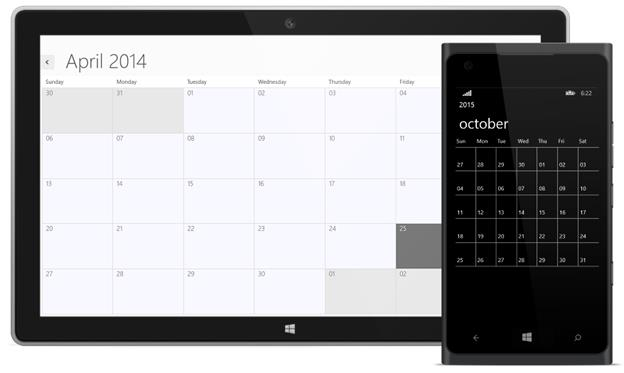

# Basic Views

Schedule provides 5 different types of viewing the events. The default view of SfSchedule is Day view.

* Day
* Week 
* Work Week
* Month
* TimeLine

Using the *ScheduleType* property of SfSchedule, you can set any of the above view. 

## Day View

Day view is used to displays a single day, the default visible day of Schedule will be current day. Appointments are added in particular timeslot based on its duration of specific day.

## Week View

Week view is used to displays all the seven days of a particular week, by default it will be current week. Appointments are added in particular timeslot based on its duration in particular day of week.

## Work Week View

Work Week view is used to displays working days of a particular week, by default current work week will be displayed. Saturday and Sunday are the non-working days by default. Appointments are added in particular timeslot based on its duration in particular day of week.

## Month

Month view is used to displays entire dates of a particular month, by default current month will be displayed. Appointments arranged within the cell based on its duration.The date of the current selected month and date of previous/next months can be differentiated using different color.

## TimeLine

TimeLine view is used to displays complete TimeLine in selected day, the default visible day of Schedule will be current day. Appointments are added in particular timeslot based on its timeline.




    <Schedule:SfSchedule ScheduleType="Month" />





    SfSchedule schedule = new SfSchedule();
    schedule.ScheduleType = ScheduleType.Month;
    this.grid.Children.Add(schedule);




