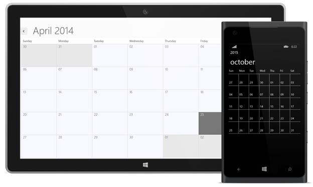

# Basic Views

Schedule provides 5 different types of viewing the events. The default view of SfSchedule is the Day view.

* Day
* Week 
* Work Week
* Month
* TimeLine

Using the *ScheduleType* property of SfSchedule, you can set any of the above views. 

## Day View

Day view is used to display a single day; the default visible day of the Schedule will be the current day. Appointments are added in particular timeslots based on their duration on a specific day.

## Week View

Week view is used to display all the seven days of a particular week; by default, it will be the current week. Appointments are added in particular timeslots based on their duration on a particular day of the week.

## Work Week View

Work Week view is used to display the working days of a particular week; by default, the current work week will be displayed. Saturday and Sunday are the non-working days by default. Appointments are added in particular timeslots based on their duration on a particular day of the week.

## Month

Month view is used to display entire dates of a particular month; by default, the current month will be displayed. Appointments are arranged within the cell based on their duration. The dates of the current selected month and the dates of previous/next months can be differentiated using different colors.

## TimeLine

TimeLine view is used to display the complete TimeLine in the selected day; the default visible day of the Schedule will be the current day. Appointments are added in particular timeslots based on their timeline.




    <Schedule:SfSchedule ScheduleType="Month" />





    SfSchedule schedule = new SfSchedule();
    schedule.ScheduleType = ScheduleType.Month;
    this.grid.Children.Add(schedule);




