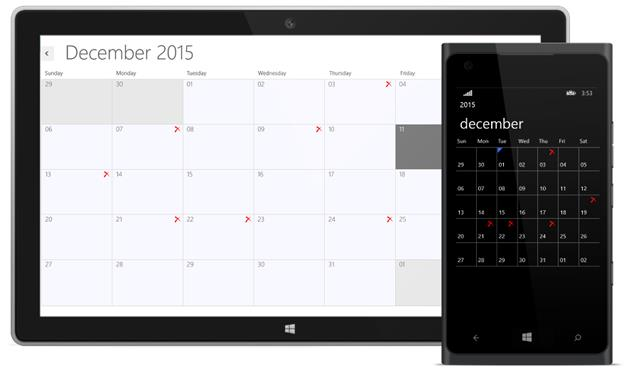

# Blackout Dates

You can restrict/allocate certain month cell as blackout days using **MonthBlockOutDates** of schedule, so that you can allocate those cells for predefined events/activities like Scheduled maintenance, planned leave etc.

>**Note:-BlockOutDates is only applicable in Month view.**



            schedule.MonthBlockOutDates.Add(new DateTime(2015, 11, 3));
            schedule.MonthBlockOutDates.Add(new DateTime(2015, 11, 19));
            schedule.MonthBlockOutDates.Add(new DateTime(2015, 11, 21));
            schedule.MonthBlockOutDates.Add(new DateTime(2015, 11, 22));
            schedule.MonthBlockOutDates.Add(new DateTime(2015, 11, 24));



