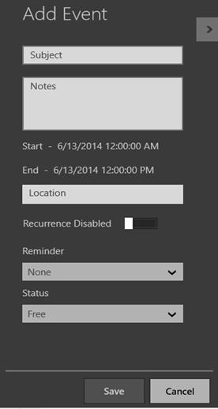
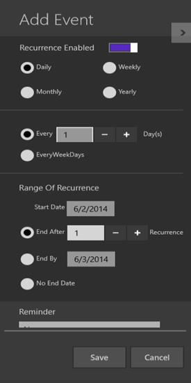
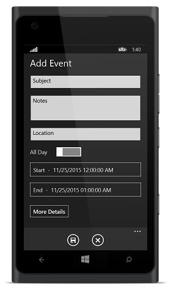
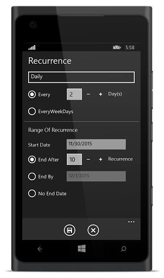

# Key Features

**Built-in Views**

Schedule provides 5 different types of viewing the calendar, 

* Day
* Week 
* Work Week
* Month
* TimeLine

**Recurrence Appointment**

You can schedule recurring appointments to repeat daily, weekly, monthly, or yearly. You can customize recurring appointment schedules that repeat for daily, weekly, monthly, or yearly.

**Appointment Editor**

Appointments Editor is used to create or edit various types of appointments, such as appointment with a specific time or All Day appointment without a specific time on your schedule. Appointment Editor can customize several feature of appointment such as applying reminder and adding recurrence to an appointment. It’s also simple to reschedule the added appointments by editing the Start and End time of appointments.

*Windows*

<table>
<tr>
<td>
{{''| markdownify }}
</td><td>
{{''| markdownify }}
</td></tr>
</table>

*Window Phone*

<table>
<tr>
<td>
{{''| markdownify }}
</td><td>
{{''| markdownify }}
</td></tr>
</table>

**Remainders**

You can use reminder for the appointments in your schedule. Schedule reminds you the particular appointment in the specified time. 

**Appointment Mapping**

Using **AppointmentMapping** the custom class or data source can be mapped to the Schedule appointments collection.

**Easy to use**

SfSchedule is available in Visual Studio toolbox itself, you can easily drag and drop the control from toolbox. And the API’s in the control are exposed in a way, which helps in enabling various features in ease.  

