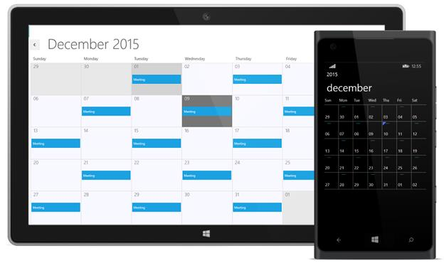

# Recurrence

## Recurrence Pattern

In this group all the properties are used to design the recurrence pattern. There are four different types of recurrences: They are: 

**Daily**

Set **IsDailyEveryNDays** property as true to apply recurrence in specific day interval and proved the day interval using the **DailyNDays** property. Or set **IsDailyEveryNDays** property to false to apply recurrence for all weekdays.

**Weekly**

Provide week intervals using **WeeklyEveryNWeeks** property and use the below property to apply recurrence in the selected weekdays.

* IsWeeklySunday   - Recurrence will be applied on Sundays with specified week interval.

* IsWeeklyMonday - Recurrence will be applied on Mondays with specified week interval.

* IsWeeklyTuesday - Recurrence will be applied on Tuesdays with specified week interval.

* IsWeeklyWednesday - Recurrence will be applied on Wednesdays with specified week interval.

* IsWeeklyThursday - Recurrence will be applied on Thursdays with specified week interval.

* IsWeeklyFriday   - Recurrence will be applied on Fridays with specified week interval.

* IsWeeklySaturday - Recurrence will be applied on Saturdays with specified week interval.

**Monthly**

Provide month intervals using **MonthlyEveryNMonths** property and set **IsMonthlySpecific** property as true to apply recurrence for the particular month day which can be chosen by **MonthlySpecificMonthDay** property. Set **IsMonthlySpecific** property as false to apply recurrence in particular week and weekday (ex: Monday of forth week) in specific month interval using **MonthlyNthWeek**” and **MonthlyWeekDay** properties.

**Yearly:**

Provide year intervals using **YearlyEveryNYears** property and set **IsYearlySpecific** property as true to apply recurrence in particular date and month in specific year interval. Or set **IsYearlySpecific** property as false to apply recurrence in particular week and weekday and month (ex: Monday of forth week of June) in specific year interval.

## Range of Recurrence

This group properties are used to decide when the recurrence should end.

Provide recurrence start date using **RangeStartDate** property which helps from when to start the recurrence. Set **IsRangeRecurrenceCount** as true and set **IsRangeNoEndDate** & **IsRangeEndDate** properties to false and provide the count for recurring appointment using **RangeRecurrenceCount** property. Or set **IsRangeEndDate** as true and set **IsRangeRecurrenceCount** & **IsRangeNoEndDate** properties to false and provide the **RangeEndDate** to set the when the recurrence should end. Or set **IsRangeNoEndDate** as true and set **IsRangeRecurrenceCount** & **IsRangeEndDate** properties to false to create recurring appointments that never ends.

## RRULE

Assign the generated RRULE to the appointment property called **RecurrenceRule** that assign the recurrence properties to the appointment. Or user can directly apply RRULE from any iCal file.

## RRuleGenerator

RRuleGenerator method is used to create RRULE which is available in the ScheduleHelper class of the SfSchedule control. Assign the generated RRULE to the appointment property called **RecurrenceRule** that assign the recurrence properties to the appointment. Or user can directly apply RRULE from any iCal file.

## Applying Recurrence to Appointments

Recurrence can be applied by using RRuleGenerator method.



            // Daily Recursive Appointment
            ScheduleAppointment SchApp = new ScheduleAppointment();
            SchApp.Subject = "Team Meeting";
            SchApp.Notes = "Daily Recurrence";
            SchApp.Location = "Meeting Hall 1";
            SchApp.StartTime = currentDate;
            SchApp.EndTime = currentDate.AddHours(4);
            SchApp.AppointmentBackground = new SolidColorBrush((Color.FromArgb(0xFF, 0xD8, 0x00, 0x73)));

            // Setting Recurrence Properties
            RecurrenceProperties RecProp = new RecurrenceProperties();
            RecProp.RecurrenceType = RecurrenceType.Daily;
            RecProp.IsDailyEveryNDays = true;
            RecProp.DailyNDays = 2;
            RecProp.IsRangeRecurrenceCount = true;
            RecProp.IsRangeNoEndDate = false;
            RecProp.IsRangeEndDate = false;
            RecProp.RangeRecurrenceCount = 100;

            // Generating RRULE using ScheduleHelper
            SchApp.RecurrenceRule =
            ScheduleHelper.RRuleGenerator(RecProp,SchApp.StartTime, SchApp.EndTime);
            SchApp.IsRecursive = true;
             this.schedule.Appointments.Add(SchApp);



